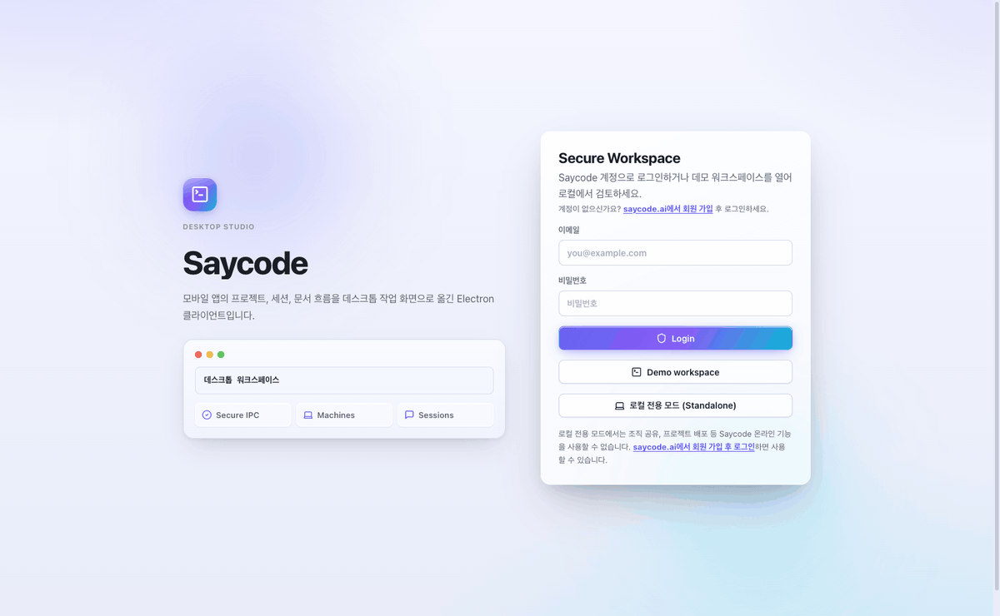

# Saycode Desktop

### 話せば、ソフトウェアになる。

**エンタープライズ向けバイブコーディング・ワークスペース** — 作りたいものを自然な言葉で伝えるだけで、
AI エージェントが企画し、作り、ライブでプレビューし、チームに届けます。

[English](README.md) | [한국어](README.ko.md) | [中文](README.zh.md) | **日本語**

 

### [⬇️ macOS 版をダウンロード (Apple Silicon)](https://github.com/buzzni/saycode-desktop-releases/releases/latest)

*署名・公証済み DMG · 自動アップデート内蔵*

**初めての方へ:** **[📘 ステップバイステップのユーザーガイド](docs/GUIDE.md)**(English / 한국어)に沿って進めてください — 初回起動からエージェント艦隊の運用まで。

 

*一文を入力すると、動くアプリが出てくる — 編集なしの実際のセッション映像。*

---

## なぜ Saycode なのか？

社員はすでに ChatGPT や Claude で素早く働いています。しかし成果物は個人 PC に散らばり、
会社からは管理も共有もできません。Saycode は個人のバイブコーディングを、
**会社全体で管理・共有・協業できるひとつのシステム**に引き上げます:

| | 一般的なバイブコーディングツール | **Saycode** |
|---|---|---|
| 社内デプロイ | 外部クラウド / 手作業 | **社内 URL へワンクリックデプロイ (SSL 自動)** |
| チーム協業 | 1 人 1 アカウントで完結 | **同僚が引き継ぎ、共同で修正・レビュー** |
| 共有・引き継ぎ | 個人 PC に散在 | **会社が管理し、全チームがそのまま利用** |
| コードとデータ | 外部に流出 | **社内保管 + エンドツーエンド暗号化 (E2EE)** |
| AI トークンコスト | 毎回いちばん高いモデルを使う | **難易度に応じた自動ルーティングでターンごとに最大 ~90% 削減** |
| 大量のエージェント運用 | チャットをひとつずつ Alt-Tab | **カンバン型エージェントボードで艦隊全体を一度に指揮** |
| 作れる人 | 基本的に開発者だけ | **作りたいものを説明できる人なら誰でも** |

作ること自体はどのツールも似ています。**その後 — デプロイ・共有・引き継ぎ — が違います。**

---

## 主な機能

<table>
<tr>
<td width="42%" valign="middle">

### 🖥️ 自分のマシンを登録 — コードのある場所でエージェントを動かす

これが Saycode の心臓部です。自分が管理するマシンなら何でも — ノート PC、GPU サーバー、
ビルドサーバー、クラウド VM — 登録して、エージェントの仕事を任せられます。
**Settings → Machines → Register machine** で **Generate code** をクリックし、表示される
ワンライナーを対象マシンで実行するだけ。数秒後には **online** になり、以後どのプロジェクト
でも実行マシンを選べます。エージェントの読み書き・ビルド・実行はすべて**あなたのインフラの上**、
コードとデータのすぐそばで行われます — 他人のクラウドではなく。

</td>
<td>
 

生成されたワンライナー — 対象マシンで実行するとオンラインになります。(この README 用にシークレットとトークンはぼかしています。)
</td>
</tr>
<tr>
<td width="42%" valign="middle">

### 🔌 スタンドアロンモード — 完全ローカル、セットアップ不要

アカウントがなくても大丈夫。ログイン画面で**ローカル専用モード (Standalone)** をワンクリック
すると、Saycode が**内蔵サーバー**を起動し、あなたのマシンを登録して、完全なワークスペース
へ数秒で連れて行きます。リレーもデータベースも、データの 1 バイトまですべてあなたの Mac の
中 — インターネットには何も出ていきません。セキュリティに厳しいチーム、閉域網環境、
あるいはインストールから 1 分以内に Saycode のすべてを試したい人にぴったりです。
チーム機能が必要になったら、ログインしてそのまま続けられます。

</td>
<td></td>
</tr>
<tr>
<td width="42%" valign="middle">

### 🗣️ 一文から動くアプリへ

欲しいものを自然な言葉で入力(音声入力も対応)。エージェントが方向性を決め、実マシン上で
本物のコードを書き、ファイル編集・ターミナルコマンド・テスト実行まで、すべてのステップを
ストリーミングカードで透明に見せます。アイデアが数分でソフトウェアになるのを見守ってください。

</td>
<td></td>
</tr>
<tr>
<td width="42%" valign="middle">

### 💸 モデル自動ルーティング — リクエストごとに最大 ~90% お得に

モデルを **Default** のままにしておけば、Saycode がターンごとに最適な頭脳を選んでくれます。
ちょっとした typo 修正は軽量モデルへ(**~90% 節約**)、日常的な作業は中位モデルへ
(**~80% 節約**)、本当に難しい問題は上位モデルへ — そしてセッションが本当に行き詰まった
ときだけ、最も強力(かつ最も高価)なティアへ引き上げます。すべてのメッセージには
*「⚡ 自動 · Haiku 4.5 · ~90% 節約」* のような透明性バッジが付き、セッションヘッダーには
累計の節約額が表示されるので、何をどれだけ節約できたか、なぜそのモデルが選ばれたのかが
いつでもわかります。

</td>
<td></td>
</tr>
<tr>
<td width="42%" valign="middle">

### 🗂️ エージェントボード — エージェント艦隊をカンバンチームのように運用

すべてのプロジェクトのすべてのエージェントセッションが、ひとつのボードに集まります:
**入力待ち → 応答中 → アイドル → レビュー中 → 完了 → PR マージ済み**。ストリーミング
カードには各エージェントが今まさに話している内容が表示されます。**カードをドラッグ**
して次の指示を送ったり、コードレビューを依頼したり、セッションをアーカイブしたりでき、
カードから直接 **Commit & PR** や **PR のマージ** を実行できます。節約ウィジェットが
自動ルーティングによる節約額を日・週・月単位で集計します。

</td>
<td></td>
</tr>
<tr>
<td width="42%" valign="middle">

### 👀 チャットのすぐ隣でライブプレビュー

**プレビュー実行**をクリックすると、サイドパネルにアプリが開きます — モックではなく、
プロジェクトのマシンで実際に動いているアプリです。左でチャットを続けながら、右で本物の
プロダクトをクリックして確かめられます。エージェントがコードを変えれば、即座に反映されます。

</td>
<td></td>
</tr>
<tr>
<td width="42%" valign="middle">

### ⚡ 新規プロジェクトは数秒で

空のプロジェクト、Git クローン、既存フォルダ — マシンを選んで名前を付けるだけ。
すべてのプロジェクトがチャットセッション・企画ドキュメント・プレビュー・環境変数・
エージェント指示を一緒に持ち歩くので、誰かの頭の中にしか残らないものはありません。

</td>
<td></td>
</tr>
<tr>
<td width="42%" valign="middle">

### 🧩 エージェントの艦隊をひとつの画面で

タブを右クリックして新しいチャット・ターミナルペインを分割し、ドラッグでサイズを調整 —
ワークスペースはその場でレイアウトを組み替えます。あるペインで Claude が考えている間に、
別のペインで Codex が成果を出す様子をリアルタイムで見られます。タスクを複数のエージェントに
ファンアウトして**すべて開く**を押せば、全セッションが一度にグリッド配置されます。サイドバーは
実行中のエージェントを常に追跡します。

</td>
<td></td>
</tr>
<tr>
<td width="42%" valign="middle">

### 💻 リモートマシン上の本物のターミナル

登録したどのマシンにも、チャットのすぐ下にドッキングされたライブシェルを開けます。
そのマシンへの本物のエンドツーエンド暗号化セッションなので、ビルドを回し、ログを追い、
あれこれ確認する — その間も上ではエージェントが働き続けます。ターミナルはタブを
切り替えても生きていて、自動で再接続します。

</td>
<td></td>
</tr>
<tr>
<td width="42%" valign="middle">

### 🤖 好きなエージェントをそのまま

**Claude (Anthropic)、Codex (OpenAI)、opencode** — セッションごとに切り替えられる
ファーストクラス対応で、モデルと effort も制御できます。ひとつのタスクを複数の角度から
攻める **Multi-Agent** 実行や、実験が main を壊さないようにするセッション別の
**git worktree** 分離もサポートします。

</td>
<td></td>
</tr>
<tr>
<td width="42%" valign="middle">

### ✅ 作業をきちんと締めくくる — まずレビュー、それから Commit & PR

**作業完了** ボタンひとつでセッションを正しく締めくくれます。現在のエージェントに自分の
変更をレビューさせるか、**読み取り専用のスナップショットを独立したレビュアー**に渡せます
— コードには一切触れず、発見事項だけを報告する別のエージェント(Claude、Codex など)です。
納得できる修正だけを適用し、そのまま **Commit & PR** に進みます。レビュー履歴と発見事項は
セッションに残り続けます。

</td>
<td></td>
</tr>
<tr>
<td width="42%" valign="middle">

### 🔎 すべての会話を全文検索

**⌘⇧F** を押すと、あなたとエージェントがこれまでに交わしたすべての会話 — タイトル、
プロンプト、返信 — を検索できます。マシンの外に出ることのないローカル SQLite FTS5
インデックスによるものです。検索範囲を*自分の会話*または*組織全体*に切り替え、
`project:web`、`role:agent`、`after:2026-07-01`、`"完全一致フレーズ"` のようなフィルタで
絞り込めます。

</td>
<td></td>
</tr>
<tr>
<td width="42%" valign="middle">

### 📋 コードと一緒に生きる企画ドキュメント

すべてのプロジェクトに **Planning** タブがあります — エージェントが作業しながら自ら読み、
更新する spec・plan・design ドキュメントです。「なぜこう作ったのか」がセッションの後も残り、
次の同僚も次のエージェントも、正確に続きから始められます。

</td>
<td></td>
</tr>
<tr>
<td width="42%" valign="middle">

### 🚀 デプロイと共有はワンクリック

チーム全員が開ける社内 URL へデプロイ — SSL は自動、デプロイのたびに同じリンクが更新
されます。プロジェクトをチームや社内コミュニティに共有すれば、同僚が眺め、クローンして
磨き上げ、変更を安全に元へマージできます。

</td>
<td></td>
</tr>
<tr>
<td width="42%" valign="middle">

### 📱 ポケットの中でも続く

Saycode モバイルアプリが同じワークスペースをそのまま持ち歩きます: エージェントセッションを
リアルタイムで見守り、リモートターミナルを開き、プレビューを確認し、長い実行が終わった瞬間に
プッシュ通知を受け取れます。

</td>
<td></td>
</tr>
<tr>
<td width="42%" valign="middle">

### 🌙 ずっと居たくなるワークスペース

Auto / Light / Dark テーマのオーロラグラス・デザイン — 情報は濃く、画面は静かに。
音声入力、チャット・プロジェクト・マシンを横断する ⌘K 検索、Dock バッジ付きの
ネイティブ完了通知まで。ディテールの積み重ねが体験になります。

</td>
<td></td>
</tr>
</table>

### さらに

- 🧭 **初回起動オンボーディング** — 内蔵サーバーの確認、Claude/Codex のサインイン検出、初回セッションまで案内するチェックリスト
- 🔔 **通知センター** — 完了通知は再起動後も保持され、未読/既読タブから完了したチャットへワンクリックで移動
- 📊 **AI 利用状況ダッシュボード** — マシンごとの Claude/Codex 残り利用量(5 時間・7 日ウィンドウ)、Claude アカウントのワンクリック切り替え
- ⌨️ **カスタムショートカット & ワンクリック分割** — すべてのキーを再割り当て、どのパネルの隣にもターミナル(⌘⌥T)やチャット(⌘⌥C)を分割表示、タブの右クリックメニュー
- 🎙️ **リアルタイム音声入力 & 添付ファイル** — 入力欄でのリアルタイム音声テキスト変換、ファイルや画像のドラッグ&ドロップ
- 📄 **リッチファイルビューア** — Markdown、HTML、PDF、DOCX をアプリ内でそのままレンダリング
- 🔗 **GitHub / GitLab インポート** — アカウントを連携し、プロジェクト作成時にリストからリポジトリを選択
- 🧩 **MCP サーバー & 環境変数グループ** — プロジェクト単位の MCP 接続と組織管理の環境変数グループ
- 🔒 **プライバシー第一の設計** — チャット・ターミナルのトラフィックはエンドツーエンド暗号化、コードとデータは社内マシンに保管
- 🌐 **個人・組織マシン** — 自分のアカウントで登録することも、組織全体でマシンを共有することも可能
- 🧠 **メモリレイヤー** — エージェントがセッションを越えてプロジェクトの文脈を記憶
- 🏢 **組織レベルの統制** — 組織/チームワークスペース、マシンレジストリ、環境変数、所有権管理
- 📱 **モバイルプッシュ** — デスクトップの実行が終わるとスマホに即通知

---

## 使い方の流れ

| | | |
|---|---|---|
| **01 · マシンを登録** | **02 · 言葉で依頼** | **03 · あなたのマシンで AI が製作** |
| 生成されたワンライナーをノート PC・GPU サーバー・ビルドサーバーで実行すれば、数秒でオンラインに。 | 自然な一文で十分: *「備品・購買リクエスト管理のバックオフィスを作って」* | エージェントが**選んだマシンの上で**実ファイルを読み書きし、コマンドを実行し、全工程をストリーミング。 |

| | |
|---|---|
| **04 · 即プレビュー** — 隣のパネルに本当に動く画面がすぐ表示。作られていく間も直接触れます。 | **05 · チームへデプロイ** — ボタンひとつで社内 URL を発行。共有し、引き継ぎ、一緒に育てましょう。 |

*左でエージェントが働いている間 — 右では本物のアプリが動いています。*

---

## インストール

### macOS (Apple Silicon)

1. **[Releases](https://github.com/buzzni/saycode-desktop-releases/releases/latest)** から最新の DMG をダウンロード
2. DMG を開き、**Saycode** を Applications にドラッグ
3. 起動して言語を選び、開始方法を選択:
   - saycode.ai アカウントで**ログイン** (チームワークスペース)
   - **Demo workspace** — アカウントなしですぐ見て回れます
   - **ローカル専用モード (Standalone)** — 内蔵サーバーによる完全ローカル環境
4. **初回起動チェックリスト**がセットアップ(サーバー、Claude/Codex サインイン)を確認し、初回セッションまで案内します。

アプリは Developer ID 署名・公証済みで、自動的にアップデートされます。
各ステップのスクリーンショット付きの詳しい手順は **[User Guide](docs/GUIDE.md)** をご覧ください。

> **Windows / Linux / Intel Mac** — 現在準備中です。[Releases](https://github.com/buzzni/saycode-desktop-releases/releases) をご確認ください。

---

## チームのための Saycode

Saycode は**統制できる**バイブコーディングを求める企業のために作られました — 組織単位の
権限と所有権、登録済み実行マシン、社内限定デプロイ、レビュー可能なコラボレーションまで。

| プラン | 対象 | |
|---|---|---|
| **Free PoC** | 導入前の無料検証 — サンプルプロジェクト制作支援つき | [お問い合わせ](mailto:soo@buzzni.com) |
| **Enterprise** | チーム協業 · オンプレミス設置 · 権限/監査/デプロイ運用 | [お問い合わせ](mailto:soo@buzzni.com) |

- 🌐 ウェブサイト: **[saycode.ai](https://saycode.ai)**
- 💼 導入のご相談: [soo@buzzni.com](mailto:soo@buzzni.com)
- 🛠 技術的なお問い合わせ: [ryan@buzzni.com](mailto:ryan@buzzni.com)
- 🤝 カスタマーサポート: [ernie@buzzni.com](mailto:ernie@buzzni.com)

---

## オープンソースについて

Saycode Desktop はオープンソースの上に築かれています。以下のプロジェクトをバンドルまたは
使用しています(ライセンス併記。ライセンス全文はパッケージ版アプリに同梱):

| プロジェクト | 用途 | ライセンス |
|---|---|---|
| [Happy](https://github.com/slopus/happy) ([buzzni フォーク](https://github.com/buzzni/happy)経由) | スタンドアロンモードにバンドルされる暗号化エージェントセッション・リレーエンジン (`happy-cli` / `happy-server`) | MIT |
| [Electron](https://www.electronjs.org/) | デスクトップアプリシェル | MIT |
| [React](https://react.dev/) | UI フレームワーク | MIT |
| [xterm.js](https://xtermjs.org/) (+ fit / web-links / WebGL アドオン) | リモートターミナルのレンダリング | MIT |
| [socket.io-client](https://socket.io/) | リアルタイム通信 | MIT |
| [react-markdown](https://github.com/remarkjs/react-markdown) + [remark-gfm](https://github.com/remarkjs/remark-gfm) | チャットのマークダウン描画 | MIT |
| [electron-updater](https://www.electron.build/) | アプリ内自動アップデート | MIT |
| [buffer](https://github.com/feross/buffer) | バイナリユーティリティ | MIT |
| [lucide-react](https://lucide.dev/) | アイコンセット | ISC |
| [TweetNaCl.js](https://tweetnacl.js.org/) | エンドツーエンド暗号化プリミティブ | Unlicense (パブリックドメイン) |

Saycode の暗号化セッション同期アーキテクチャの土台となった Kirill Dubovitskiy と
コントリビューターの **[slopus/happy](https://github.com/slopus/happy)** (MIT) に、
特別な感謝を捧げます。

---

**© 2026 [Buzzni](https://buzzni.com) · [saycode.ai](https://saycode.ai)**

*会社の誰もが、話すだけで作れるように。*

