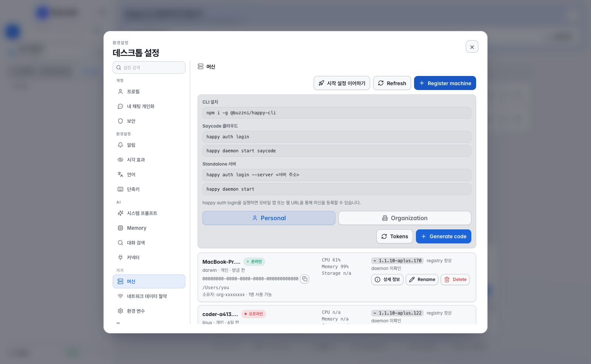
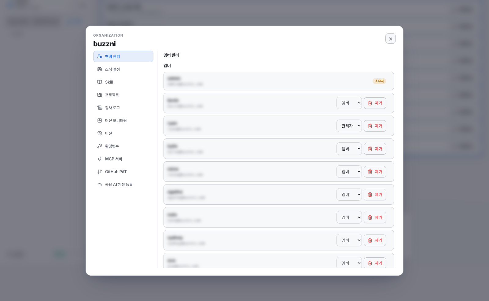
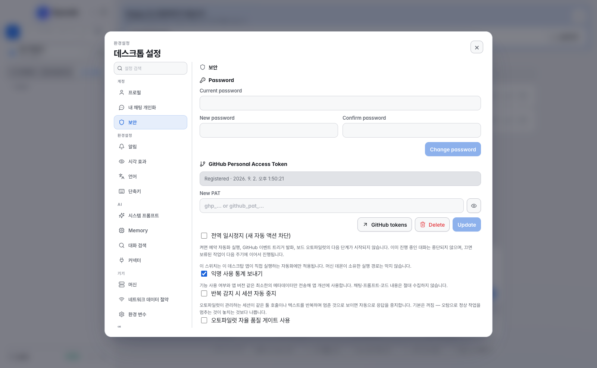

# Saycode Desktop

### 話せば、ソフトウェアになる。

**社内のAIサブスクリプションとAPIを一箇所で管理する運用レイヤー** —
チームがすでに使い慣れた最新モデル(Claude · Codex · Grok · opencode)はそのままに、
アカウント・権限・モデル選択・コスト・デプロイを会社が一つの画面で管理します。
**管理は一画面で、コストは半分に。**

[English](README.md) | [한국어](README.ko.md) | [中文](README.zh.md) | **日本語**

 

### [⬇️ macOS 版をダウンロード (Apple Silicon)](https://github.com/buzzni/saycode-desktop-releases/releases/download/v0.1.41/Saycode-0.1.41-arm64.dmg)

*署名・公証済み DMG · 自動アップデート内蔵 · アカウント不要ですぐ開始*

**初めての方へ:** **[📘 ステップバイステップのユーザーガイド](docs/GUIDE.md)**(English / [한국어](docs/GUIDE.ko.md))に沿って進めてください — 初回起動からエージェント艦隊の運用まで。

 

*一文を入力すると、動くアプリが出来上がります — 編集なしの実際のセッション画面。メッセージごとにどのモデルがなぜ選ばれたかがバッジで表示されます。*

<!-- release-notes:start -->
## 新機能と変更点

- [最新リリースノート](docs/releases/v0.1.41.ko.md)（韓国語）
- [リリース履歴](docs/releases/README.ko.md)（韓国語）
<!-- release-notes:end -->

---

## なぜ Saycode なのか？

社員はすでに ChatGPT や Claude で素早く働いています。しかし、サブスクリプションと API 契約は部署・個人ごとに
散らばり、誰がどのモデルをどれだけ使っているか会社にはわかりません。**制限すれば生産性が止まり、
野放しにすれば統制を失います。** 成果物は個人の PC に残ったまま、退職とともに消えていきます。

Saycode は**モデルと競合する製品ではありません。** チームがすでに知っている最新モデルをそのまま使いながら、
組織に必要な管理・セキュリティ・デプロイをその上に加える**運用レイヤー**です。

| | 個人で直接契約する場合 | **Saycode で一緒に使う場合** |
|---|---|---|
| アカウント・コスト | 個人ごとの支払い・アカウントが分散し、管理者は利用状況を把握できない | **同じモデルを中央管理・監査・コスト統制のもとで利用** |
| プロンプト・成果物 | 個人アカウントに紐づき、退職すると消える | **組織の資産として蓄積 — 担当者が変わっても引き継がれる** |
| モデル選択 | 一つのモデルに縛られ、より良いモデルが出ても切り替えにくい | **リクエストごとに最適なモデルを自動選択、ベンダーロックインなしで新モデルをすぐ利用** |
| コード・データ | 外部クラウドへ流出 | **会社が指定した実行マシンに常駐 + エンドツーエンド暗号化(E2EE)** |
| 複数エージェントの運用 | チャットウィンドウをひとつずつ Alt-Tab | **カンバン型エージェントボードで艦隊全体を一画面で指揮** |
| 成果物 | レビュー待ちのブランチ | **作業完了 → レビュー → Commit & PR → 社内 URL へデプロイ** |

一人で使うなら、個人契約が正解です。**組織で一緒に使う瞬間、必要なものが変わります。**

### 会社の管理者が実際にコントロールする4つのこと

| | 何を | どうやって |
|---|---|---|
| **誰が使えるか** | アカウント・シート | 従業員ごとにアカウントを発行・回収します。会社が持つ AI サブスクリプションや API を誰に割り当てるかも会社が決めます。異動・退職時は即座に回収。 |
| **どの AI を使えるか** | モデル・マシンポリシー | チーム・マシンごとに使える AI を選んで開放し、個人ごとに例外を設定できます。会社アカウントでシングルサインオン(SSO)。 |
| **どれだけ使っているか** | 利用量・コスト | 誰がどれだけ使い、コストがいくらかかったかを一画面で確認。予算上限に近づくと通知し、超えると自動停止。 |
| **何が起きたか** | 監査ログ | 誰がいつ何をしたかの記録が残ります。検索してファイルへ書き出せます。 |

### 私たちが先に導入し、測定しました

Buzzni の開発組織が Saycode 上で開発・運用しながら実測した結果です。

| **49%** | 単純なリクエスト **~90%** | 日常的な作業 **~80%** |
|:---:|:---:|:---:|
| 月間 AI 実行コスト削減 — 作業量はそのままに、コストだけを削減 | 誤字・文言修正は軽量モデルが処理 | 機能実装・リファクタリングは中位モデルが処理 |

> 測定条件: Buzzni 開発組織 35名 · 2026年6〜7月 · サブスクリプション・API 実行コスト基準 · 同一作業量を維持。
> ターンあたりの削減率は全体の削減率とは異なる指標です。お客様の環境での削減率を保証するものではなく、
> 導入初月に一緒にベースラインを測定します。

---

## Agent IDE(Orca など)とは何が違うのか？

[Orca](https://www.onorca.dev) のようなツールは **Agent IDE** であり、開発者のコーディングループに
集中しています — worktree 単位での並列エージェント実行、diff、レビュー、エディタとの深い統合。その領域を
非常によくこなしており、一部は組織単位の導入とガバナンスまで提供します。そのループが皆さんの課題であれば、
良い選択です。

Saycode が向き合う問いは異なります。エージェントがコードを作り終えた*その後*に始まる問いです:

> **Agent IDE は開発者がより多くのエージェントを動かせるようにします。
> Saycode はそのエージェントが作った成果物を会社の資産にします。**

| | Agent IDE(Orca など) | **Saycode** |
|---|---|---|
| 主な焦点 | 開発者のコーディングループ | **会社のデリバリーループ** — 制作 → レビュー → デプロイ → 共有 → 引き継ぎ |
| 管理の単位 | Repo · worktree · エージェントセッション | **組織 · チーム · プロジェクト · マシン · シート · デプロイ済み成果物** |
| 「デプロイ」の意味 | エージェントツールを組織に安全に導入・展開すること | **作った成果物をチームが開く社内 URL でサービスすること** |
| 一般的なゴール | レビューを経て Git にマージされた変更 | **共有・引き継ぎ可能な、実際に稼働中の社内サービス** |
| AI モデルコスト | 利用量の追跡、アカウント切り替え | **難易度ベースの自動ルーティング + サブエージェント委任 — 組織全体で49%削減を実測** |
| 届く相手 | 主に開発者 | **会社の全構成員** — 開発者、企画者、運用担当者 |

両者は並列エージェント、worktree、リモート実行、ローカルファーストのセキュリティという点で重なっています。
したがって、それらは選択の決め手にはなりません。Saycode がその上に加えるのは**運用レイヤー**です:

- **会社の所有権** — プロジェクト、セッション、企画ドキュメント、マシンは個人のノート PC ではなく組織に
  帰属します。担当者が退職したりチームを異動しても、成果物は検索でき、引き継がれます。
- **社内デプロイ** — ワンクリックで固定の社内 URL(SSL 自動)にデプロイされます。成果物は
  レビュー待ちのブランチではなく、チームが今日すぐ開ける実際のツールになります。
- **共有・引き継ぎ** — 同僚が閲覧し、複製し、磨き上げ、変更を反映し直します。他のチームが完成させた
  プロジェクトは作り直す対象ではなく、出発点になります。
- **コスト運用** — リクエストの難易度に応じて最も安価で適切なモデルへ自動ルーティングし(セッションが
  行き詰まったときだけ上位モデルへ昇格)、機械的なサブタスクはより軽量なモデルのサブエージェントに
  委任し、これらすべてが中央管理された組織共用マシンの上で動きます。メッセージごとにどのモデルが
  なぜ選ばれたかがバッジで表示されます。会社全体の AI コストを「確認する」のではなく「運用する」のです。

**いつ何を使えばいいか:** 自分のリポジトリで最も深い並列エージェントコーディング体験を求めるなら、
Agent IDE も良い選択です — 両方を併用しない理由もありません。AI が作ったソフトウェアが
**会社のインフラ**になること — 社内にデプロイされ、チーム間で共有され、引き継ぎを経ても生き残り、
コストまで管理される — それが目標なら、それが Saycode が解決する課題です。

---

## 主な機能

<table>
<tr>
<td width="42%" valign="middle">

### 🧭 インストールしたらすぐ開始 — アカウントも設定も不要

DMG を開いて言語を選べば完了です。Saycode が**内蔵サーバーを自ら起動し、この Mac をローカルマシンとして
登録し、Guest ローカルワークスペースへ連れて行きます** — ログイン画面もデモボタンもありません。続く
**3ステップウィザード**が Saycode CLI(アプリに内蔵されたローカルランタイム)、Claude Code・Codex の
ログイン状態、通知音を確認し、そのまま最初のプロジェクト追加へつながります。リレーもデータベースも、
データの1バイトまですべてあなたの Mac の中にあり、インターネットには何も出ていきません。チーム機能が
必要になったら、そのときログインすれば十分です。

</td>
<td></td>
</tr>
<tr>
<td width="42%" valign="middle">

### 🗣️ 一文で動くアプリになる

欲しいものを言葉で(音声入力にも対応)説明してください。エージェントが方向性を定め、実際のマシン上で
本物のコードを書き、ファイル編集・ターミナルコマンド・テスト実行まで、すべての過程をストリーミング
カードで透明に示します。ターンが終わると、入力欄が**次にやるとよさそうなリクエストをあらかじめ提案**
します — *「GitHub リモートを追加して PR を作って」*のように。

</td>
<td></td>
</tr>
<tr>
<td width="42%" valign="middle">

### 🧱 テンプレートギャラリー — すでに動くアプリから始める

**新規プロジェクト → テンプレート**から、社内ダッシュボード、アンケートフォーム、API バックオフィスの
ような実績のある Vite + React + TypeScript テンプレートを選んでください。プロジェクトが作成されると
同時に**最初のプロンプトが入力欄にあらかじめ入力され**、エージェントが `npm install` → `npm run dev`
→ ブラウザ確認まで続けて進めます。空のプロジェクト、Git URL からのクローン、ZIP/フォルダのインポート
も同じダイアログで行えます。

</td>
<td>
 

</td>
</tr>
<tr>
<td width="42%" valign="middle">

### 💸 モデル自動選択 — リクエストごとに最大 ~90% 節約

モデルを**Default**にしておけば、Saycode が毎ターン、ぴったりの頭脳を選んでくれます。誤字修正は軽量
モデルへ(**~90% 節約**)、日常的な作業は中位モデルへ(**~80% 節約**)、本当に難しい問題は上位モデルへ
— そしてセッションが本当に行き詰まったときだけ、最も強力なティアへ昇格します。すべてのメッセージに
*「⚡ 自動選択 · Sonnet 5 · medium · ~80% 節約」*のような透明性バッジが付き、セッションヘッダーには
*「自動選択2ターン · 平均~65% 節約」*のように累計の節約率が集計されます。お好みで Fable 5 · Opus 5 ·
Sonnet 5 · Haiku 4.5 を直接固定し、effort まで指定することもできます。

</td>
<td></td>
</tr>
<tr>
<td width="42%" valign="middle">

### 🗂️ エージェントボード — エージェント艦隊をカンバンで指揮

すべてのプロジェクトのすべてのエージェントセッションが一つのボードに集まります: **入力待ち → 応答中
→ 待機 → レビュー中 → 完了 → PR Merged**。応答中のカードには、エージェントが今まさに話している内容が
リアルタイムで流れます。**カードをドラッグ**して次の指示を送ったり、コードレビューを依頼したり、
セッションをアーカイブしたりできます — **Commit & PR**、**PR マージ**、CI が失敗した場合の**自動修正を
先に**まで、カードから直接実行できます。自動選択が節約したコストは日次/週次/月次のウィジェットで
集計されます。

</td>
<td>
 

</td>
</tr>
<tr>
<td width="42%" valign="middle">

### 👀 ブラウザパネル — 画面の要素をクリックしてその場で直す

チャットの横に**ブラウザパネル**を分割して開くと、自分のマシンで実際に動いているアプリがそのまま
表示されます。デスクトップ・タブレット・モバイルのビューポートプリセットを切り替え、**要素選択モード**
で画面のボタンやカードをクリックすると、その要素のセレクタがチャットに添付されます — *「このボタンを
青にして」*の一言でエージェントが修正し、HMR で即座に反映された結果を同じパネルで確認できます。

</td>
<td>
 

</td>
</tr>
<tr>
<td width="42%" valign="middle">

### 🧩 ワークスペースを思いどおりの形に

タブの横にある**分割**ボタンやショートカット(⌘⌥T ターミナル、⌘⌥C チャット)で、どのパネルの横にも
新しいチャット・ターミナル・ブラウザ・ファイルペインを分割し、ドラッグでサイズを調整できます。片方の
ペインで Claude が考えている間に、もう一方のペインで Codex が結果を出す様子をリアルタイムで見守ること
もできます。作業を複数のエージェントへ**ファンアウト**したり、セッションを別のエージェントへ
**ハンドオフ**したりすることもできます。

</td>
<td></td>
</tr>
<tr>
<td width="42%" valign="middle">

### 💻 リモートマシン上の本物のターミナル

登録したどのマシンでも、チャットのすぐ下に実際のシェルをドッキングして開けます。そのマシンに接続
された本物のエンドツーエンド暗号化セッションなので — ビルドを実行し、ログを確認し、git のステータス
を確かめる、といったことを — 上ではエージェントが働き続けている間にそのまま行えます。ターミナルは
タブを切り替えても生き続け、自動で再接続します。

</td>
<td></td>
</tr>
<tr>
<td width="42%" valign="middle">

### 🤖 好きなエージェントをそのまま、セッションごとに worktree で分離

**Claude Code(Anthropic)、Codex(OpenAI)、Grok(xAI)、opencode** をセッションごとに選んで使い、モデルと
effort まで制御できます。新しい会話を開くときに **Worktree** オプションを有効にすると、セッション
専用のブランチと隔離された作業フォルダが作られ、実験が main に影響しません — セッションヘッダーの
ブランチチップで、常にどこで作業しているかがわかります。既存の PR からセッションを開始したり、外部で
作成した worktree を Saycode に取り込んだりすることもできます。

</td>
<td>
 

</td>
</tr>
<tr>
<td width="42%" valign="middle">

### ✅ 作業を仕上げる — まずレビュー、それから Commit & PR

**作業を仕上げる**ボタン一つでセッションをきちんと締めくくれます。現在のエージェントに自分の変更を
レビューさせるか、**読み取り専用のスナップショットを独立したレビュアー**に任せましょう — コードには
一切手を触れず、見つけた問題だけを報告する別のエージェント(Claude、Codex など)です。受け入れる
修正だけを反映したら、そのまま **Commit & PR** へ進みます: レビュー → テスト → コミット → push →
PR 作成(リモートが GitHub でない場合はその旨を知らせ、コミット・push までで止まります)まで、
一つのターンで完了します。

</td>
<td>
 

</td>
</tr>
<tr>
<td width="42%" valign="middle">

### 🔎 すべての会話を全文検索、⌘P でどこへでもジャンプ

**⌘⇧F** を押すと、あなたとエージェントが交わしたすべての会話 — タイトル、プロンプト、応答 — を
検索できます。あなたのマシンを離れないローカル SQLite FTS5 インデックスに基づいています。
`project:web`、`role:agent`、`after:2026-07-01`、`"正確なフレーズ"` のようなフィルタで絞り込めます。
**⌘P Quick Open** はプロジェクト・会話・ファイルを一つの入力欄からすぐに開き、**⌘K** はプロジェクト・
会話・マシンを横断して検索します。

</td>
<td>
 

</td>
</tr>
<tr>
<td width="42%" valign="middle">

### 📊 利用量を一目で、アカウントはワンクリックで切り替え

セッションヘッダーの利用量チップを押すと、マシンごとの **Claude · Codex · Grok** の残り利用量
(5時間/7日ウィンドウ)が表示されます。Claude アカウントを複数連携しておけば、一覧から**クリック
一つで切り替え** — 一つのアカウントが上限に達しても作業は止まりません。照会はマシンごとに5分に
一度だけ行われ、プロバイダの API に負荷をかけません。

</td>
<td></td>
</tr>
<tr>
<td width="42%" valign="middle">

### 🧠 システムプロンプト · メモリ · 拡張機能

**環境設定 → AI → システムプロンプト**では、Saycode のデフォルト指示(子エージェント呼び出し、内部
タスク委任、企画から始めるワークフロー、コミットクレジット、成果物のインラインプレビュー)を項目
ごとにオン/オフでき、プリセット(TypeScript · Tailwind · Korean · Minimal · Full-stack)や独自の指示
を重ねられます。**Memory** タブはエージェントがセッションを越えてプロジェクトの文脈を記憶するメモリ
レイヤーを、**拡張機能** タブはテンプレートパックのような拡張機能とスキルを管理します。

</td>
<td>
 

</td>
</tr>
<tr>
<td width="42%" valign="middle">

### 📱 ポケットの中でも続きます

**環境設定 → デバイス → モバイル連携**の QR コードを Saycode モバイルアプリで読み取ると、同じ
ワークスペースがそのままスマホに開きます — ローカルモードなら同じネットワークで、異なるネットワーク
ではトンネル経由で。エージェントセッションをリアルタイムで見守り、リモートターミナルを開き、長時間
タスクが終わった瞬間にプッシュ通知を受け取れます。

</td>
<td></td>
</tr>
<tr>
<td width="42%" valign="middle">

### 🖥️ 自分のマシンを登録して、コードがある場所でエージェントを動かす

この Mac は初回起動時に自動的に登録されます。ここに、あなたが管理するどんなマシンでも — GPU サーバー、
ビルドサーバー、クラウド VM — 追加登録して、エージェントの作業を任せられます。**環境設定 → デバイス
→ マシン**で登録コードを発行し、表示される一行のコマンドを対象マシンで実行すれば、数秒で**オンライン**
になります。以後、すべてのプロジェクトでどのマシンで実行するかを選べます。エージェントが読み、書き、
ビルドし、実行するすべてが**あなたのインフラ上**、コードとデータのすぐそばで行われます — 他人の
クラウドではなく。

</td>
<td>
 

</td>
</tr>
<tr>
<td width="42%" valign="middle">

### 🚀 デプロイと共有はワンクリック *(チームワークスペース)*

saycode.ai アカウントでログインすると、チーム全員が開ける**社内 URL** へデプロイできます — SSL は
自動で、デプロイのたびに同じリンクが更新されます。プロジェクトをチームや社内コミュニティに共有すれば、
同僚が閲覧し、複製して磨き上げ、変更を安全に元のプロジェクトへ反映できます。レンダリングされた HTML
ドキュメント・レポートは公開リンクとしてそのまま公開されます。デプロイされたアプリ・レポートの URL
を利用するだけの**エンドユーザーにはシートが不要です。**

</td>
<td></td>
</tr>
<tr>
<td width="42%" valign="middle">

### 🏢 組織コンソールで会社が統制します *(チームワークスペース)*

組織管理コンソールでは、メンバーの招待・権限（管理者/メンバー）の変更・削除に加え、
監査ログ（誰がいつどのプロジェクトを開いたか）まで一箇所で確認できます。同じコンソール
から組織全体の MCP サーバー、GitHub PAT、共用 AI アカウントを登録でき、チームメンバーが
それぞれ個別に鍵を管理する必要がありません。**環境設定 → セキュリティ**の全域一時停止
スイッチは、予約自動化・GitHub トリガー・ボードのオートパイロットの次の実行を即座に
保留するチーム専用の非常停止です。

</td>
<td>
 

</td>
</tr>
<tr>
<td width="42%" valign="middle">

### 🌙 いつまでも居たくなるワークスペース

Auto / Light / Dark テーマのオーロラグラスデザイン — 情報は密に、画面は落ち着いた印象に。通知
センター、再割り当て可能なすべてのショートカット、Dock バッジとネイティブの完了通知、入力リクエスト・
作業完了時のサウンドまで。細部の積み重ねが体験になります。

</td>
<td>
 

</td>
</tr>
</table>

### これもあります

- 🔔 **通知センター & アウトバウンド Webhook** — 完了通知は再起動後も保持され、クリックすると該当のチャットへ移動。セッション完了・入力待ち・停滞イベントを HMAC-SHA256 署名付きで自分のエンドポイントへ送信
- 💬 **diff 行コメント** — 変更された行に直接コメントを付け、まとめてエージェントへ次の指示として送信
- ⌨️ **スラッシュコマンド & 添付メニュー** — 入力欄で `/` からコマンドを呼び出し、ファイル・画像・フォルダをドラッグして添付
- 🎙️ **リアルタイム音声入力** — 話した内容をその場で文字起こし
- 📄 **リッチファイルビューア** — Markdown・HTML・PDF・DOCX をアプリ内でそのままレンダリング、成果物のインラインプレビュー
- 🔗 **GitHub / GitLab インポート & コネクタ** — 一覧からリポジトリを選択、Google Drive・Slack・Notion のようなコネクタをセッションに接続 *(チームワークスペース)*
- 🧩 **MCP サーバー & 環境変数グループ** — プロジェクトごとの MCP 接続と、組織が管理する環境変数グループのマウント
- 🛑 **グローバル一時停止 & 品質ゲート** — スケジュール自動化・GitHub トリガー・ボードのオートパイロットをスイッチ一つで保留、自律実行に自己レビューラウンドと品質ゲートを適用 *(チームワークスペース)*
- 🔐 **パスキー MFA** — チームアカウントのログインに WebAuthn パスキーまたは TOTP
- 📉 **ネットワークデータ節約** — テザリング・従量制ネットワークでは重い同期を自動的に抑制
- 🔒 **プライバシー優先設計** — チャット・ターミナルのトラフィックはエンドツーエンド暗号化、コードとデータは自分のマシンに保管
- 🏢 **組織単位の統制** — 組織/チームワークスペース、シート・マシン・環境変数・所有権管理、監査ログ *(チームワークスペース)*
- 🔄 **段階的自動アップデート** — 新バージョンは一部のインストール環境から段階的に配信され、問題が起きても全体には広がらない

---

## こう動きます

| | | |
|---|---|---|
| **01 · インストールすれば準備完了** | **02 · プロジェクトを追加** | **03 · 言葉でリクエスト** |
| DMG を開いて言語を選ぶと、内蔵サーバーが起動し、この Mac がローカルマシンとして登録されます。3ステップウィザードが CLI・AI ツール・通知を確認します。 | 既存フォルダを開く、テンプレート、空のプロジェクト、Git URL からのクローン、ZIP — マシンを選んで名前を決めるだけです。 | 自然な一文で十分です: *「リクエストテーブルに担当者列を追加してダミーデータを入れて」* |

| | |
|---|---|
| **04 · 自分のマシンで AI が制作** — エージェントが実際のファイルを読み書きし、コマンドを実行しながら全工程をストリーミングします。ブラウザパネルでその場で確認し、要素をクリックして修正します。 | **05 · 仕上げてチームへデプロイ** — 作業を仕上げてレビュー → Commit & PR。チームワークスペースならボタン一つで社内 URL を発行。共有し、引き継ぎ、一緒に育てましょう。 |

*最初のセッション — 一行のリクエストで、エージェントがファイルを修正し、型チェックを実行し、結果を報告します。*

---

## インストールと初回起動

### macOS (Apple Silicon)

1. **[Releases](https://github.com/buzzni/saycode-desktop-releases/releases/latest)** から最新の DMG をダウンロード
2. DMG を開き、**Saycode** を Applications へドラッグ
3. 起動して**言語**を選んでください(日本語 · English · 한국어 · 中文)
4. それで完了です。Saycode が内蔵サーバーを起動し、この Mac を登録して **Guest ローカルワークスペース**
   を開きます(約10秒)。ログイン画面はありません — チーム機能が必要になったら、いつでも **Guest
   メニュー → ログイン** すればよいだけです。

### 最初の作業まで一緒に準備しましょう — 3ステップウィザード

<table>
<tr>
<td width="33%"></td>
<td width="33%"></td>
<td width="33%"></td>
</tr>
<tr>
<td valign="top"><b>① Saycode CLI</b> — アプリに内蔵されたローカルランタイムを確認します。Standalone アプリは別途インストール不要で<i>インストール済み</i>と表示されます。</td>
<td valign="top"><b>② AI ツール</b> — Claude Code と Codex のログイン状態を検出します。まだの場合はターミナルで <code>claude</code> → <code>/login</code>、<code>codex login</code> を済ませてから<b>状態を再確認</b>を押してください。</td>
<td valign="top"><b>③ 通知</b> — 入力リクエスト音・作業完了音を選び、<b>テスト通知を送信</b>で確認します。最後のボタンからそのまま最初のプロジェクト追加へ進みます。</td>
</tr>
</table>

各ステップは**あとで行う**でスキップでき、**環境設定 → デバイス → マシン → セットアップの続きを
行う**からいつでも再度開けます。

### 最初のプロジェクトと最初の会話

<table>
<tr>
<td width="50%"></td>
<td width="50%"></td>
</tr>
<tr>
<td valign="top">ウィザードが終わると<b>プロジェクト追加</b>が開きます。ホスト(マシン)を選び、<b>既存フォルダを開く</b> — または新規プロジェクト作成・Git URL からのクローン・ZIP インポートを選んでください。新規プロジェクトはテンプレートギャラリーから始められます。</td>
<td valign="top">最初の会話を開くと、<b>Saycode デフォルト指示</b>を使うかどうか尋ねられます。オンにしておくと、エージェントが子エージェントへの委任、コミットクレジット、成果物のインラインプレビューといった Saycode のワークフローに従います。あとから環境設定で項目ごとに変更できます。</td>
</tr>
</table>

アプリは Developer ID 署名・公証済みで、自動的にアップデートされます。
すべてのステップをスクリーンショット付きで確認したい場合は、**[ユーザーガイド](docs/GUIDE.md)**(English / [한국어](docs/GUIDE.ko.md))をご参照ください。

### ローカルワークスペースとチームワークスペース

| | Guest ローカルワークスペース(デフォルト) | チームワークスペース(saycode.ai ログイン) |
|---|---|---|
| 必要なもの | なし — インストールするだけ | 組織アカウント(SSO・パスキー/TOTP MFA) |
| データの保存場所 | すべてこの Mac | コード・データは指定マシン、メタデータ・監査ログは組織コンソール |
| エージェント · モデル自動選択 · エージェントボード · worktree · 作業の仕上げ · ブラウザパネル · ターミナル · テンプレート · 検索 · メモリ | ✅ | ✅ |
| リモートマシン登録 · モバイル連携 | ✅(モバイルは同じネットワークまたはトンネル) | ✅ |
| 社内 URL デプロイ · プロジェクト共有・引き継ぎ · コミュニティ | — | ✅ |
| 組織コンソール(シート・権限・モデルポリシー・コスト・監査ログ) · コネクタ · 個人メモリ同期 · プロジェクトエクスポート | — | ✅ |

まずローカルで始めて、必要になったらログインすればよいだけです。ローカルのプロジェクトはそのまま維持されます。

> **Windows / Linux / Intel Mac** — まだ準備中です。[Releases](https://github.com/buzzni/saycode-desktop-releases/releases) で情報をご確認ください。

---

## 導入シナリオ — どこから始めるかはお客様が決めます

三つのシナリオは順番ではなく選択肢です。一つから始めても、組み合わせても構いません。

| 💬 チャットとドキュメント | ⚙️ 個人業務の自動化 | 🚀 アプリ構築とデプロイ |
|---|---|---|
| 議事録の要約、企画書・報告書のドラフト、検索・要約。承認されたユーザー・モデルのみ使用し、グループごとにモデルを制限し、利用量・コストを集計します。 | 社内のコラボレーションツール・ドキュメントストレージと連携し、定型レポートの生成、申請・承認フローの補助といった反復業務を自動化します。 | 現場の担当者が自ら社内ツールを作り、社内 URL でデプロイします。成果物のレビュー・承認フローまで。 |

**開発者でなくても最初の週から使えます** — 経営支援(議事録・月次報告書のドラフト・規定 Q&A)、
営業・マーケティング(提案書ドラフト・VOC 分類)、コマース運用(商品・価格・在庫の確認レポート)、
人事・総務(規定案内・申請/承認フロー・オンボーディング資料)のように、今まさに手作業・Excel・
メッセンジャーで処理している反復業務から始めます。成果物はリンクで共有するので、メッセンジャーへの
添付なしにレビューが完結します。

---

## チームのための Saycode

### 1ヶ月無料の PoC で、まず数字を確認します

お客様が選んだシナリオを対象に、利用量・コスト・ポリシー・監査を実測し、導入判断に必要な結果報告書
まで一緒に作成します。**プレミアムシートの全機能を PoC でそのまま利用できます。**

| 第1週 · ベースライン | 第2〜3週 · 実利用 | 第4週 · 結果報告 |
|---|---|---|
| 現在の AI 利用・コストのベースライン測定、対象部署と PoC シナリオの選定 | 実際の業務に適用し、利用量・コストを実測、ポリシー・権限設定を検証 | 有効化率・コスト・ポリシーの動作結果を整理し、本導入の見積もりを算出 |

PoC 期間は1ヶ月無料。期間中に発生するモデル利用料はお客様の契約に従います。

### 価格 — シートが必要なのは自分で作る人だけ

AI モデルを転売するツールではありません。すでにお使いの AI 契約をそのまま接続し、管理と実行環境に
対するシート料金のみをいただきます。

| プラン | 価格 | 対象 | 含まれるもの |
|---|---|---|---|
| **オフィス** | $10 / 人・月 | チャット・ドキュメント中心の全社員向け | チャット・ドキュメント作業 · 成果物の閲覧・レビュー・承認 · 利用量ダッシュボード |
| **プレミアム** ⭐ | $40 / 人・月 | 自ら作りデプロイする実務担当者向け | オフィスの全機能 + アプリ制作・エージェント実行 · 社内 URL デプロイ · SSO 連携 |
| **大量導入** | 規模に応じて協議 | 全社導入・特殊要件 | 全社規模の単価 · オンプレミス設置型・閉域網構成 · 専任サポート・SLA |

- **AI モデルへのマークアップ 0%** — お使いの Anthropic・OpenAI・Azure・Bedrock・Vertex の契約をそのまま接続します。月額総コスト = シート料金 + 外部 AI サブスクリプション料金 + API 利用料。
- デプロイされたアプリ・レポートの URL を利用するだけの**エンドユーザーにはシートが不要です。** 記名制のシートで、アカウントの共有は行いません。
- 予算上限としきい値アラートを設定でき、上限を超えると自動的に停止します。
- 現在の導入キャンペーン期間中は初期セットアップ費用なし。

- 🌐 ウェブサイト: **[saycode.ai](https://saycode.ai)** · 紹介資料: **[saycodepoc.apps.saycode.ai](https://saycodepoc.apps.saycode.ai/)**
- 💼 導入のお問い合わせ: [soo@buzzni.com](mailto:soo@buzzni.com)
- 🛠 技術に関するお問い合わせ: [ryan@buzzni.com](mailto:ryan@buzzni.com)
- 🤝 カスタマーサポート: [ernie@buzzni.com](mailto:ernie@buzzni.com)

---

## オープンソースについて

Saycode Desktop はオープンソースの上に構築されています。以下のプロジェクトをバンドルまたは使用して
おり(ライセンスを併記)、ライセンス全文はパッケージ版アプリに同梱されています:

| プロジェクト | 用途 | ライセンス |
|---|---|---|
| [Happy](https://github.com/slopus/happy) ([buzzni フォーク](https://github.com/buzzni/happy) 経由) | スタンドアロンモードにバンドルされる暗号化エージェントセッション・リレーエンジン (`happy-cli` / `happy-server`) | MIT |
| [Electron](https://www.electronjs.org/) | デスクトップアプリシェル | MIT |
| [React](https://react.dev/) | UI フレームワーク | MIT |
| [xterm.js](https://xtermjs.org/) (+ fit / web-links / WebGL アドオン) | リモートターミナルのレンダリング | MIT |
| [socket.io-client](https://socket.io/) | リアルタイム通信 | MIT |
| [react-markdown](https://github.com/remarkjs/react-markdown) + [remark-gfm](https://github.com/remarkjs/remark-gfm) | チャットの Markdown レンダリング | MIT |
| [electron-updater](https://www.electron.build/) | アプリ内自動アップデート | MIT |
| [buffer](https://github.com/feross/buffer) | バイナリユーティリティ | MIT |
| [lucide-react](https://lucide.dev/) | アイコンセット | ISC |
| [TweetNaCl.js](https://tweetnacl.js.org/) | エンドツーエンド暗号化プリミティブ | Unlicense (パブリックドメイン) |

Saycode の暗号化セッション同期アーキテクチャの土台となった Kirill Dubovitskiy と
コントリビューターの **[slopus/happy](https://github.com/slopus/happy)** (MIT) に、
特別な感謝を捧げます。

---

**© 2026 [Buzzni](https://buzzni.com) · [saycode.ai](https://saycode.ai)**

*会社の誰もが、話すだけで作れるように。*

