

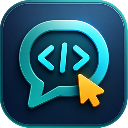

# Saycode Desktop

### 말하면, 소프트웨어가 됩니다.

**기업용 바이브 코딩 워크스페이스** — 만들고 싶은 것을 말로 설명하면
AI 에이전트가 기획하고, 만들고, 실시간으로 보여주고, 팀에 배포까지 해줍니다.

[English](README.md) | **한국어** | [日本語](README.ja.md) | [中文](README.zh.md)

 

### [⬇️ macOS용 다운로드 (Apple Silicon)](https://github.com/buzzni/saycode-desktop-releases/releases/latest)

*서명·공증된 DMG · 자동 업데이트 내장*

 

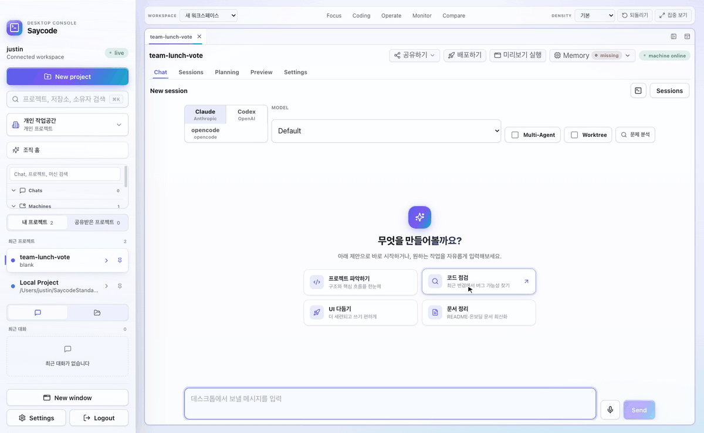

*한 문장을 입력하면 동작하는 앱이 나옵니다 — 편집 없는 실제 세션 화면.*

---

## 왜 Saycode인가요?

직원들은 이미 ChatGPT와 Claude로 빠르게 일합니다. 하지만 결과물은 개인 PC에 흩어지고,
회사는 통제도 공유도 하지 못합니다. Saycode는 개인의 바이브 코딩을
**회사가 통제·공유·협업하는 하나의 시스템**으로 올려줍니다:

| | 일반 바이브 코딩 툴 | **Saycode** |
|---|---|---|
| 사내 배포 | 외부 클라우드 / 수동 작업 | **사내 URL로 원클릭 배포 (SSL 자동)** |
| 팀 공동작업 | 1인 1계정, 개인 작업으로 끝 | **동료가 이어받아 함께 수정·검토** |
| 공유·인수인계 | 개인 PC에 흩어짐 | **회사가 관리, 팀 전체가 그대로 사용** |
| 코드·데이터 | 외부로 나감 | **사내 보관 + 종단간 암호화(E2EE)** |
| 만드는 주체 | 보통 개발자 손이 필요 | **개발자가 아니어도 가능** |

만드는 건 비슷합니다. **그 다음 — 배포·공유·인수인계 — 이 다릅니다.**

---

## 주요 기능

<table>
<tr>
<td width="42%" valign="middle">

### 🖥️ 내 머신을 등록해서, 코드가 있는 곳에서 에이전트를 돌립니다

Saycode의 핵심입니다. 내가 관리하는 어떤 머신이든 — 노트북, GPU 서버, 빌드 서버, 클라우드
VM — 등록해서 에이전트 작업을 맡기세요. **Settings → Machines → Register machine**에서
**Generate code**를 누르고, 나오는 한 줄 명령어를 대상 머신에서 실행하면 됩니다. 몇 초 만에
**online**으로 뜨고, 이후 모든 프로젝트에서 어느 머신에서 돌릴지 고를 수 있습니다. 에이전트가
읽고, 쓰고, 빌드하고, 실행하는 모든 게 **내 인프라 위에서**, 코드와 데이터 옆에서 이뤄집니다 —
남의 클라우드가 아니라.

</td>
<td>
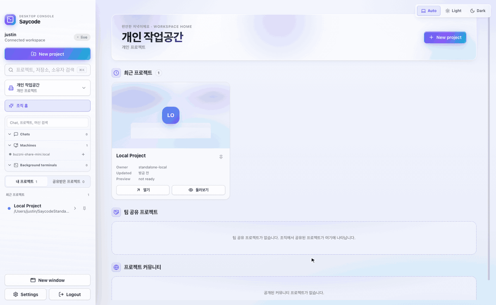 
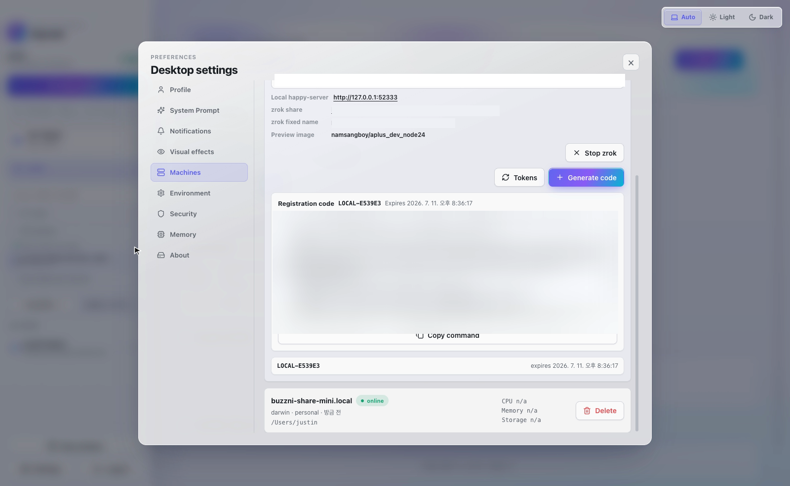
생성된 한 줄 명령어 — 대상 머신에서 실행하면 온라인으로 붙습니다. (이 README용으로 시크릿·토큰은 블러 처리했습니다.)
</td>
</tr>
<tr>
<td width="42%" valign="middle">

### 🗣️ 한 문장이면 동작하는 앱이 됩니다

원하는 것을 말로(음성 입력도 지원) 설명하세요. 에이전트가 방향을 잡고, 실제 머신에서
진짜 코드를 작성하며, 파일 수정·터미널 명령·테스트 실행까지 모든 과정을 스트리밍
카드로 투명하게 보여줍니다. 아이디어가 몇 분 만에 소프트웨어가 되는 걸 지켜보세요.

</td>
<td></td>
</tr>
<tr>
<td width="42%" valign="middle">

### 👀 대화하면서 바로 옆에서 미리보기

**미리보기 실행**을 누르면 사이드 패널에 앱이 열립니다 — 목업이 아니라 프로젝트
머신에서 실제로 돌아가는 앱입니다. 왼쪽에서 대화를 계속하고, 오른쪽에서 진짜 제품을
클릭해 보세요. 에이전트가 코드를 바꾸면 즉시 반영됩니다.

</td>
<td>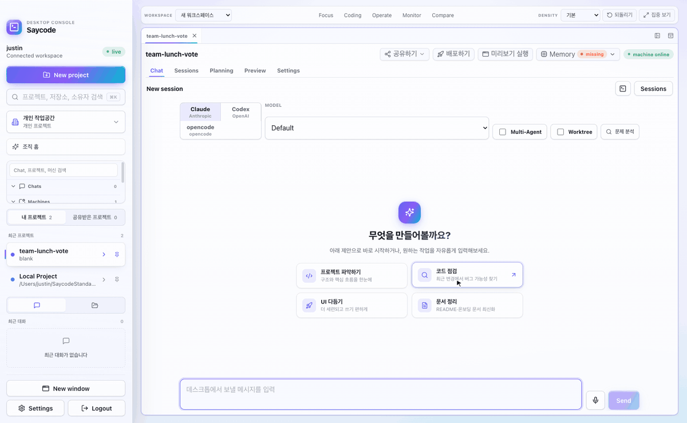</td>
</tr>
<tr>
<td width="42%" valign="middle">

### ⚡ 새 프로젝트는 몇 초면 충분

빈 프로젝트, Git 클론, 기존 폴더 — 머신을 고르고 이름만 정하면 끝. 모든 프로젝트가
채팅 세션·기획 문서·미리보기·환경변수·에이전트 지침을 함께 갖고 다니므로, 그 어떤
것도 누군가의 머릿속에만 남지 않습니다.

</td>
<td></td>
</tr>
<tr>
<td width="42%" valign="middle">

### 🧩 에이전트 함대를 한 화면에서

탭을 우클릭해 새 채팅·터미널 페인을 나누고, 드래그로 크기를 조절하세요 — 워크스페이스가
그때그때 원하는 모양으로 재배치됩니다. 한쪽 페인에서 Claude가 생각하는 동안 다른 페인에서
Codex가 결과를 내는 모습을 실시간으로 지켜볼 수 있습니다. 작업을 여러 에이전트로 팬아웃한
뒤 **모두 열기**를 누르면 모든 세션이 한 번에 그리드로 배치됩니다.

</td>
<td>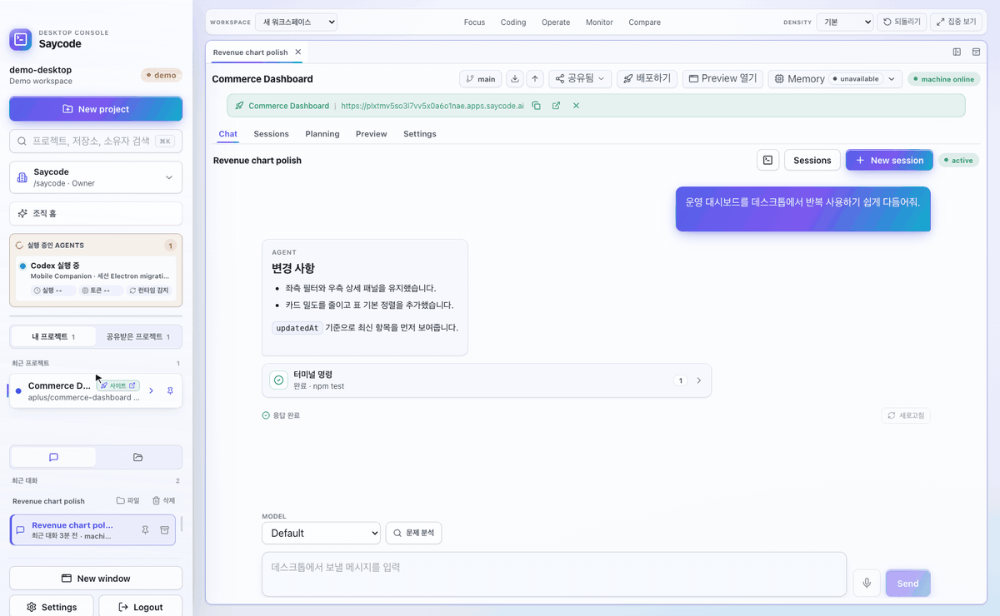</td>
</tr>
<tr>
<td width="42%" valign="middle">

### 💻 원격 머신 위의 진짜 터미널

등록한 어떤 머신이든 채팅 바로 아래에 실제 셸을 도킹해서 엽니다. 그 머신에 붙은 진짜
종단간 암호화 세션이라 — 빌드 돌리고, 로그 보고, 이것저것 확인하는 걸 — 위에서 에이전트가
계속 일하는 동안 그대로 할 수 있습니다. 터미널은 탭을 바꿔도 살아있고 스스로 재연결됩니다.

</td>
<td>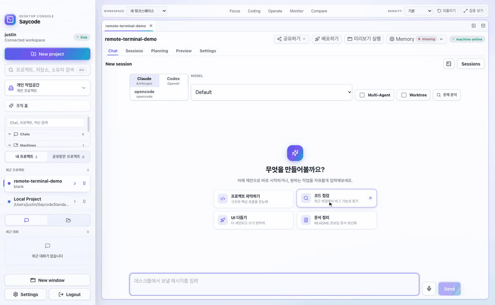</td>
</tr>
<tr>
<td width="42%" valign="middle">

### 🤖 좋아하는 에이전트를 그대로

**Claude(Anthropic), Codex(OpenAI), opencode**를 세션마다 골라 쓰고, 모델과 effort까지
제어합니다. 하나의 작업을 여러 각도로 공략하는 **Multi-Agent** 실행, 실험이 main을
건드리지 않도록 하는 세션별 **git worktree** 격리도 지원합니다.

</td>
<td>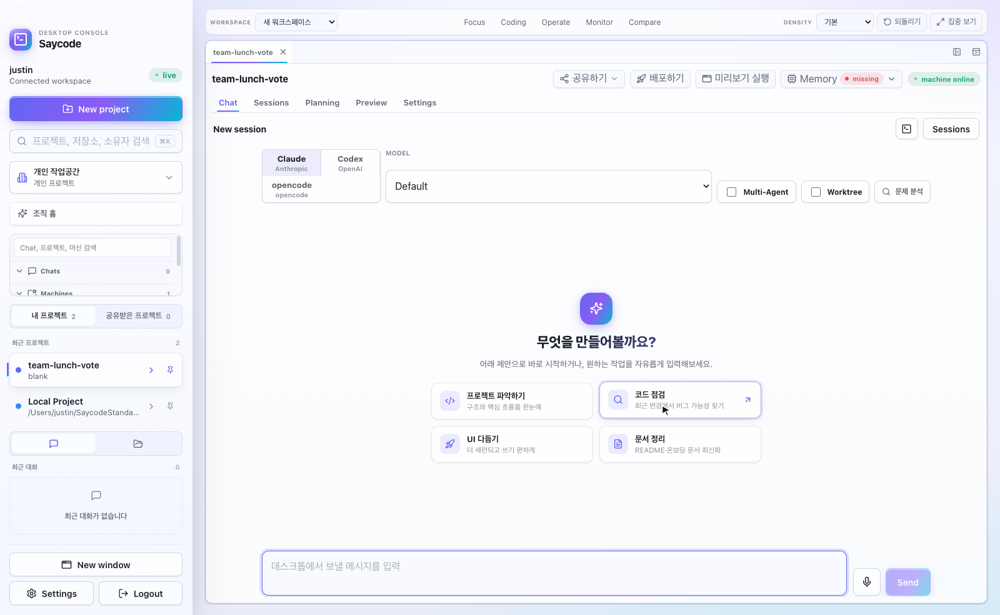</td>
</tr>
<tr>
<td width="42%" valign="middle">

### 📋 코드와 함께 사는 기획 문서

모든 프로젝트에 **Planning** 탭이 있습니다 — 에이전트가 작업하며 직접 읽고 갱신하는
spec·plan·design 문서입니다. "왜 이렇게 만들었는지"가 세션이 끝나도 남아, 다음 동료도
다음 에이전트도 정확히 이어서 시작합니다.

</td>
<td>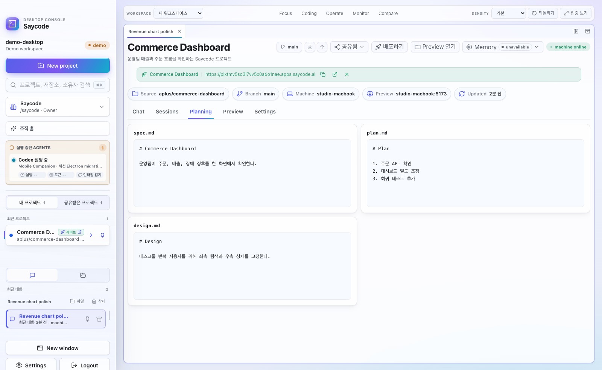</td>
</tr>
<tr>
<td width="42%" valign="middle">

### 🚀 배포와 공유는 클릭 한 번

팀 전체가 열어볼 수 있는 사내 URL로 배포하세요 — SSL은 자동이고, 배포할 때마다 같은
링크가 갱신됩니다. 프로젝트를 팀이나 사내 커뮤니티에 공유하면 동료가 둘러보고,
복제해서 다듬고, 변경 사항을 안전하게 원본에 반영할 수 있습니다.

</td>
<td>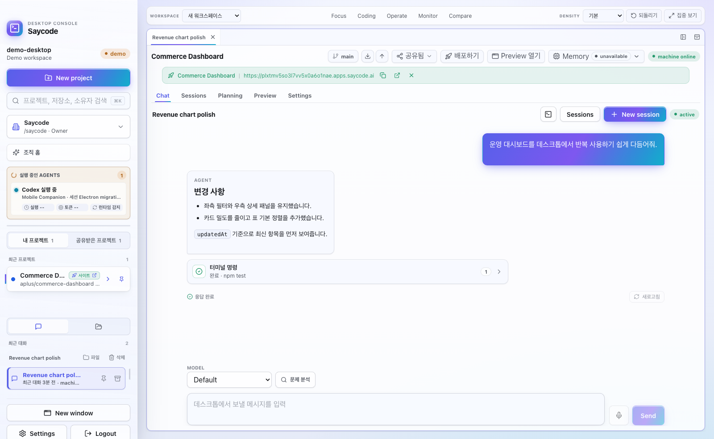</td>
</tr>
<tr>
<td width="42%" valign="middle">

### 📱 주머니 속에서도 이어집니다

Saycode 모바일 앱이 같은 워크스페이스를 그대로 들고 다닙니다: 에이전트 세션을 실시간
으로 지켜보고, 원격 터미널을 열고, 미리보기를 확인하고, 긴 작업이 끝나는 순간 푸시
알림을 받으세요.

</td>
<td>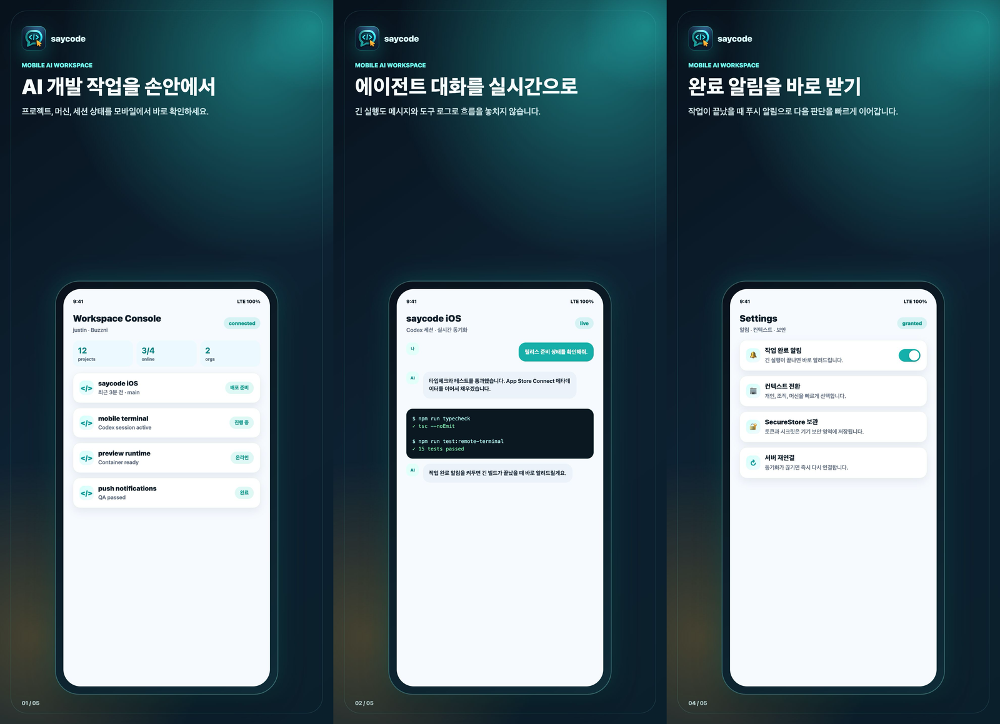</td>
</tr>
<tr>
<td width="42%" valign="middle">

### 🌙 계속 머물고 싶은 워크스페이스

Auto / Light / Dark 테마의 오로라 글래스 디자인 — 정보는 촘촘하게, 화면은 차분하게.
음성 입력, 채팅·프로젝트·머신을 가로지르는 ⌘K 검색, Dock 배지와 네이티브 완료 알림
까지. 디테일이 쌓여 경험이 됩니다.

</td>
<td>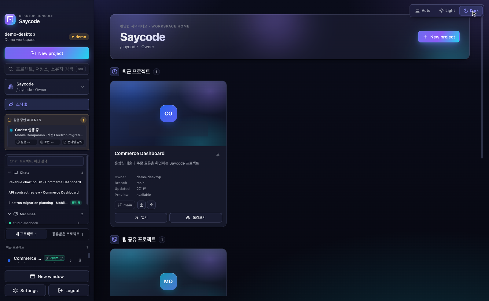</td>
</tr>
</table>

### 이것도 있습니다

- 🔒 **프라이버시 우선 설계** — 채팅·터미널 트래픽 종단간 암호화, 코드와 데이터는 사내 머신에 보관
- 🖥️ **스탠드얼론 모드** — 계정도 외부 인프라도 없이, 내장 서버로 100% 로컬 실행
- 🌐 **개인·조직 머신** — 내 계정으로 등록하거나 조직 전체가 공유하는 머신으로 운영
- 🧠 **메모리 레이어** — 에이전트가 세션을 넘어 프로젝트 맥락을 기억
- 🏢 **조직 단위 통제** — 조직/팀 워크스페이스, 머신 등록 관리, 환경변수, 소유권 관리
- 🔔 **모바일 푸시** — 데스크톱 작업이 끝나면 폰으로 바로 알림

---

## 이렇게 동작합니다

| | | |
|---|---|---|
| **01 · 머신 등록** | **02 · 말로 요청** | **03 · 내 머신에서 AI가 제작** |
| 생성된 한 줄 명령어를 노트북·GPU 서버·빌드 서버에서 실행하면 몇 초 만에 온라인으로 붙습니다. | 자연어 한 문장이면 됩니다: *"비품·구매 요청 관리 백오피스 만들어줘"* | 에이전트가 **내가 고른 머신에서** 실제 파일을 읽고 쓰고 명령을 실행하며 전 과정을 스트리밍합니다. |

| | |
|---|---|
| **04 · 즉시 미리보기** — 옆 패널에 진짜 동작하는 화면이 바로 뜹니다. 만들어지는 동안 직접 눌러보세요. | **05 · 팀에 배포** — 버튼 한 번으로 사내 URL 발급. 공유하고, 인수인계하고, 함께 발전시키세요. |

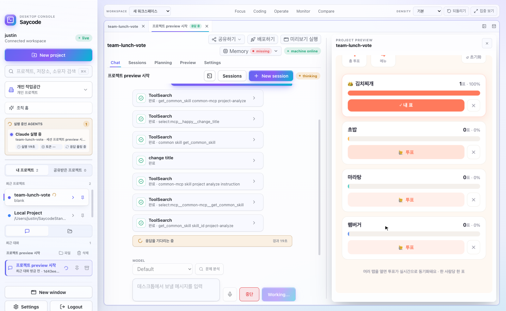

*왼쪽에서 에이전트가 일하는 동안 — 오른쪽에서 진짜 앱이 돌아갑니다.*

---

## 설치

### macOS (Apple Silicon)

1. **[Releases](https://github.com/buzzni/saycode-desktop-releases/releases/latest)**에서 최신 DMG 다운로드
2. DMG를 열고 **Saycode**를 Applications로 드래그
3. 실행 후 시작 방식을 선택하세요:
   - saycode.ai 계정으로 **로그인** (팀 워크스페이스)
   - **Demo workspace** — 계정 없이 바로 둘러보기
   - **로컬 전용 모드 (Standalone)** — 내장 서버로 완전한 로컬 환경 구성

앱은 Developer ID 서명·공증되어 있으며, 자동으로 업데이트됩니다.

> **Windows / Linux / Intel Mac** — 아직 준비 중입니다. [Releases](https://github.com/buzzni/saycode-desktop-releases/releases)에서 소식을 확인하세요.

---

## 팀을 위한 Saycode

Saycode는 **통제 가능한** 바이브 코딩을 원하는 회사를 위해 만들어졌습니다 — 조직 단위
권한과 소유권, 등록된 실행 머신, 사내 전용 배포, 검토 가능한 협업까지.

| 플랜 | 대상 | |
|---|---|---|
| **Free PoC** | 도입 전 무료 검증 — 샘플 프로젝트 제작 지원 포함 | [도입 문의](mailto:soo@buzzni.com) |
| **Enterprise** | 팀 협업 · 사내 서버 설치 · 권한/감사/배포 운영 | [도입 문의](mailto:soo@buzzni.com) |

- 🌐 웹사이트: **[saycode.ai](https://saycode.ai)**
- 💼 도입 문의: [soo@buzzni.com](mailto:soo@buzzni.com)
- 🛠 기술 문의: [ryan@buzzni.com](mailto:ryan@buzzni.com)
- 🤝 고객 지원: [ernie@buzzni.com](mailto:ernie@buzzni.com)

---

## 오픈소스 고지

Saycode Desktop은 오픈소스 위에 만들어졌습니다. 아래 프로젝트를 번들하거나 사용하고
있으며(라이선스 병기), 전체 라이선스 전문은 패키징된 앱에 포함되어 있습니다:

| 프로젝트 | 용도 | 라이선스 |
|---|---|---|
| [Happy](https://github.com/slopus/happy) ([buzzni 포크](https://github.com/buzzni/happy) 경유) | 스탠드얼론 모드에 번들되는 암호화 에이전트 세션 릴레이 엔진 (`happy-cli` / `happy-server`) | MIT |
| [Electron](https://www.electronjs.org/) | 데스크톱 앱 셸 | MIT |
| [React](https://react.dev/) | UI 프레임워크 | MIT |
| [xterm.js](https://xtermjs.org/) (+ fit / web-links / WebGL 애드온) | 원격 터미널 렌더링 | MIT |
| [socket.io-client](https://socket.io/) | 실시간 전송 | MIT |
| [react-markdown](https://github.com/remarkjs/react-markdown) + [remark-gfm](https://github.com/remarkjs/remark-gfm) | 채팅 마크다운 렌더링 | MIT |
| [electron-updater](https://www.electron.build/) | 앱 내 자동 업데이트 | MIT |
| [buffer](https://github.com/feross/buffer) | 바이너리 유틸리티 | MIT |
| [lucide-react](https://lucide.dev/) | 아이콘 세트 | ISC |
| [TweetNaCl.js](https://tweetnacl.js.org/) | 종단간 암호화 프리미티브 | Unlicense (퍼블릭 도메인) |

Saycode의 암호화 세션 동기화 아키텍처의 근간이 되어준 Kirill Dubovitskiy와 기여자들의
**[slopus/happy](https://github.com/slopus/happy)** (MIT)에 특별한 감사를 전합니다.

---

**© 2026 [Buzzni](https://buzzni.com) · [saycode.ai](https://saycode.ai)**

*회사의 누구든, 말하면 만들 수 있도록.*

