

# Saycode Desktop

### Say it. Ship it.

**The operations layer for every AI subscription and API your company uses.**
Keep the frontier models your team already knows (Claude · Codex · Grok · opencode) —
and let the company manage accounts, permissions, model routing, cost and deployment from one screen.
**One place to manage. Half the cost.**

**English** | [한국어](README.ko.md) | [中文](README.zh.md) | [日本語](README.ja.md)

 

### [⬇️ Download for macOS (Apple Silicon)](https://github.com/buzzni/saycode-desktop-releases/releases/download/v0.1.41/Saycode-0.1.41-arm64.dmg)

*Signed & notarized DMG · auto-updates built in · no account needed to start*

**New here?** Follow the **[📘 Step-by-step User Guide](docs/GUIDE.md)** ([한국어](docs/GUIDE.ko.md)) — from first launch to running a fleet of agents.

 

*Type one sentence, get a working app — a real, unedited session. Every message carries a badge showing which model was picked and why.*

<!-- release-notes:start -->
## What's new

- [Latest release notes](docs/releases/v0.1.41.ko.md) (Korean)
- [Full release history](docs/releases/README.ko.md) (Korean)
<!-- release-notes:end -->

---

## Why Saycode?

Your people already move fast with ChatGPT and Claude. But subscriptions and API contracts
are scattered across teams and individuals, and nobody at the company can tell who is using
which model, or how much it costs. **Block it and productivity stops; leave it open and you
lose control.** The work lives on personal laptops and walks out the door with the employee.

Saycode **does not compete with the models.** It keeps the frontier models your team already
knows and adds the management, security and deployment an organisation needs on top — an
**operations layer**.

| | Individual subscriptions | **Saycode** |
|---|---|---|
| Accounts & cost | Per-person billing, fragmented accounts, admins can't see usage | **Same models under central management, audit and cost control** |
| Prompts & output | Tied to personal accounts, gone when people leave | **Accumulated as company assets — survives hand-overs** |
| Model choice | Locked to one vendor; hard to switch when a better model ships | **Best model auto-selected per request; new models usable on day one** |
| Code & data | Leaves for someone else's cloud | **Stays on machines the company designates, end-to-end encrypted** |
| Running many agents | Alt-tabbing between chat windows | **A kanban agent board to command the whole fleet from one screen** |
| The finish line | A branch waiting for review | **Finish work → review → Commit & PR → deploy to an internal URL** |

Solo, a personal subscription is the right call. **The moment an organisation works together, the requirements change.**

### Four things a company admin actually controls

| | What | How |
|---|---|---|
| **Who can use it** | Accounts & seats | Hand out and revoke accounts per employee. The company decides which of its AI subscriptions or APIs are attached to whom. Instant revocation on transfer or departure. |
| **Which AI they can use** | Model & machine policy | Open up specific models per team or machine, with per-person exceptions. Single sign-on with the company account. |
| **How much they use** | Usage & cost | See who used what and what it cost on one screen. Alerts before a budget cap, automatic stop when it is exceeded. |
| **What happened** | Audit log | Who did what, when. Searchable and exportable. |

### We adopted it first — and measured

Results measured while Buzzni's own engineering organisation built and operated on Saycode.

| **49%** | Simple requests **~90%** | Everyday work **~80%** |
|:---:|:---:|:---:|
| lower monthly AI execution cost — same workload, lower bill | Typos and copy fixes go to a light model | Features and refactors go to a mid-tier model |

> Measurement: Buzzni engineering, 35 people · June–July 2026 · subscription + API execution
> cost · workload held constant. Per-turn savings are a different metric from the overall
> figure. No guarantee for your environment — we measure your baseline together during the
> first month.

---

## How is this different from an Agent IDE (Orca etc.)?

Tools like [Orca](https://www.onorca.dev) are **Agent IDEs**: they focus on the developer's
coding loop — parallel agents in worktrees, diffs, review, deep editor integration. They do
that very well, and some add org-level rollout and governance. If that loop is your problem,
they are a fine choice.

Saycode targets a different question — the one that begins *after* the agent has written the code:

> **An Agent IDE lets a developer run more agents.
> Saycode turns what those agents build into company assets.**

| | Agent IDE (Orca etc.) | **Saycode** |
|---|---|---|
| Primary focus | The developer's coding loop | **The company's delivery loop** — build → review → deploy → share → hand over |
| Unit of management | Repo · worktree · agent session | **Org · team · project · machine · seat · deployed artifact** |
| What "deploy" means | Rolling the agent tool out safely across an org | **Serving the result at an internal URL the team opens** |
| Typical finish line | A reviewed change merged in Git | **A live internal service that can be shared and handed over** |
| AI model cost | Usage tracking, account switching | **Difficulty-based auto-routing + sub-agent delegation — 49% measured org-wide** |
| Who it reaches | Mostly developers | **Everyone in the company** — developers, planners, operators |

The two overlap on parallel agents, worktrees, remote execution and local-first security, so
those aren't the deciding factors. What Saycode adds on top is the **operations layer**:

- **Company ownership** — projects, sessions, planning docs and machines belong to the
  organisation, not a laptop. When someone leaves or changes teams, the work stays
  searchable and hand-over-able.
- **Internal deployment** — one click to a fixed internal URL with automatic SSL. The result
  is a tool the team opens today, not a branch waiting for review.
- **Sharing & hand-over** — colleagues browse, clone, refine and merge changes back.
  A project another team finished is a starting point, not something to rebuild.
- **Cost operations** — route every request to the cheapest adequate model (escalating only
  when a session is genuinely stuck), delegate mechanical sub-tasks to lighter sub-agents,
  and run it all on centrally managed shared machines. Every message shows which model was
  chosen and why. Company-wide AI cost is *operated*, not just *observed*.

**When to use which:** if the goal is the deepest parallel-agent coding experience in your
own repo, an Agent IDE is a great pick — and nothing stops you using both. If the goal is
AI-built software becoming **company infrastructure** — deployed internally, shared across
teams, surviving hand-overs, with cost under control — that's the problem Saycode solves.

---

## Highlights

<table>
<tr>
<td width="42%" valign="middle">

### 🧭 Install and go — no account, no setup

Open the DMG, pick a language, done. Saycode **starts its embedded server, registers this
Mac as a local machine and drops you into a Guest local workspace** — no login screen, no
demo buttons. A **3-step wizard** then checks the Saycode CLI (the runtime bundled in the
app), your Claude Code / Codex login state and notification sounds, and leads straight into
adding your first project. Relay, database and every byte of data live on your Mac; nothing
leaves for the internet. Log in later, when you need team features.

</td>
<td>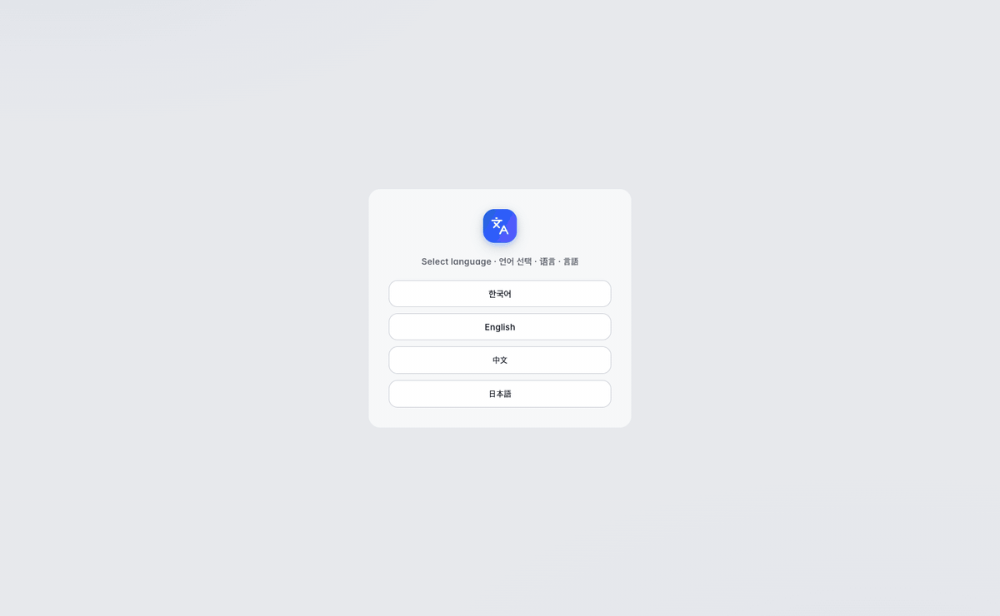</td>
</tr>
<tr>
<td width="42%" valign="middle">

### 🗣️ One sentence becomes a working app

Describe what you want in plain language (voice input too). The agent plans, writes real
code on a real machine, and streams every file edit, terminal command and test run as
transparent cards. When the turn ends, the composer **suggests what to ask next** —
*"Add a GitHub remote and open a PR"*, for example.

</td>
<td></td>
</tr>
<tr>
<td width="42%" valign="middle">

### 🧱 Template gallery — start from an app that already runs

In **New project → Templates**, pick a proven Vite + React + TypeScript starter: internal
dashboard, survey form, API back-office. As the project is created, the **first prompt is
pre-filled in the composer**, and the agent carries on through `npm install` → `npm run dev`
→ checking it in the browser. Blank projects, Git URL clone and ZIP/folder import live in
the same dialog.

</td>
<td>
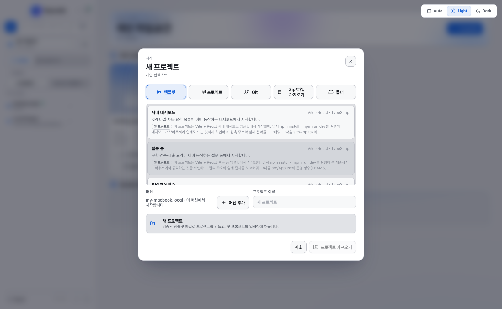 
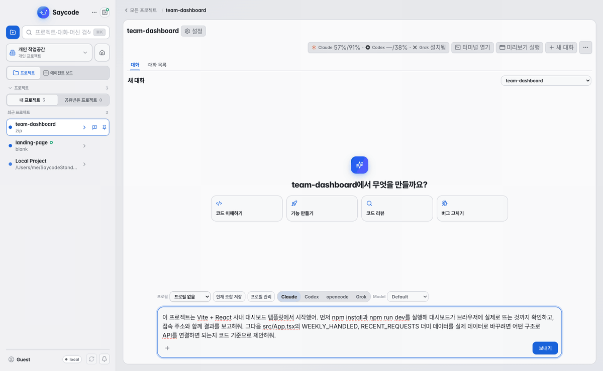
</td>
</tr>
<tr>
<td width="42%" valign="middle">

### 💸 Auto model selection — up to ~90% cheaper per request

Leave the model on **Default** and Saycode picks the right brain every turn. Typo fixes go
to a light model (**~90% saved**), everyday work to a mid-tier one (**~80% saved**), genuinely
hard problems to a top model — and only when a session is truly stuck does it escalate to
the strongest tier. Every message gets a transparency badge like *"⚡ Auto · Sonnet 5 ·
medium · ~80% saved"*, and the session header rolls it up: *"Auto 2 turns · avg ~65% saved"*.
Prefer control? Pin Fable 5 · Opus 5 · Sonnet 5 · Haiku 4.5 and set the effort yourself.

</td>
<td>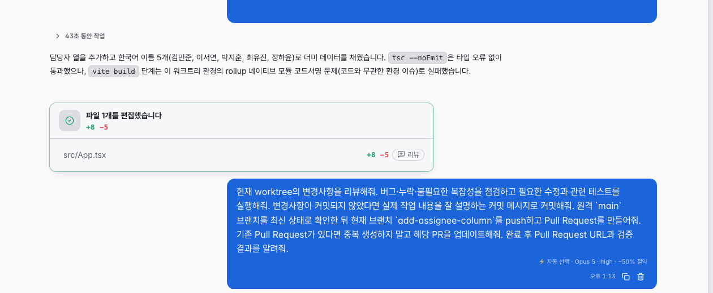</td>
</tr>
<tr>
<td width="42%" valign="middle">

### 🗂️ Agent Board — command your fleet as a kanban

Every agent session across every project on one board: **Awaiting input → Responding →
Waiting → In review → Done → PR Merged**. Responding cards stream what the agent is saying
right now. **Drag a card** to send the next instruction, request a code review or archive a
session — **Commit & PR**, **Merge PR** and **auto-fix first if CI fails** run straight from
the card. What auto-routing saved is rolled up in daily / weekly / monthly widgets.

</td>
<td>
 
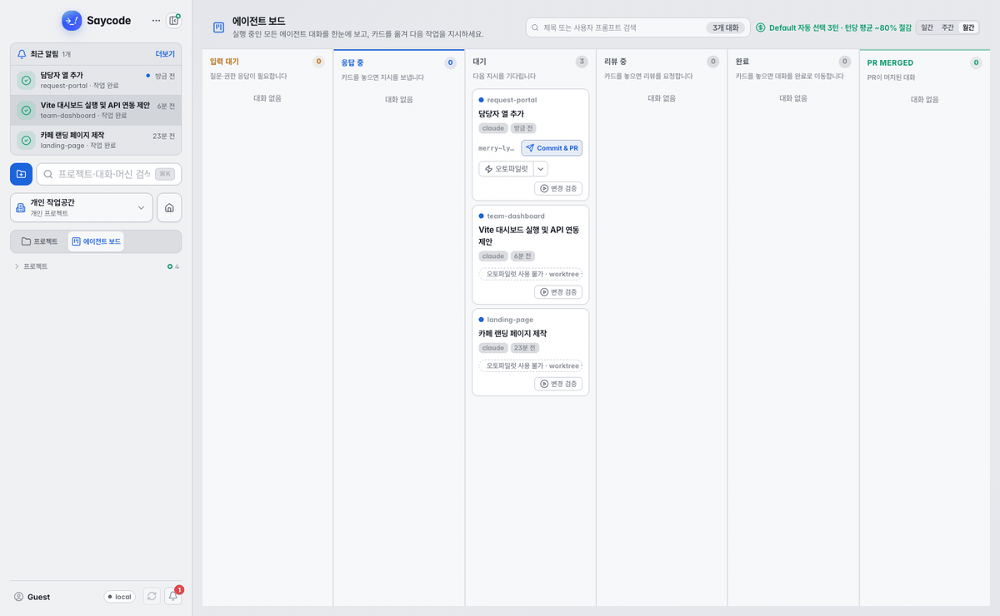
</td>
</tr>
<tr>
<td width="42%" valign="middle">

### 👀 Browser panel — pick an element on screen, fix it in chat

Split a **browser panel** next to the chat and the app running on your machine shows up as
is. Switch desktop / tablet / mobile viewport presets, then enter **element-select mode** and
click a button or card — its selector is attached to the chat. *"Make this button blue"* is
enough: the agent fixes it and HMR shows the result in the same panel.

</td>
<td>
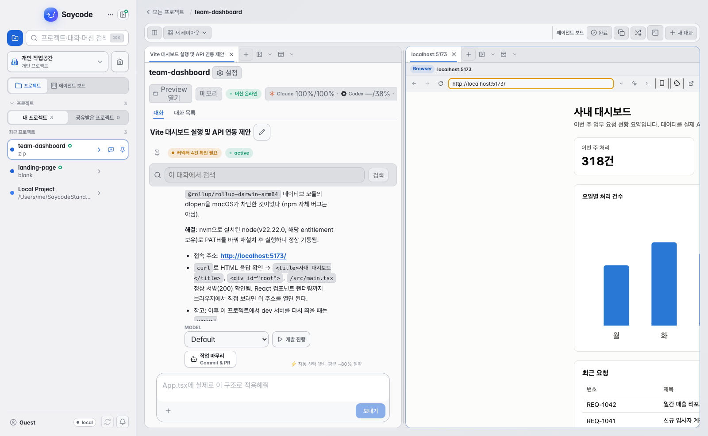 
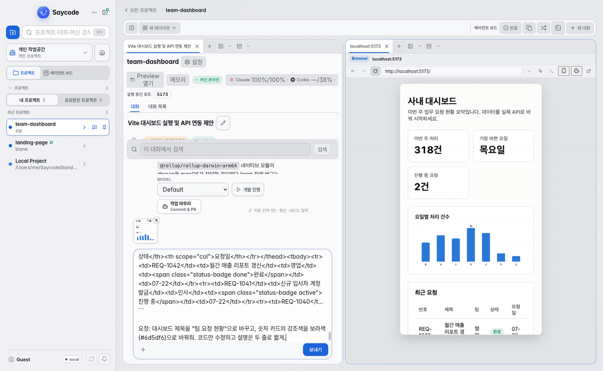
</td>
</tr>
<tr>
<td width="42%" valign="middle">

### 🧩 Shape the workspace your way

Use the **Split** button next to the tabs or shortcuts (⌘⌥T terminal, ⌘⌥C chat) to open a
new chat, terminal, browser or file pane beside any panel, and drag to resize. Watch Claude
think in one pane while Codex delivers in another. **Fan out** a task to several agents, or
**hand off** a session to a different agent.

</td>
<td>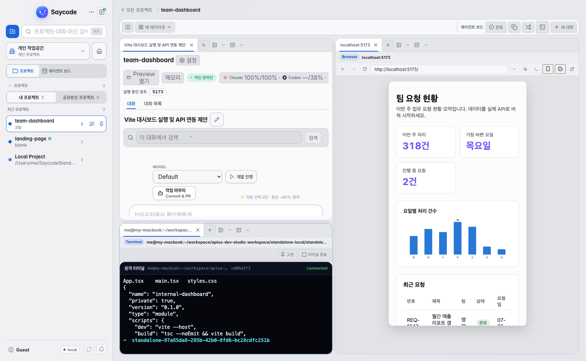</td>
</tr>
<tr>
<td width="42%" valign="middle">

### 💻 A real terminal on the remote machine

Dock a real shell under the chat on any registered machine. It's a genuine end-to-end
encrypted session on that box — run builds, tail logs, check git status — while the agent
keeps working above. Terminals survive tab switches and reconnect on their own.

</td>
<td></td>
</tr>
<tr>
<td width="42%" valign="middle">

### 🤖 Your favourite agents, one worktree per session

Choose **Claude Code (Anthropic), Codex (OpenAI), Grok (xAI) or opencode** per session,
with control over model and effort. Turn on **Worktree** when starting a conversation and
the session gets its own branch and isolated folder, so experiments never touch main — the
branch chip in the session header always shows where you are. Start a session from an
existing PR, or adopt a worktree created outside Saycode.

</td>
<td>
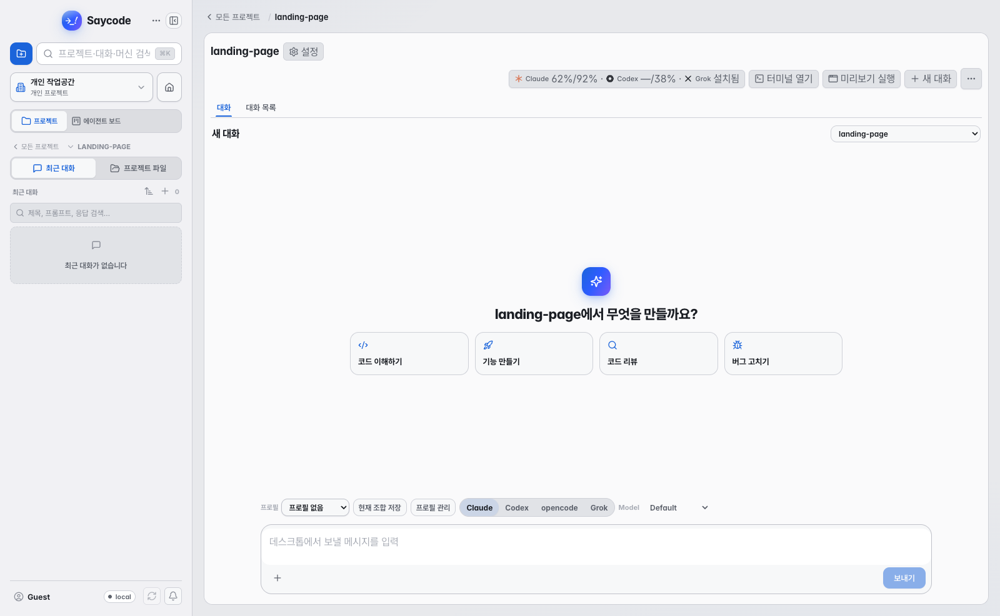 
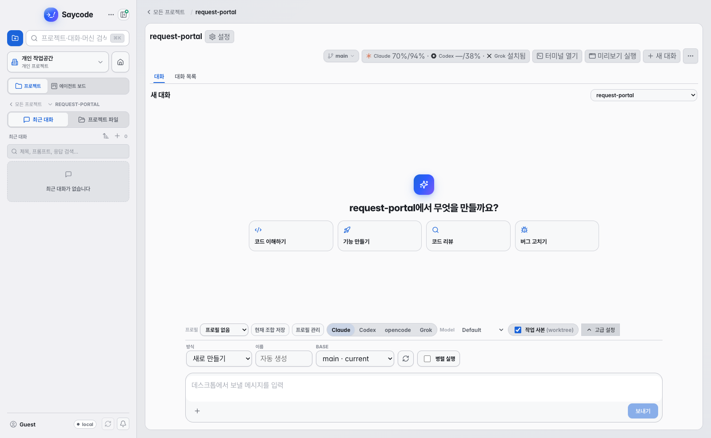
</td>
</tr>
<tr>
<td width="42%" valign="middle">

### ✅ Finish work — review first, then Commit & PR

One **Finish work** button closes a session properly. Have the current agent review its own
changes, or hand a **read-only snapshot to an independent reviewer** — a separate agent
(Claude, Codex, …) that cannot touch the code and only reports what it finds. Apply the
fixes you accept, then go straight to **Commit & PR**: review → tests → commit → push → PR
in a single turn (if the remote isn't GitHub it says so and stops after commit + push).

</td>
<td>
 
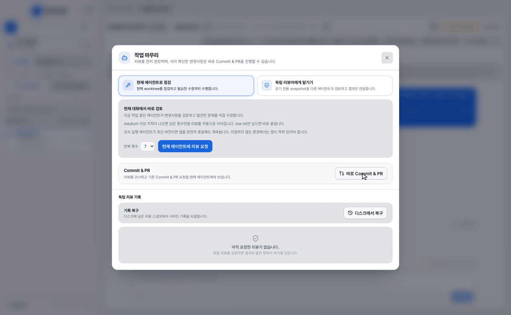
</td>
</tr>
<tr>
<td width="42%" valign="middle">

### 🔎 Full-text search across every conversation, ⌘P to jump anywhere

**⌘⇧F** searches everything you and your agents have said — titles, prompts, responses —
backed by a local SQLite FTS5 index that never leaves your machine. Narrow with
`project:web`, `role:agent`, `after:2026-07-01` or `"exact phrase"`. **⌘P Quick Open** opens
projects, conversations and files from one box; **⌘K** searches across projects,
conversations and machines.

</td>
<td>
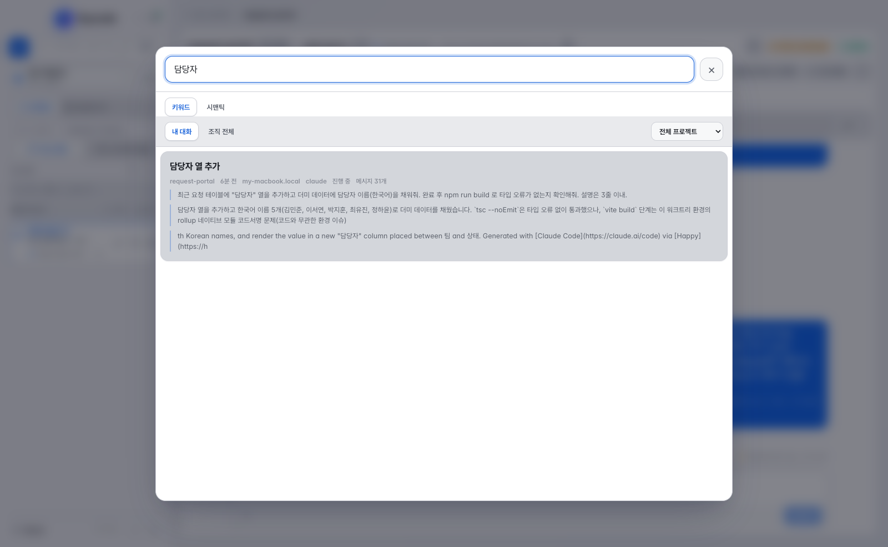 
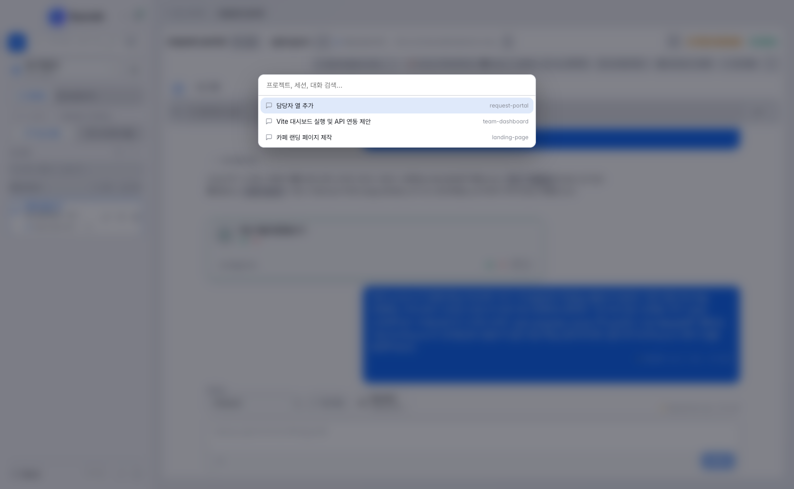
</td>
</tr>
<tr>
<td width="42%" valign="middle">

### 📊 Usage at a glance, accounts swapped in one click

Click the usage chip in the session header to see remaining **Claude · Codex · Grok** quota
per machine (5-hour / 7-day windows). Connect several Claude accounts and **switch with one
click** — when one hits its limit, work doesn't stop. Polling happens once per machine every
five minutes, so provider APIs are never hammered.

</td>
<td>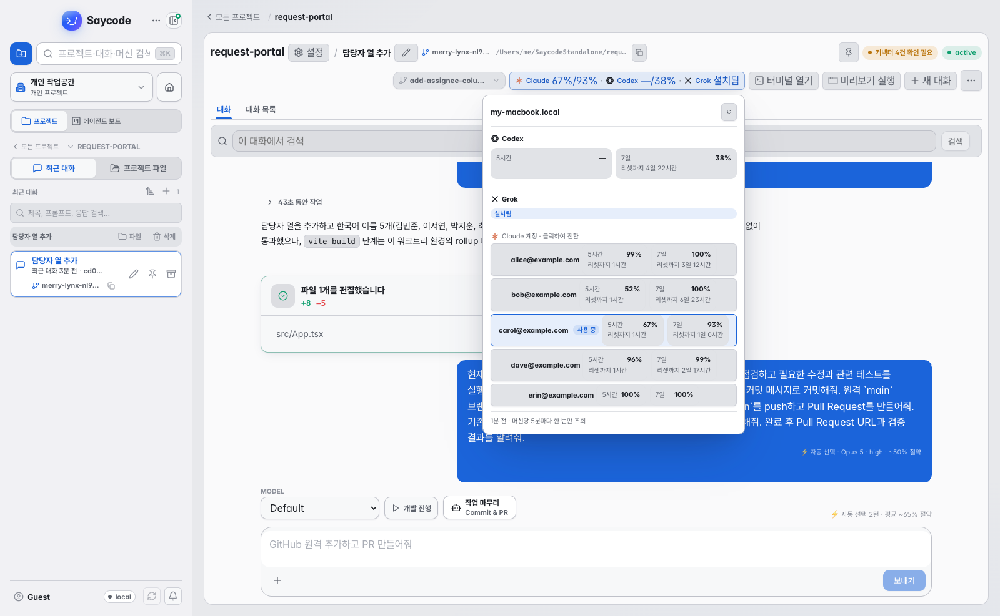</td>
</tr>
<tr>
<td width="42%" valign="middle">

### 🧠 System prompt · Memory · Extensions

**Settings → AI → System prompt** lets you toggle each Saycode default instruction (child
agent calls, internal delegation, plan-first workflow, commit credits, inline artifact
preview) and layer presets (TypeScript · Tailwind · Korean · Minimal · Full-stack) or your
own text on top. The **Memory** tab is the layer agents use to remember project context
across sessions; **Extensions** manages template packs and skills.

</td>
<td>
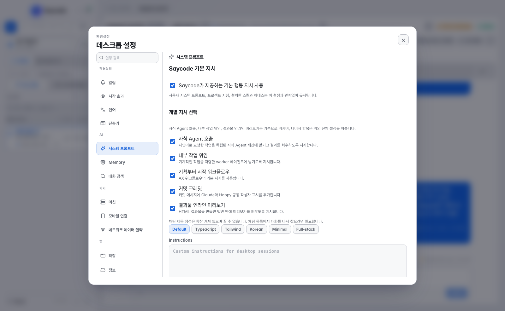 
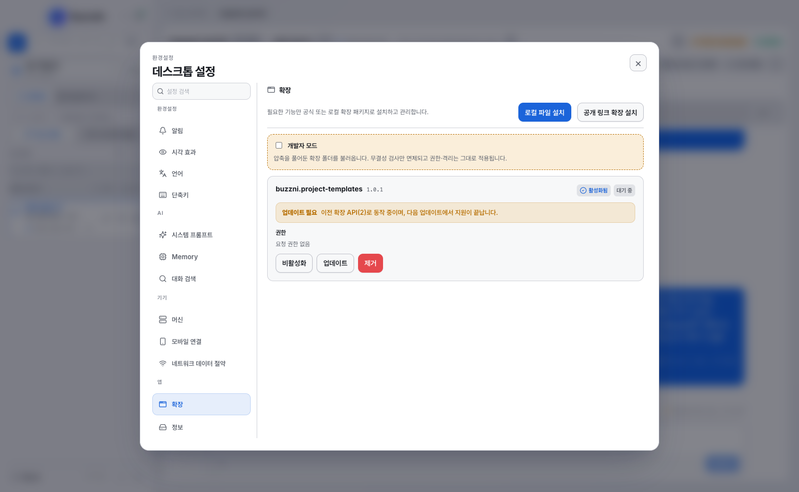
</td>
</tr>
<tr>
<td width="42%" valign="middle">

### 📱 Continues in your pocket

Scan the QR code in **Settings → Devices → Mobile** with the Saycode mobile app and the same
workspace opens on your phone — on the same network in local mode, or through a tunnel from
anywhere. Watch agent sessions live, open a remote terminal, and get a push the moment a
long task finishes.

</td>
<td></td>
</tr>
<tr>
<td width="42%" valign="middle">

### 🖥️ Register your machines — run agents where the code lives

This Mac is registered automatically on first run. Add any machine you manage — a GPU
server, a build box, a cloud VM — and hand agent work to it. In **Settings → Devices →
Machines** create a registration code, run the one-liner on the target, and it shows up
**Online** within seconds. From then on every project lets you choose where it runs.
Everything the agent reads, writes, builds and runs happens **on your infrastructure**, next
to the code and data — not in someone else's cloud.

</td>
<td>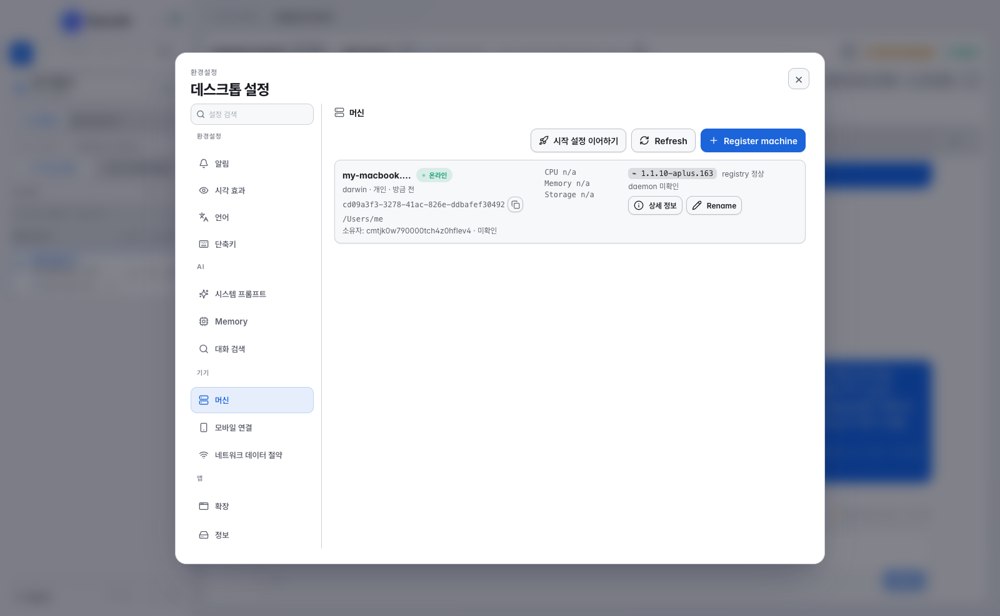</td>
</tr>
<tr>
<td width="42%" valign="middle">

### 🚀 Deploy & share in one click *(team workspace)*

Signed in with a saycode.ai account, you can deploy to an **internal URL** the whole team
can open — SSL is automatic and the same link is refreshed on every deploy. Share a project
with your team or the internal community so colleagues can browse, clone, refine and merge
changes back safely. Rendered HTML documents and reports publish to a public link.
**End users who only open deployed apps and reports don't need a seat.**

</td>
<td>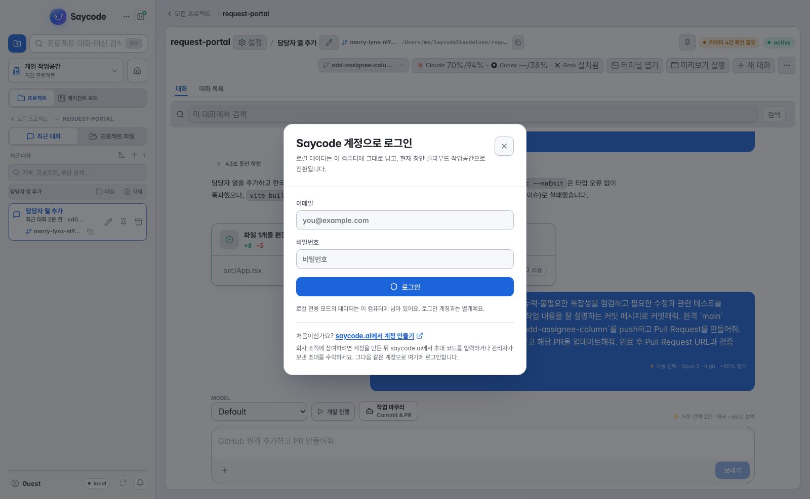</td>
</tr>
<tr>
<td width="42%" valign="middle">

### 🌙 A workspace you'll want to stay in

Aurora-glass design in Auto / Light / Dark — dense with information, calm on the eyes.
Notification centre, every shortcut rebindable, Dock badges and native completion
notifications, sounds for input requests and finished work. The details add up.

</td>
<td>
 
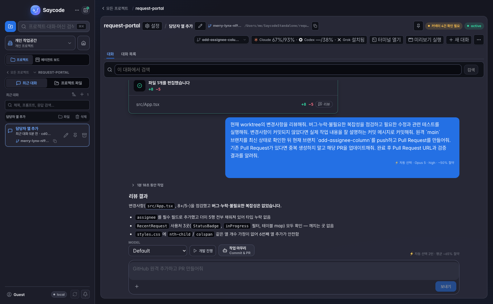
</td>
</tr>
</table>

### Also in the box

- 🔔 **Notification centre & outbound webhooks** — completion notices persist across restarts and jump to the chat; turn-completed / waiting-input / stalled events posted to your endpoint with an HMAC-SHA256 signature
- 💬 **Diff line comments** — comment on changed lines and send them to the agent as a bundled follow-up
- ⌨️ **Slash commands & attach menu** — `/` commands in the composer; drag in files, images and folders
- 🎙️ **Live voice input** — real-time transcription as you speak
- 📄 **Rich file viewer** — Markdown, HTML, PDF and DOCX rendered in-app, inline artifact previews
- 🔗 **GitHub / GitLab import & connectors** — pick repos from a list; attach Google Drive, Slack, Notion and other connectors to a session *(team workspace)*
- 🧩 **MCP servers & env-var groups** — per-project MCP connections and org-managed environment variable groups
- 🛑 **Global pause & quality gates** — hold scheduled automations, GitHub triggers and board autopilot with one switch; self-review rounds and quality gates for autonomous runs *(team workspace)*
- 🔐 **Passkey MFA** — WebAuthn passkeys or TOTP for team accounts
- 📉 **Network data saver** — heavy sync backs off automatically on tethered / metered connections
- 🔒 **Privacy by design** — chat and terminal traffic end-to-end encrypted; code and data stay on your machines
- 🏢 **Org-level control** — org/team workspaces, seat, machine, env-var and ownership management, audit log *(team workspace)*
- 🔄 **Staged auto-updates** — new versions roll out gradually, so a bad build never reaches everyone at once

---

## How it works

| | | |
|---|---|---|
| **01 · Install, ready** | **02 · Add a project** | **03 · Ask in plain words** |
| Open the DMG, pick a language; the embedded server starts and this Mac is registered as a local machine. A 3-step wizard checks CLI, AI tools and notifications. | Open a folder, pick a template, start blank, clone a Git URL or import a ZIP — choose a machine and a name. | One sentence is enough: *"Add an assignee column to the requests table and fill in dummy data"* |

| | |
|---|---|
| **04 · AI builds on your machine** — the agent reads and writes real files, runs commands and streams the whole process. Click through it in the browser panel; pick an element to fix. | **05 · Finish and ship to the team** — Finish work runs review → Commit & PR. In a team workspace one button issues an internal URL. Share, hand over, keep improving together. |

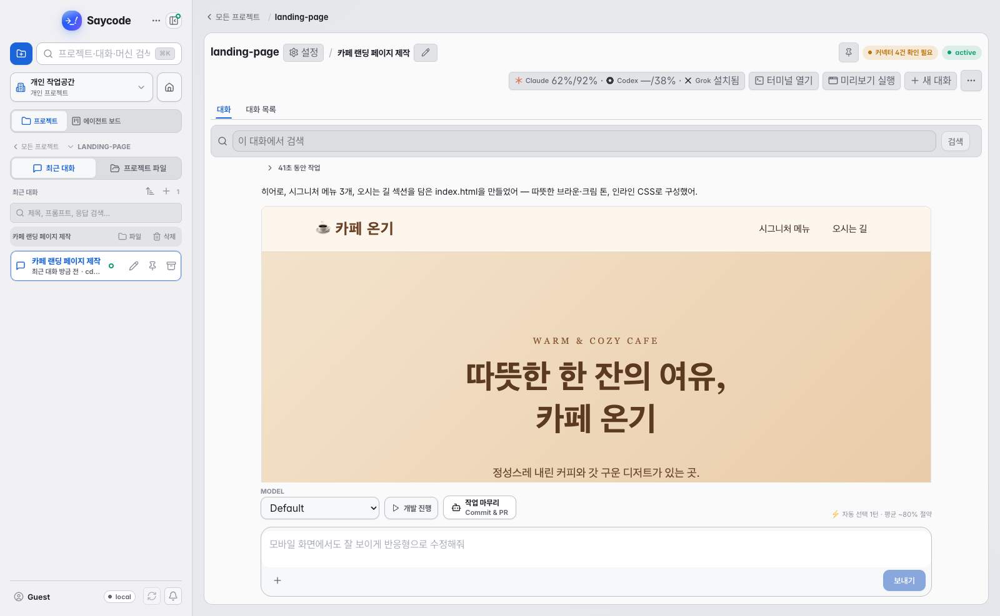

*First session — one request, and the agent edits files, runs the type-check and reports back.*

---

## Install & first run

### macOS (Apple Silicon)

1. Download the latest DMG from **[Releases](https://github.com/buzzni/saycode-desktop-releases/releases/latest)**
2. Open it and drag **Saycode** to Applications
3. Launch and pick a **language** (English · 한국어 · 中文 · 日本語)
4. That's it. Saycode starts its embedded server, registers this Mac and opens the **Guest
   local workspace** (about 10 seconds). There is no login screen — when you want team
   features, use **Guest menu → Log in** any time.

### Getting ready for your first task — the 3-step wizard

<table>
<tr>
<td width="33%">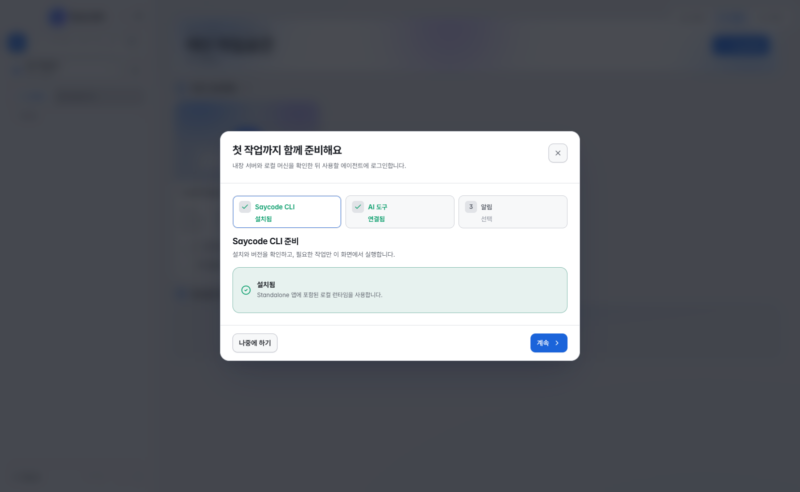</td>
<td width="33%">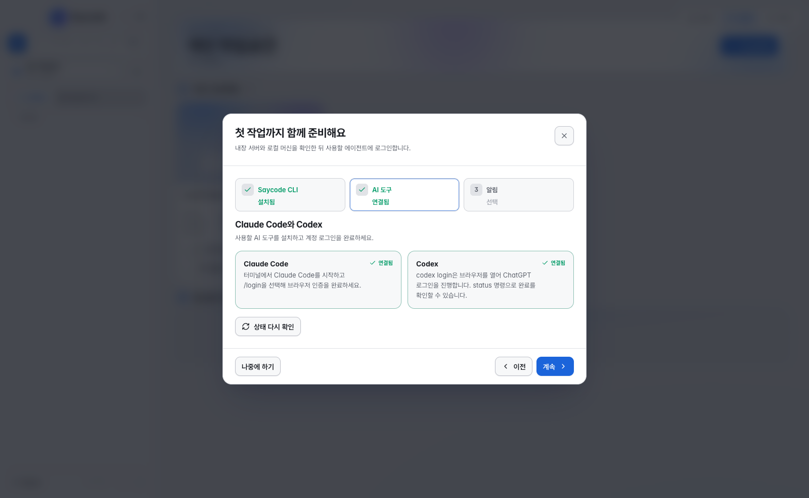</td>
<td width="33%">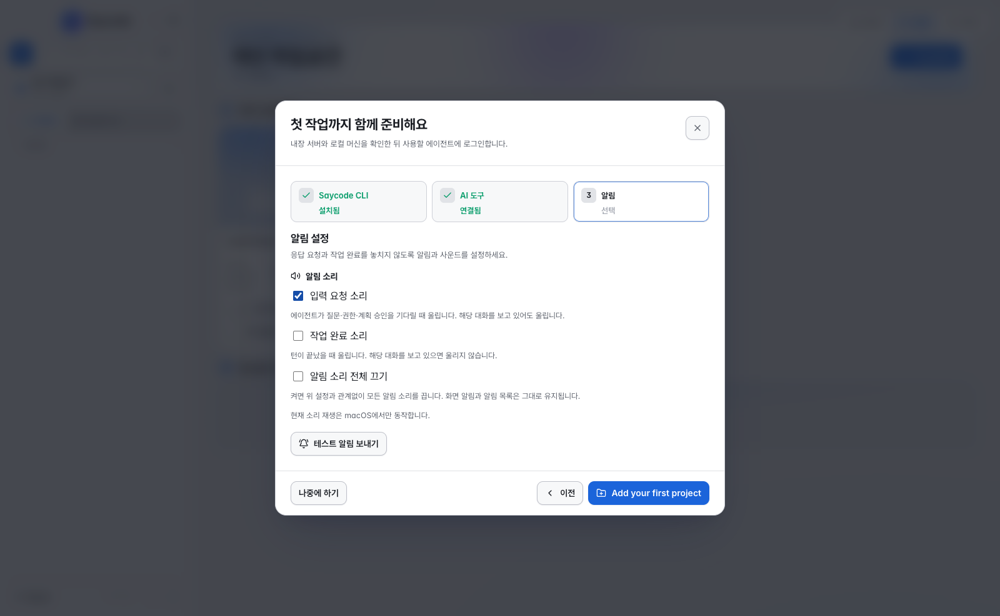</td>
</tr>
<tr>
<td valign="top"><b>① Saycode CLI</b> — checks the local runtime bundled with the app. The standalone build shows <i>Installed</i> with nothing extra to install.</td>
<td valign="top"><b>② AI tools</b> — detects Claude Code and Codex login state. If not yet logged in, run <code>claude</code> → <code>/login</code> and <code>codex login</code> in a terminal, then press <b>Check again</b>.</td>
<td valign="top"><b>③ Notifications</b> — choose input-request and task-complete sounds and press <b>Send test notification</b>. The final button leads straight into adding your first project.</td>
</tr>
</table>

Every step can be skipped with **Later**, and the wizard can be reopened any time from
**Settings → Devices → Machines → Resume setup**.

### First project, first conversation

<table>
<tr>
<td width="50%">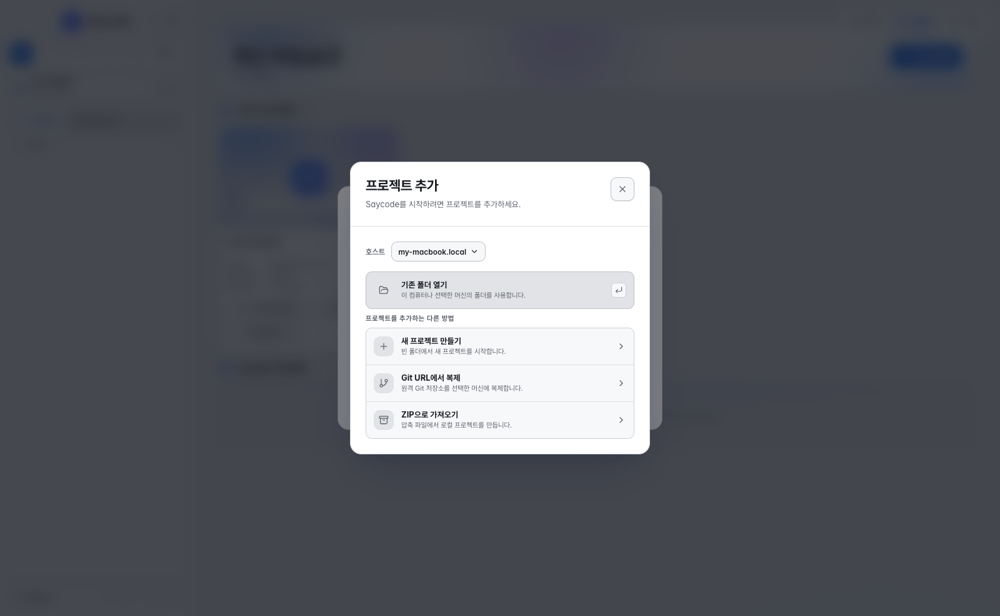</td>
<td width="50%">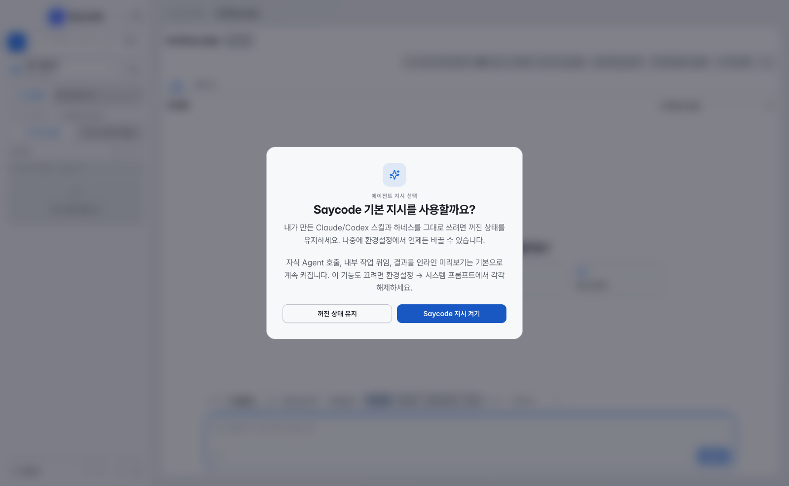</td>
</tr>
<tr>
<td valign="top">When the wizard finishes, <b>Add project</b> opens. Pick a host (machine) and <b>Open existing folder</b> — or choose New project · Clone from Git URL · Import ZIP. New projects can start from the template gallery.</td>
<td valign="top">Opening the first conversation asks whether to use <b>Saycode default instructions</b>. Keep them on and the agent follows Saycode workflows such as child-agent delegation, commit credits and inline artifact previews. Each item can be changed later in Settings.</td>
</tr>
</table>

The app is Developer ID signed and notarized, and updates itself automatically.
For every step with screenshots, see the **[User Guide](docs/GUIDE.md)**.

### Local workspace vs. team workspace

| | Guest local workspace (default) | Team workspace (saycode.ai login) |
|---|---|---|
| Requirements | None — just install | Organisation account (SSO · passkey/TOTP MFA) |
| Where data lives | Entirely on this Mac | Code & data on designated machines; metadata & audit log in the org console |
| Agents · auto model selection · Agent Board · worktrees · Finish work · browser panel · terminal · templates · search · memory | ✅ | ✅ |
| Remote machine registration · mobile connection | ✅ (mobile on the same network or via tunnel) | ✅ |
| Internal URL deployment · project sharing & hand-over · community | — | ✅ |
| Org console (seats · permissions · model policy · cost · audit log) · connectors · personal memory sync · project export | — | ✅ |

Start local, log in when you need to. Local projects stay where they are.

> **Windows / Linux / Intel Mac** — coming soon. Watch [Releases](https://github.com/buzzni/saycode-desktop-releases/releases).

---

## Adoption scenarios — you choose where to start

Three scenarios, not a sequence. Start with one or combine them.

| 💬 Chat & documents | ⚙️ Personal workflow automation | 🚀 App building & deployment |
|---|---|---|
| Meeting summaries, drafts of plans and reports, search and summarise. Only approved users and models, model limits per group, usage and cost rolled up. | Connect internal collaboration tools and document stores to automate recurring reports, request/approval flows and other repetitive work. | Business teams build their own internal tools and deploy them to an internal URL, with review and approval built in. |

**Non-developers use it from week one** — business support (minutes, monthly report drafts,
policy Q&A), sales & marketing (proposal drafts, VOC classification), commerce operations
(product / price / inventory check reports), HR & general affairs (policy guidance,
request/approval flows, onboarding material). Start with whatever is done by hand, in
spreadsheets or over chat today. Results are shared as links, so review ends without
attachments flying around.

---

## Saycode for teams

### A free one-month PoC — see the numbers first

We measure usage, cost, policy and audit for the scenario you choose and write the results
report with you. **The PoC includes every Premium feature.**

| Week 1 · Baseline | Weeks 2–3 · Real use | Week 4 · Report |
|---|---|---|
| Measure current AI usage and cost baseline, pick the target team and PoC scenario | Apply to real work, measure usage and cost, validate policy and permission settings | Summarise activation, cost and policy results; produce a rollout quote |

The PoC month is free. Model usage during the PoC follows your own contracts.

### Pricing — seats only for the people who build

Saycode does not resell AI models. Connect the AI contracts you already have and pay a seat
fee only for management and the execution environment.

| Plan | Price | For | Includes |
|---|---|---|---|
| **Office** | $10 / user · month | Everyone — chat & documents | Chat and document work · viewing, reviewing and approving results · usage dashboard |
| **Premium** ⭐ | $40 / user · month | People who build and deploy | Everything in Office + app building & agent execution · internal URL deployment · SSO |
| **Volume** | Negotiated | Company-wide rollout, special requirements | Volume pricing · on-premise / air-gapped installation · dedicated support & SLA |

- **0% markup on AI models** — connect your existing Anthropic, OpenAI, Azure, Bedrock or Vertex contracts. Monthly total = seats + external AI subscriptions + API usage.
- **End users who only open deployed apps and reports don't need a seat.** Seats are named; no account sharing.
- Budget caps and threshold alerts, with automatic stop when a cap is exceeded.
- No setup fee during the current launch period.

- 🌐 Website: **[saycode.ai](https://saycode.ai)** · Deck: **[saycodepoc.apps.saycode.ai](https://saycodepoc.apps.saycode.ai/)**
- 💼 Sales: [soo@buzzni.com](mailto:soo@buzzni.com)
- 🛠 Technical: [ryan@buzzni.com](mailto:ryan@buzzni.com)
- 🤝 Support: [ernie@buzzni.com](mailto:ernie@buzzni.com)

---

## Open-source notice

Saycode Desktop is built on open source. It bundles or uses the following projects (licences
noted); full licence texts ship inside the packaged app:

| Project | Used for | Licence |
|---|---|---|
| [Happy](https://github.com/slopus/happy) (via the [buzzni fork](https://github.com/buzzni/happy)) | Encrypted agent-session relay engine bundled in standalone mode (`happy-cli` / `happy-server`) | MIT |
| [Electron](https://www.electronjs.org/) | Desktop app shell | MIT |
| [React](https://react.dev/) | UI framework | MIT |
| [xterm.js](https://xtermjs.org/) (+ fit / web-links / WebGL addons) | Remote terminal rendering | MIT |
| [socket.io-client](https://socket.io/) | Real-time transport | MIT |
| [react-markdown](https://github.com/remarkjs/react-markdown) + [remark-gfm](https://github.com/remarkjs/remark-gfm) | Chat Markdown rendering | MIT |
| [electron-updater](https://www.electron.build/) | In-app auto-updates | MIT |
| [buffer](https://github.com/feross/buffer) | Binary utilities | MIT |
| [lucide-react](https://lucide.dev/) | Icon set | ISC |
| [TweetNaCl.js](https://tweetnacl.js.org/) | End-to-end encryption primitives | Unlicense (public domain) |

Special thanks to Kirill Dubovitskiy and the contributors of
**[slopus/happy](https://github.com/slopus/happy)** (MIT), the foundation of Saycode's
encrypted session-sync architecture.

---

**© 2026 [Buzzni](https://buzzni.com) · [saycode.ai](https://saycode.ai)**

*So that anyone in the company can build, just by saying it.*

