

# Saycode Desktop

### Say it. Watch it become software.

**The Enterprise Vibe Coding & Delivery Platform** — describe what you need in plain
language, AI agents build it and preview it live — and your company deploys, shares, and owns it.

**English** | [한국어](README.ko.md) | [中文](README.zh.md) | [日本語](README.ja.md)

 

### [⬇️ Download for macOS (Apple Silicon)](https://github.com/buzzni/saycode-desktop-releases/releases/latest/download/saycode-desktop-mac-arm64.dmg)

*Signed & notarized DMG · auto-updates built in*

**New here?** Follow the **[📘 step-by-step User Guide](docs/GUIDE.md)** ([한국어](docs/GUIDE.ko.md)) — from first launch to shipping with a whole agent fleet.

 

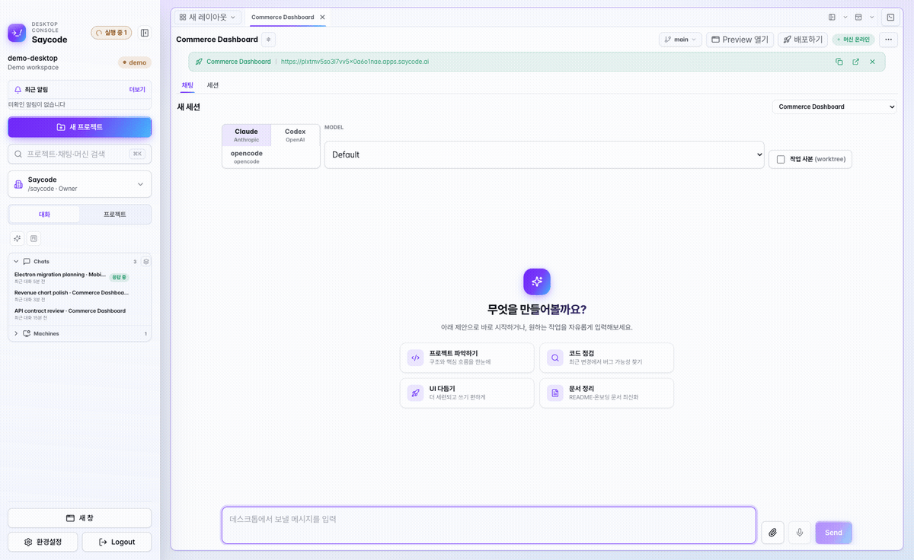

*One sentence in, a working app out — a real, unedited session.*

---

## Why Saycode?

Your team already uses ChatGPT and Claude to move faster — but everything they build ends up
scattered across personal machines, invisible to the company. Saycode turns individual
vibe-coding into a **system your whole company can control, share, and build on**:

| | Typical vibe-coding tools | **Saycode** |
|---|---|---|
| Internal deployment | External cloud, manual work | **One-click deploy to an internal URL (auto SSL)** |
| Team collaboration | One person, one account | **Teammates take over, edit, and review together** |
| Sharing & handover | Stranded on personal PCs | **Managed by the company, reused by every team** |
| Code & data | Leaves the building | **Stays in-house, end-to-end encrypted** |
| AI token cost | Every request on the priciest model | **Difficulty-aware auto-routing cuts model cost up to ~90% per turn** |
| Running many agents | One chat at a time, alt-tabbing | **A Kanban Agent Board that drives a whole fleet at once** |
| Who can build | Developers only | **Anyone who can describe what they want** |

Building is table stakes. **What happens after — deploy, share, hand over — is where Saycode is different.**

---

## How is this different from an agent IDE (Orca, etc.)?

Tools like [Orca](https://www.onorca.dev) are **agent IDEs**, focused on the developer's
coding loop: running many agents in parallel across worktrees, diffs, reviews, deep editor
integration. They do that very well — several offer org-level rollout and governance too —
and if that loop is your problem, use one.

Saycode is aimed at a different question — the one that starts *after* the agent finishes:

> **Agent IDEs help developers run more agents.
> Saycode helps companies own and operate what those agents build.**

| | Agent IDEs (Orca, etc.) | **Saycode** |
|---|---|---|
| Primary focus | The developer's coding loop | **The company's delivery loop** — build → deploy → share → hand over |
| Unit of work | Repo · worktree · agent session | **Org · team · project · machine · deployment** |
| "Deployment" means | Rolling the agent tooling out to your org, safely | **Shipping what was built to an internal URL your team opens** |
| Typical finish line | Reviewed changes merged to Git | **A running internal service, shared and transferable** |
| AI model cost | Usage tracking, account switching | **Difficulty-aware auto-routing + sub-agent delegation — orgs have cut total spend by ~50%** |
| Reaches | Mostly developers | **Everyone in the company** — developers, PMs, ops |

The two overlap on parallel agents, worktrees, remote execution, and local-first security —
so those aren't the reason to pick one. What Saycode adds is an **operations layer** on top:

- **Company ownership** — projects, sessions, planning docs, and machines belong to the org,
  not to whoever's laptop they were built on. When someone leaves or moves teams, their work
  is searchable and transferable, not stranded.
- **Internal deployment** — one click ships to a stable internal URL (auto SSL). The output
  isn't a branch waiting for review; it's a running tool your team opens today.
- **Sharing & handover** — teammates browse, clone, refine, and merge back. Another team's
  finished project is a starting point, not something to rebuild.
- **Cost operations** — requests are auto-routed to the cheapest capable model (escalating
  only when a session gets stuck), mechanical subtasks are delegated to sub-agents on
  lighter tiers, and it all runs on centrally managed org machines. Organizations working
  this way have cut their overall AI token spend by close to 50% — and a per-message badge
  shows why each model was chosen. You manage the company's AI spend, not just observe it.

**When to use which:** if your goal is the deepest possible parallel-agent coding experience
in your own repos, an agent IDE is a fine choice — and nothing stops you from using both. If
your goal is for AI-built software to become **company infrastructure** — deployed
internally, shared across teams, survivable through handovers, with costs under control —
that's what Saycode is for.

---

## Features

<table>
<tr>
<td width="42%" valign="middle">

### 🖥️ Register your own machines — run agents where your code lives

This is the heart of Saycode. Register any machine you control — your laptop, a GPU box,
a build server, a cloud VM — and hand agent work to it. Open **Settings → Machines →
Register machine**, click **Generate code**, and run the one-line command it gives you on
the target machine. Seconds later it shows up **online**, and every new project can pick
which machine it runs on. Your agents read, write, build, and run **on your infrastructure**,
next to your code and data — not on someone else's cloud.

</td>
<td>
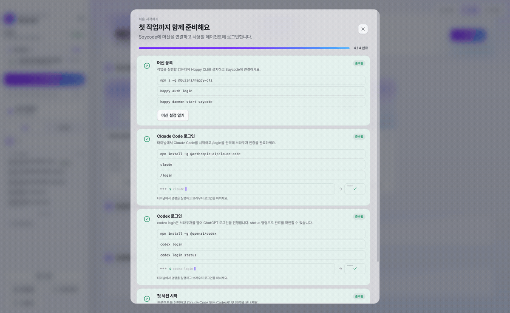 
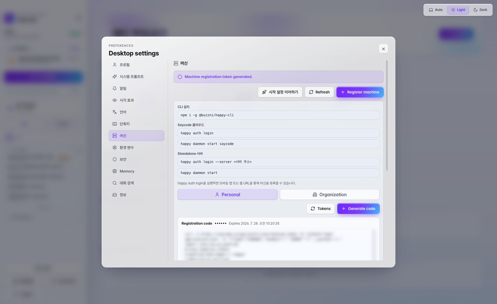
The generated one-line command — run it on the target machine and it comes online. (Secret + token blurred for this README.)
</td>
</tr>
<tr>
<td width="42%" valign="middle">

### 🔌 Standalone mode — fully local, zero setup

No account? No problem. One click on **Standalone (local-only) mode** at the login screen
and Saycode boots its **own embedded server**, registers your machine, and drops you into a
complete workspace — in seconds. The relay, the database, and every byte of your data live
on your Mac; nothing touches the internet. Perfect for security-sensitive teams, air-gapped
environments, or simply test-driving everything Saycode can do within a minute of installing
it. When you're ready for team features, just log in and keep going.

</td>
<td>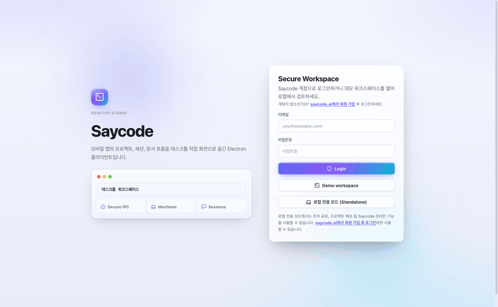</td>
</tr>
<tr>
<td width="42%" valign="middle">

### 🗣️ From one sentence to a working app

Type (or speak) what you want in plain language. The agent picks a direction, writes real
code on a real machine, and narrates every step — file edits, terminal commands, test runs —
as streaming, inspectable cards. Watch your idea become software in minutes, not sprints.

</td>
<td></td>
</tr>
<tr>
<td width="42%" valign="middle">

### 💸 Auto model routing — up to ~90% cheaper per request

Leave the model on **Default** and Saycode picks the right brain for every single turn.
A typo fix routes to a light model (**~90% saved**), routine work to a mid-tier one
(**~80% saved**), genuinely hard problems to a top model — and only when a session is
truly stuck does it escalate to the most powerful (and most expensive) tier. Every
message carries a transparency badge — *"⚡ Auto · Haiku 4.5 · ~90% saved"* — and the
session header totals it up, so you always know what you saved and why a model was chosen.
It compounds at the company level, too: delegate mechanical subtasks to sub-agents on
lighter tiers and manage usage centrally across shared org machines, and organizations
have cut their overall AI token bill by close to 50%.

</td>
<td></td>
</tr>
<tr>
<td width="42%" valign="middle">

### 🗂️ Agent Board — run your agent fleet like a Kanban team

Every agent session across every project, on one board: **Waiting for input → Responding
→ Idle → In review → Done → PR merged**. Streaming cards show what each agent is saying
right now. **Drag a card** to send the next instruction, request a code review, or
archive the session — and fire **Commit & PR** or **merge the PR** straight from a card.
A savings widget tracks what auto-routing saved you by day, week, or month.

</td>
<td>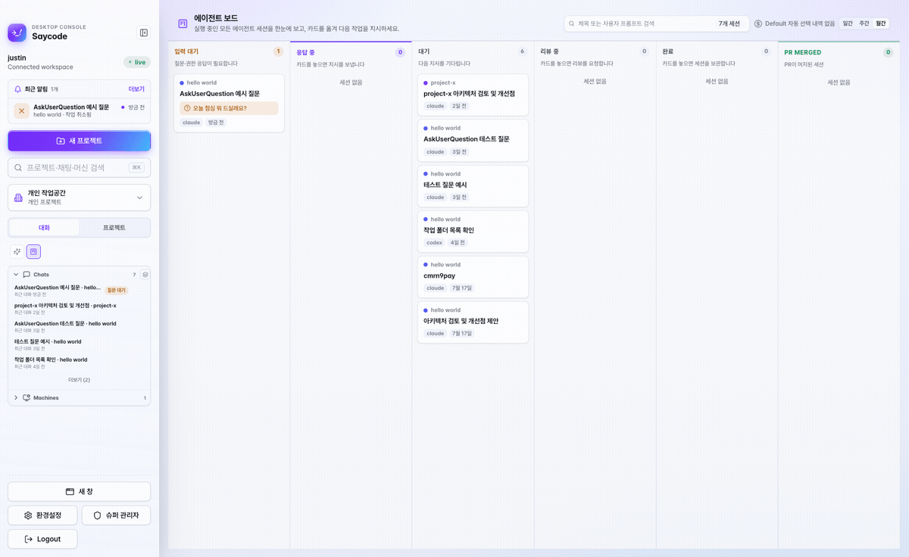</td>
</tr>
<tr>
<td width="42%" valign="middle">

### 👀 Live preview, right next to the chat

Click **Run preview** and your app opens in a sidecar panel — running on the project's
machine, not a mock. Keep chatting on the left, click around your real product on the
right. When the agent changes code, you see it immediately.

</td>
<td></td>
</tr>
<tr>
<td width="42%" valign="middle">

### ⚡ A new project in seconds

Blank, Git-cloned, or an existing folder — pick a machine, name it, done. Every project
carries its own chat sessions, planning docs, preview, environment variables, and agent
instructions, so nothing lives in someone's head.

</td>
<td>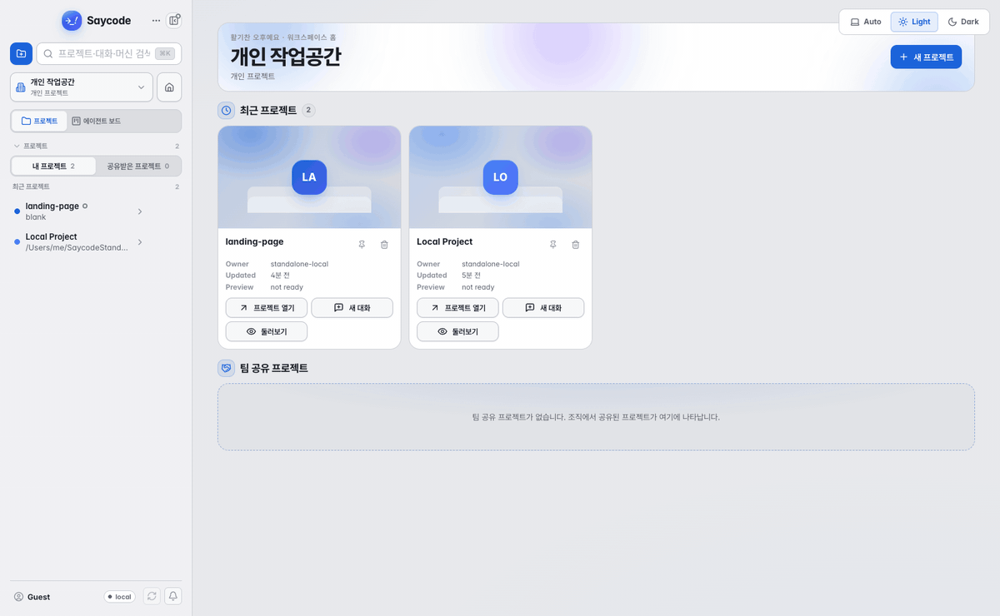</td>
</tr>
<tr>
<td width="42%" valign="middle">

### 🧩 Run a whole fleet of agents

Right-click any tab to split off a new chat or terminal pane, then drag to resize — the
workspace rearranges itself as you go. Watch a Claude session think in one pane while a
Codex session ships in another. Fan a task out across agents and hit **Open All** to lay
every session out in a grid at once. The sidebar tracks every running agent, live.

</td>
<td>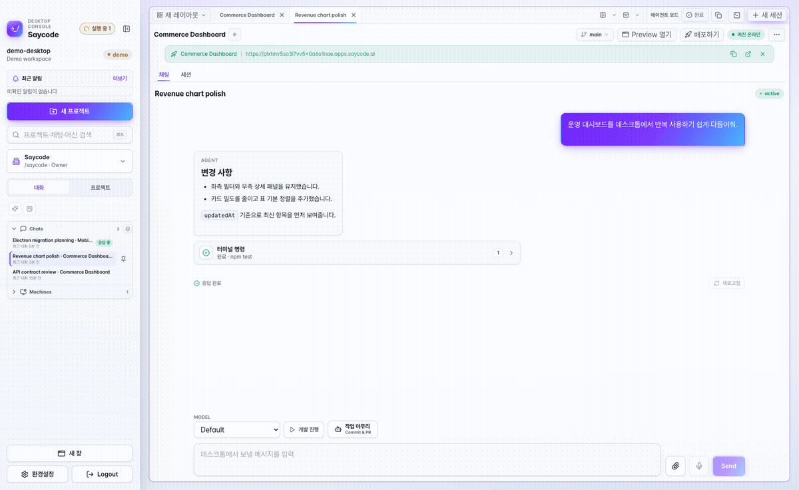</td>
</tr>
<tr>
<td width="42%" valign="middle">

### 💻 A real terminal on the remote machine

Open a live shell on any registered machine, docked right under the chat. It's a genuine
end-to-end encrypted session on that box — run builds, tail logs, poke around — while the
agent keeps working above it. Terminals survive tab switches and reconnect on their own.

</td>
<td>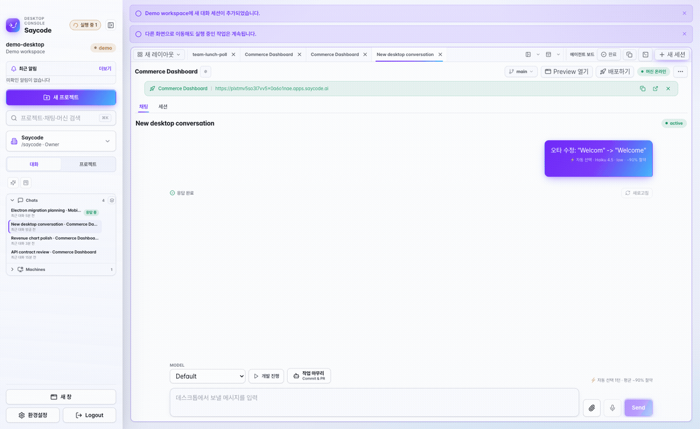</td>
</tr>
<tr>
<td width="42%" valign="middle">

### 🤖 Bring your favorite agent

**Claude (Anthropic), Codex (OpenAI), and opencode** — first-class, switchable per
session, with model and effort control. Claude sessions auto-route: easy turns get
quietly delegated to a cheaper worker model (the **⚡ auto-route badge** shows what you
saved), so you're not paying frontier prices for every message. Give a session its own
isolated **git worktree** so experiments never trample main.

</td>
<td>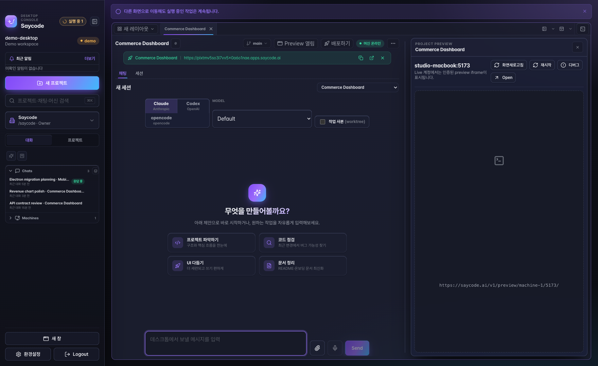</td>
</tr>
<tr>
<td width="42%" valign="middle">

### ✅ Finish work properly — review first, then Commit & PR

One **Work completion** button wraps up a session the right way. Have the current agent
review its own changes, or hand a **read-only snapshot to an independent reviewer** —
another agent (Claude, Codex, and more) that only reports findings and can't touch your
code. Apply the fixes you accept, then continue straight to **Commit & PR**. Review
history and findings stay attached to the session.

</td>
<td></td>
</tr>
<tr>
<td width="42%" valign="middle">

### 🔎 Full-text search across every conversation

Press **⌘⇧F** and search everything you and your agents ever said — titles, prompts,
and replies — powered by a local SQLite FTS5 index that never leaves your machine.
Scope it to *My conversations* or the *whole organization*, and narrow with filters
like `project:web`, `role:agent`, `after:2026-07-01`, or `"exact phrase"`.

</td>
<td>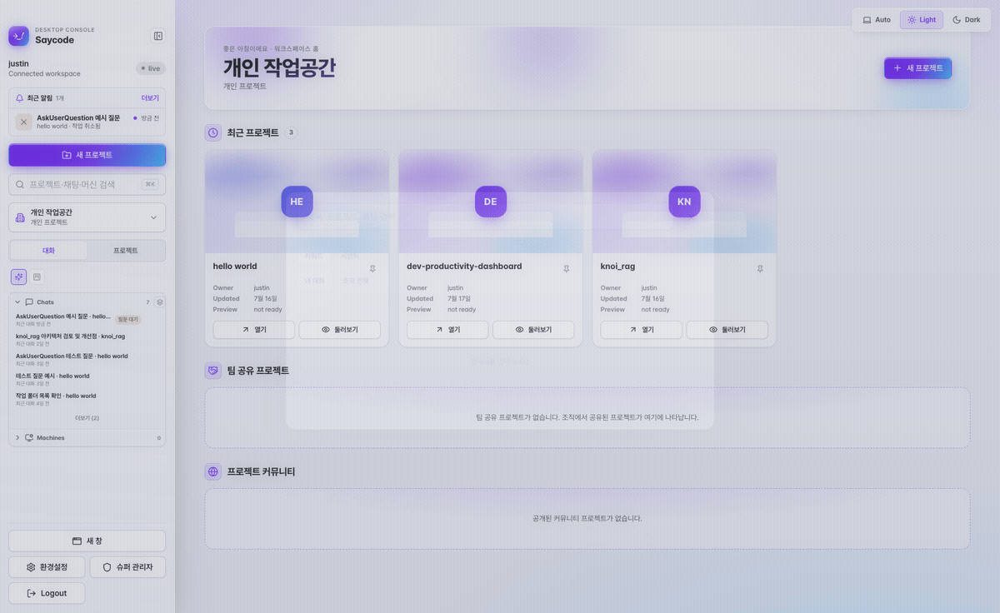</td>
</tr>
<tr>
<td width="42%" valign="middle">

### 🚀 Deploy and share in one click

Ship to an internal URL your whole team can open — SSL handled, same link updated on
every deploy. Share projects to your team or the company community; teammates can browse,
clone, refine, and safely merge changes back.

</td>
<td>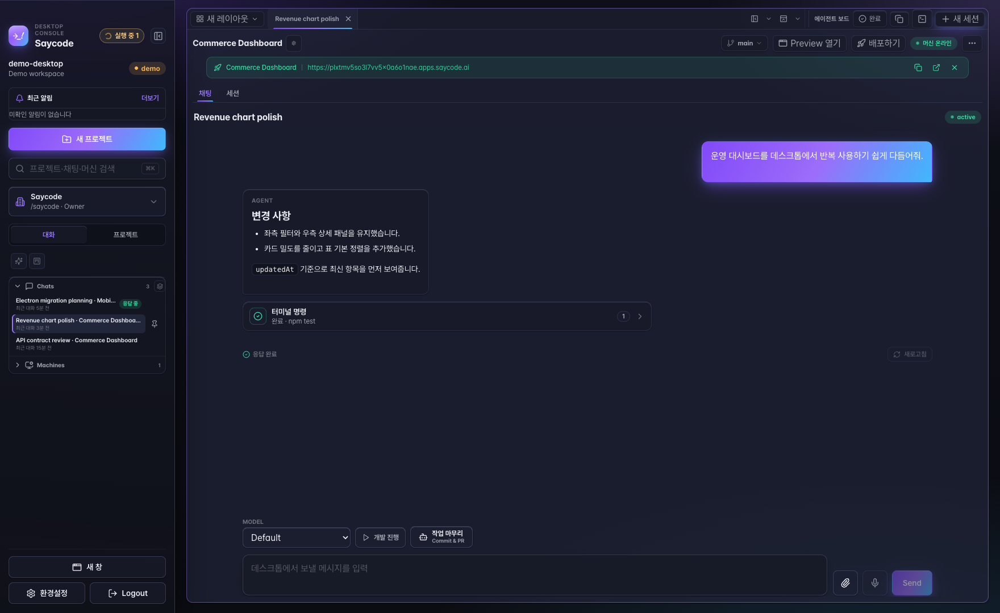</td>
</tr>
<tr>
<td width="42%" valign="middle">

### 📱 Take it with you

The Saycode mobile app keeps the same workspace in your pocket: watch agent sessions
stream in real time, open a remote terminal, check previews, and get a push the moment a
long run finishes.

</td>
<td></td>
</tr>
<tr>
<td width="42%" valign="middle">

### 🌙 A workspace you'll want to live in

Aurora-glass design with Auto / Light / Dark themes, information-dense but calm. Voice
input, ⌘K search across chats, projects, and machines, native completion notifications
with Dock badges — the details add up.

</td>
<td>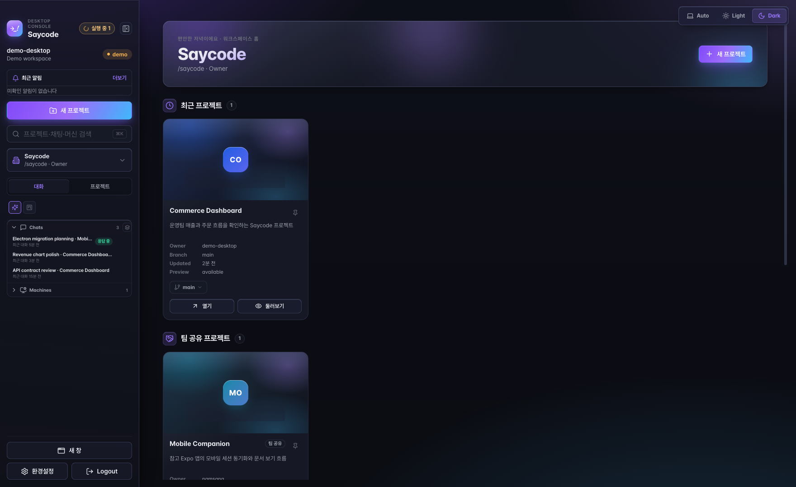</td>
</tr>
</table>

### And more

- 🧭 **Guided first-run onboarding** — a checklist that verifies the embedded server, detects your Claude/Codex sign-ins, and walks you to your first session
- 🔔 **Notification center** — completion notices survive restarts, unread/read tabs, click to jump straight into the chat that finished
- 📊 **AI usage dashboard** — remaining Claude/Codex quota (5-hour & 7-day windows) per machine, with one-click Claude account switching
- ⌨️ **Custom shortcuts & one-click splits** — rebind every key; split a terminal (⌘⌥T) or another chat (⌘⌥C) next to any panel, or right-click a tab
- 🎙️ **Live voice input & attachments** — realtime speech-to-text in the composer, drag in files and images
- 📄 **Rich file viewer** — markdown, HTML, PDF, and DOCX render right in the app
- 🔗 **GitHub / GitLab import** — connect an account and pick a repository from a list when creating a project
- 🧩 **MCP servers & env-var groups** — per-project MCP connections and org-managed environment variable groups
- 🔒 **Private by design** — chat and terminal traffic is end-to-end encrypted; code and data stay on your machines
- 🌐 **Personal & org machines** — register machines under your own account or share them across your organization
- 🧠 **Memory layer** — agents remember project context across sessions
- 🏢 **Org-grade control** — org/team workspaces, machine registry, environment variables, audit-friendly ownership
- 📱 **Mobile push** — get notified on your phone when desktop runs finish

---

## How it works

| | | |
|---|---|---|
| **01 · Register a machine** | **02 · Say it** | **03 · Agents build on your machine** |
| Run the generated one-line command on your laptop, GPU box, or server — it comes online in seconds. | One sentence in plain language: *"Build a back-office for purchase requests."* | AI agents read and write real files and run commands **on the machine you chose**, streaming every step. |

| | |
|---|---|
| **04 · Preview instantly** — the live app opens right next to the chat, click through it as it evolves. | **05 · Ship it to the team** — one click deploys to an internal URL; share, hand over, and iterate together. |

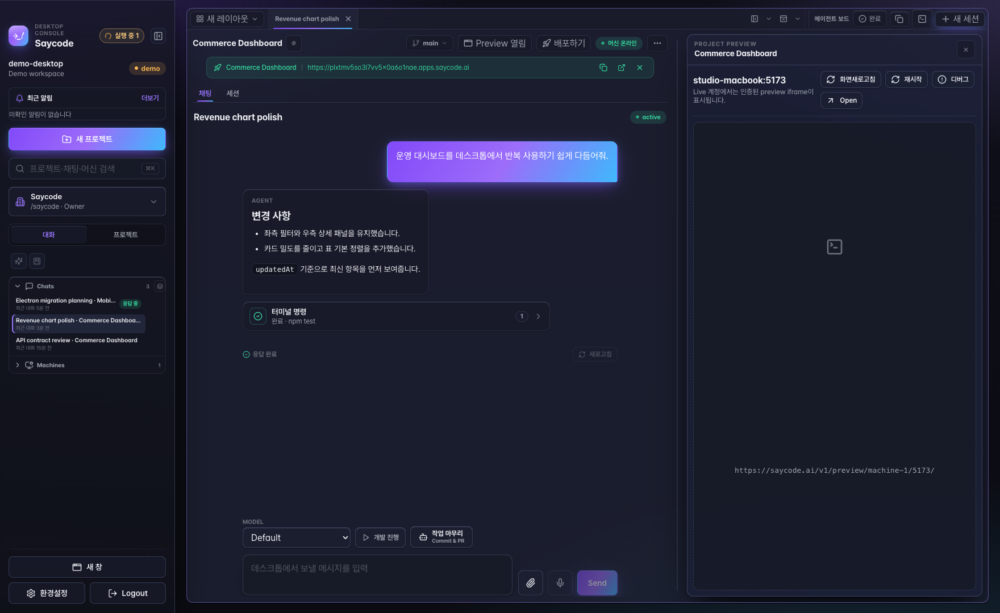

*The agent works on the left — your real app runs on the right.*

---

## Install

### macOS (Apple Silicon)

1. Download the latest DMG from **[Releases](https://github.com/buzzni/saycode-desktop-releases/releases/latest)**
2. Open the DMG and drag **Saycode** into Applications
3. Launch, pick your language, and choose how to start:
   - **Log in** with your saycode.ai account (team workspace)
   - **Demo workspace** — explore instantly, no account needed
   - **Standalone (local-only) mode** — a fully local setup with an embedded server
4. A **first-run checklist** verifies your setup (server, Claude/Codex sign-in) and takes you to your first session.

The app is Developer-ID signed, notarized, and updates itself in place.
For a full walkthrough with screenshots of every step, see the **[User Guide](docs/GUIDE.md)**.

> **Windows / Linux / Intel Mac** — not available yet. Watch [Releases](https://github.com/buzzni/saycode-desktop-releases/releases) for platform updates.

---

## Saycode for teams

Saycode is built for companies that want vibe coding **with** control — permissions and
ownership at the organization level, registered execution machines, internal-only
deployment, and reviewable collaboration.

| Plan | For | |
|---|---|---|
| **Free PoC** | Validate before you adopt — sample project support included | [Contact us](mailto:soo@buzzni.com) |
| **Enterprise** | Team collaboration, on-prem install, org/audit/deploy controls | [Contact us](mailto:soo@buzzni.com) |

- 🌐 Website: **[saycode.ai](https://saycode.ai)**
- 💼 Sales: [soo@buzzni.com](mailto:soo@buzzni.com)
- 🛠 Technical: [ryan@buzzni.com](mailto:ryan@buzzni.com)
- 🤝 Support: [ernie@buzzni.com](mailto:ernie@buzzni.com)

---

## Open-source acknowledgements

Saycode Desktop is proudly built on open source. It bundles and gratefully uses the
following projects (licenses noted; full license texts ship inside the packaged app):

| Project | Use | License |
|---|---|---|
| [Happy](https://github.com/slopus/happy) (via the [buzzni fork](https://github.com/buzzni/happy)) | Encrypted agent-session relay engine (`happy-cli` / `happy-server`) bundled for standalone mode | MIT |
| [Electron](https://www.electronjs.org/) | Desktop application shell | MIT |
| [React](https://react.dev/) | UI framework | MIT |
| [xterm.js](https://xtermjs.org/) (+ fit / web-links / WebGL addons) | Remote terminal rendering | MIT |
| [socket.io-client](https://socket.io/) | Realtime transport | MIT |
| [react-markdown](https://github.com/remarkjs/react-markdown) + [remark-gfm](https://github.com/remarkjs/remark-gfm) | Chat markdown rendering | MIT |
| [electron-updater](https://www.electron.build/) | In-app auto-updates | MIT |
| [buffer](https://github.com/feross/buffer) | Binary utilities | MIT |
| [lucide-react](https://lucide.dev/) | Icon set | ISC |
| [TweetNaCl.js](https://tweetnacl.js.org/) | End-to-end encryption primitives | Unlicense (public domain) |

Special thanks to **[slopus/happy](https://github.com/slopus/happy)** (MIT) by Kirill
Dubovitskiy and contributors — the open-source foundation of Saycode's encrypted
session-sync architecture.

---

**© 2026 [Buzzni](https://buzzni.com) · [saycode.ai](https://saycode.ai)**

*Built so that anyone in your company can say it — and ship it.*

