

# Saycode Desktop

### 说出来，就变成软件。

**统一管理公司内所有 AI 订阅与 API 的运营层** ——
团队照常使用已经熟悉的最新模型（Claude · Codex · Grok · opencode），
账号、权限、模型选择、成本、部署则由公司在同一屏幕上统一管理。
**集中管理，成本减半。**

[English](README.md) | [한국어](README.ko.md) | **中文** | [日本語](README.ja.md)

 

### [⬇️ 下载 macOS 版 (Apple Silicon)](https://github.com/buzzni/saycode-desktop-releases/releases/download/v0.1.51/Saycode-0.1.51-arm64.dmg)

*已签名并公证的 DMG · 内置自动更新 · 无需账号即可开始*

**第一次使用？** 跟着**[📘 分步用户指南](docs/GUIDE.md)**（[한국어](docs/GUIDE.ko.md)）操作 —
从首次启动到指挥整支智能体舰队。

 

https://github.com/user-attachments/assets/9eea6cbb-bf4d-4d10-a86d-dc4011a8d9dc

*🔊 请打开声音 —— 用真实 v0.1.50 画面在 Blender 中制作的 92 秒介绍视频（英文字幕·背景音乐） · [下载 MP4](docs/assets/saycode-intro-en.mp4) · [字幕 SRT](docs/assets/saycode-intro-en.srt)*

<!-- release-notes:start -->
## 新功能与变更

- [最新发布说明](docs/releases/v0.1.41.ko.md)（韩文）
- [完整发布记录](docs/releases/README.ko.md)（韩文）
<!-- release-notes:end -->

---

## 30 秒速览

| 🗣️ **一句话就能变成应用** | 🗂️ **在一块面板上指挥智能体舰队** | ✅ **评审 → 提交 → 完成，一气呵成** |
|:---|:---|:---|
| 说出你想要的，智能体就会**在你的 Mac 上**编写真正的代码、启动开发服务器，并**自动打开预览**。 | 用**看板**同时指挥多个 Claude · Codex · Grok · opencode 对话。拖放卡片，下一条指令或评审请求就会自动发出。 | 只需一次**工作完成**，自评审、构建验证、提交全部搞定，对话会归入面板的**已完成**列。 |

> **v0.1.50 —— 焕然一新的界面。** 首次启动改为*选择个人 / 组织使用 → 自动引导*；
> 主页重新设计为 **Chat · Build · Develop** 三个按目的划分的起点；项目界面则改为**中间是对话标签页 +
> 右侧是文件 · 变更 · 终端 · 浏览器工作区**。无需项目即可直接制作文档的 **Chat（Work）与文档模板**、
> 侧边栏的**任务看板 · 外部集成**，以及输入框中的**智能体 · 模型选择与 ↑ 提示词历史** ——
> 下方的视频全部是 v0.1.50 的真实画面。

---

## 为什么选择 Saycode？

员工早已借助 ChatGPT 和 Claude 快速开展工作。但订阅和 API 合约却分散在各部门、各个人手中，
公司无法得知谁在用什么模型、用了多少。**一禁用，生产力就停摆；放开管，又会失去控制。**
成果留在个人电脑上，随着员工离职一起消失。

Saycode **不是与模型竞争的产品。** 它让团队照常使用已经熟悉的最新模型，
并在此之上叠加组织所需的管理、安全与部署能力 —— 是一层**运营层**。

| | 个人自行订阅时 | **通过 Saycode 共同使用时** |
|---|---|---|
| 账号与成本 | 按个人付费、账号分散，管理员无法查看用量 | **在中央管理、审计与成本控制下使用同一批模型** |
| 提示词与产出 | 归属于个人账号，人一走就随之消失 | **作为组织资产持续积累 —— 即使负责人更替也能保留** |
| 模型选择 | 被锁定在单一模型上，更好的模型出现也难以切换 | **按请求自动选择最优模型，不受供应商绑定，新模型即刻可用** |
| 代码与数据 | 流向外部云端 | **驻留在公司指定的执行机器上 + 端到端加密（E2EE）** |
| 多智能体运行 | 一个个聊天窗口来回切换 | **用看板式智能体面板在同一屏幕上指挥整支舰队** |
| 产出 | 等待评审的分支 | **工作完成 → 评审 → Commit & PR → 部署到内网 URL** |

独自使用时，直接订阅是对的选择。**而当组织共同使用的那一刻起，所需要的东西就不一样了。**

### 公司管理员实际掌控的四件事

| | 内容 | 方式 |
|---|---|---|
| **谁能使用** | 账号与坐席 | 为每位员工分配并回收账号。公司拥有的 AI 订阅或 API 要挂在谁名下，也由公司决定。部门调动或离职时立即回收。 |
| **能用哪些 AI** | 模型与机器策略 | 按团队或机器开放可用的 AI，并为个别人设置例外。使用公司账号一次登录（SSO）。 |
| **用了多少** | 用量与成本 | 在同一屏幕上查看谁用了多少、花费了多少。在超出预算上限前发出提醒，超出后自动停止。 |
| **发生过什么** | 审计日志 | 记录谁在何时做了什么。可搜索并导出为文件。 |

### 我们率先采用并进行了实测

以下是 Buzzni 研发团队在 Saycode 上进行开发与运营后实测得到的结果。

| **49%** | 简单请求 **~90%** | 日常工作 **~80%** |
|:---:|:---:|:---:|
| 月度 AI 执行成本降低 —— 工作量不变，只是成本减少了 | 错别字、文案修正交给轻量模型处理 | 功能实现、重构交给中等模型处理 |

> 测量条件：Buzzni 研发团队 35 人 · 2026 年 6-7 月 · 以订阅与 API 执行成本为准 · 工作量保持不变。
> 单轮节省率与整体节省率是不同的指标。不保证客户环境能取得相同的节省率，
> 导入的第一个月会与客户一起测量基线。

---

## 这和 Agent IDE（Orca 等）有什么不同？

像 [Orca](https://www.onorca.dev) 这样的工具是 **Agent IDE**，专注于开发者的编码循环 ——
按 worktree 并行运行智能体、diff、评审、深度编辑器集成。它们在这方面做得非常出色，
其中一些还提供组织级的推广和治理能力。如果这正是你要解决的循环，
它们是不错的选择。

Saycode 瞄准的是一个不同的问题 —— 从智能体完成代码编写*之后*才开始的问题：

> **Agent IDE 让开发者能运行更多智能体。
> Saycode 把这些智能体构建的成果变成公司的资产。**

| | Agent IDE（Orca 等） | **Saycode** |
|---|---|---|
| 主要关注点 | 开发者的编码循环 | **公司的交付循环** —— 制作 → 评审 → 部署 → 共享 → 交接 |
| 管理单元 | 仓库 · worktree · 智能体会话 | **组织 · 团队 · 项目 · 机器 · 坐席 · 部署成果** |
| "部署"的含义 | 把智能体工具安全地推广到组织内 | **把构建成果作为团队可访问的内网 URL 提供服务** |
| 一般的终点 | 经评审后合并进 Git 的改动 | **可共享、可交接、正在实际运行的内网服务** |
| AI 模型成本 | 用量追踪、账号切换 | **基于难度的自动路由 + 子智能体委派 —— 组织整体实测节省 49%** |
| 触达范围 | 主要是开发者 | **公司的全体成员** —— 开发者、产品经理、运维人员 |

两款产品在并行智能体、worktree、远程执行和本地优先安全性上是重叠的，
所以这些都不是你该做选择的依据。Saycode 在此之上增加的是一层**运营层**：

- **公司所有权** —— 项目、会话、规划文档和机器归属于组织，而不是个人笔记本电脑。
  即使负责人离职或调岗，成果依然可搜索、可交接。
- **内网部署** —— 一键部署到固定的内网 URL（自动 SSL）。产出的不是一个
  等待评审的分支，而是团队今天就能打开使用的真实工具。
- **共享与交接** —— 同事可以浏览、克隆、打磨并把改动合并回去。
  别的团队完成的项目是一个起点，而不是需要重新制作的对象。
- **成本运营** —— 按请求难度自动路由到最便宜的适用模型（只有会话真正卡住时才升级到更高层级），
  机械性的子任务会委派给使用轻量模型的子智能体，
  而这一切都运行在集中管理的组织共用机器之上。
  每条消息都会用徽章标明选择了哪个模型、为什么选择它。公司整体的 AI 成本
  由"查看"变为"运营"。

**什么时候该用哪个：** 如果你的目标是在自己的代码仓库中获得最深度的并行智能体编码体验，
Agent IDE 也是不错的选择 —— 而且没有理由不能两者兼用。如果你的目标是让 AI 构建的
软件成为**公司的基础设施** —— 部署在内网、跨团队共享、经得起人员交接、成本还可控 ——
那正是 Saycode 要解决的问题。

---

## 核心功能

*截图为韩文界面；应用同样支持 English、中文 和 日本語。*

<table>
<tr>
<td width="42%" valign="middle">

### 🧭 安装后即可开始 —— 选一下，稍等片刻就好

打开 DMG，选择语言，然后在**个人使用 / 组织使用**中点选其一即可。选择个人使用时，
Saycode 会**自行启动内置服务器，把这台 Mac 注册为本地机器**，并**自动推进**引导清单 ——
检查 Saycode CLI、检测 Claude Code · Codex 登录状态、设置通知声音。某一步卡住时，
就地重试即可，已完成的步骤会原样保留。数据一个字节也不会离开你的 Mac。

</td>
<td>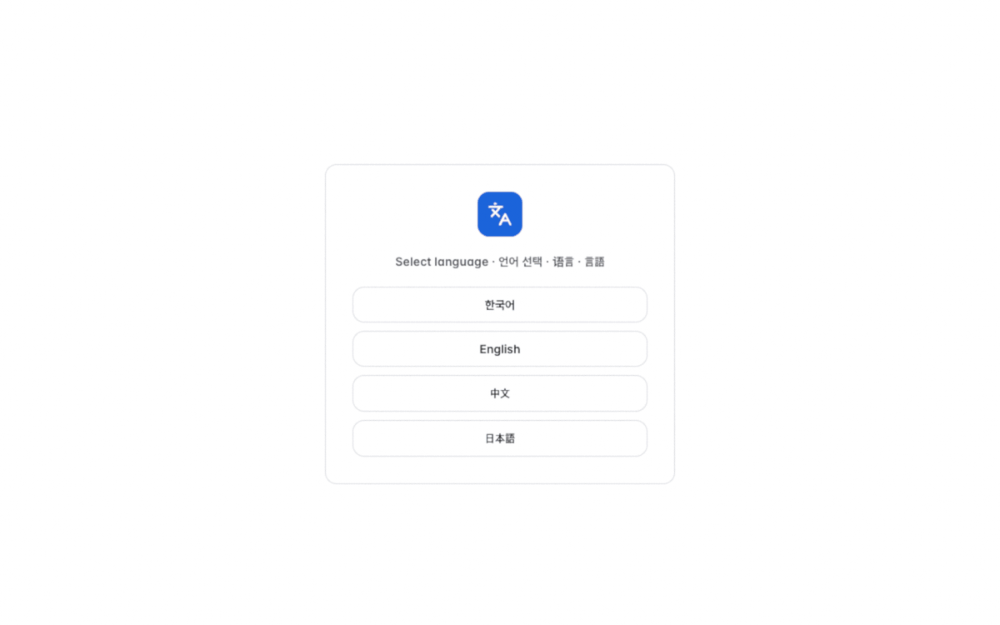</td>
</tr>
<tr>
<td width="42%" valign="middle">

### 🏠 在主页按目的出发 —— Chat · Build · Develop

以 *"○○，你好"* 开头的全新主页分为三条路径。
**Chat** 无需项目即可直接提问、制作文档；**Build** 通过预览卡片挑选新规划或新项目；
**Develop** 则从新项目 · 代码仓库 · ZIP · 机器文件夹开始开发，并以详细列表浏览所有项目。
切换标签页后 Chat 草稿依然保留，下次打开主页时也会记住上次停留的标签页。

</td>
<td>
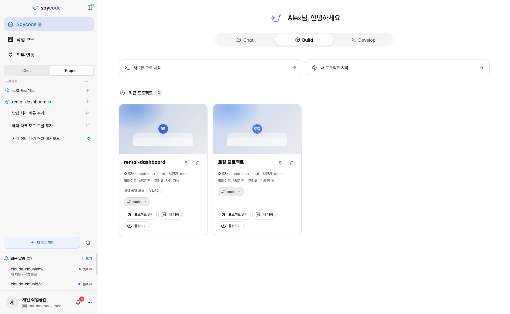 
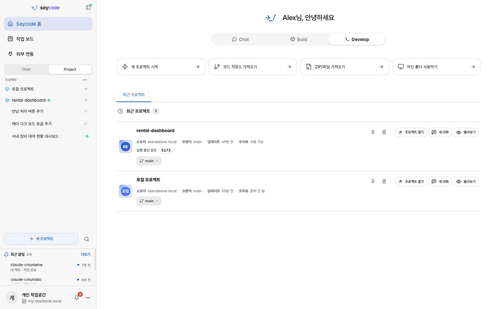
</td>
</tr>
<tr>
<td width="42%" valign="middle">

### 🗣️ 一句话，就能变成能运行的应用

*"做一个公司设备借用情况仪表盘"* —— 就这一句，智能体便会搭建 Vite + React 应用脚手架、
安装依赖，并在 5173 端口启动开发服务器。文件修改、终端命令、构建验证都以**流式卡片**
透明呈现，智能体的回答也是边写边显示。服务器启动的那一刻，右侧会**自动检测并打开预览**，
直接点点看就行。（视频中的应用正是这样做出来的。）

</td>
<td>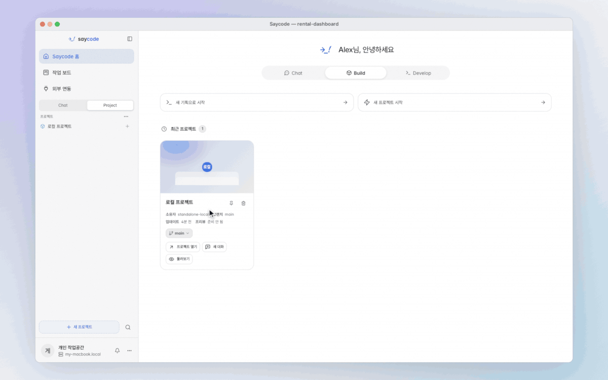</td>
</tr>
<tr>
<td width="42%" valign="middle">

### 📄 无需项目，直接开工 —— Chat 与文档模板

没有代码也没关系。在主页的 **Chat** 中说一句 *"把第三季度设备借用情况报告做成 DOCX"*，
就会生成包含表格和改进建议的 Word 文档，并**直接在应用内渲染**。在**文档选择**中挑选
文档 · 电子表格 · 演示文稿 · PDF 格式，以及*设计报告*、*基础信笺*等模板；也可以用自己的
Office 文件创建**我的模板**，之后就能沿用同样的格式持续撰写。还可以选中已有文件夹，
就地开始工作。

</td>
<td>
 
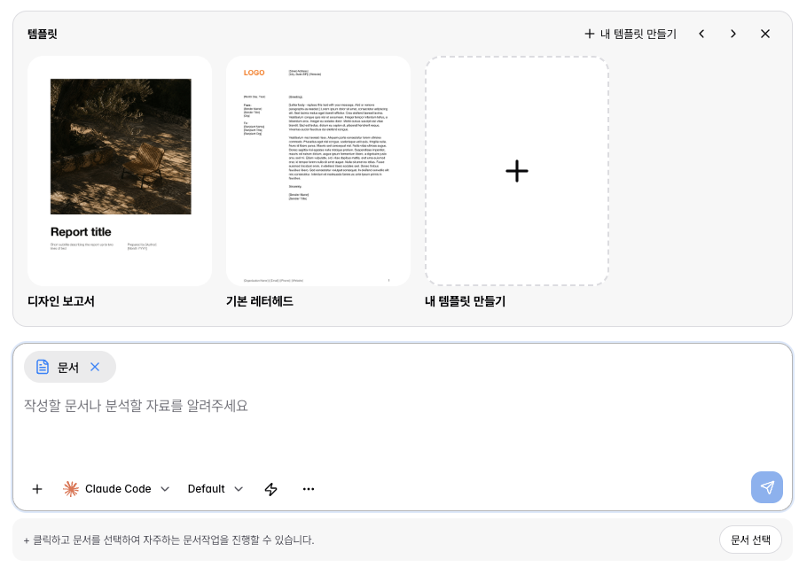
</td>
</tr>
<tr>
<td width="42%" valign="middle">

### 🧩 全新工作界面 —— 对话居中，工具在右

打开项目后，**中间是对话标签页**，**右侧是文件 · 变更 · 终端 · 浏览器**工作区，两者并排而立。
智能体修改过的文件会以**左右对比 diff** 直接呈现，还可以把工作区**全屏**放大仔细检查。
文件面板除了文件名过滤，还支持在整个项目 · worktree 范围内进行**内容搜索**，点击结果即可
打开对应的行。聊天旁的真实终端在切换标签页后依然存活。

</td>
<td>
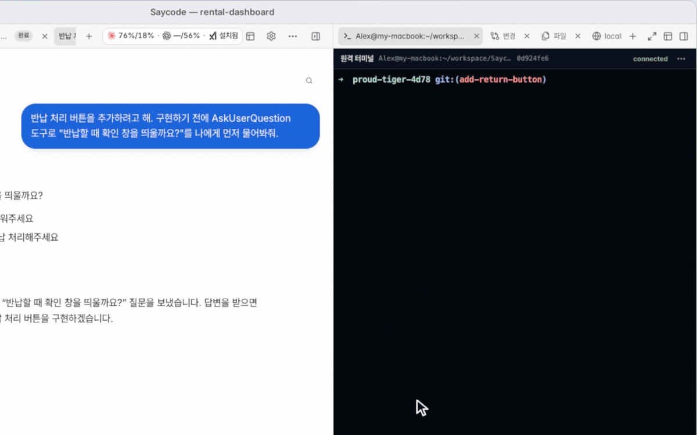 
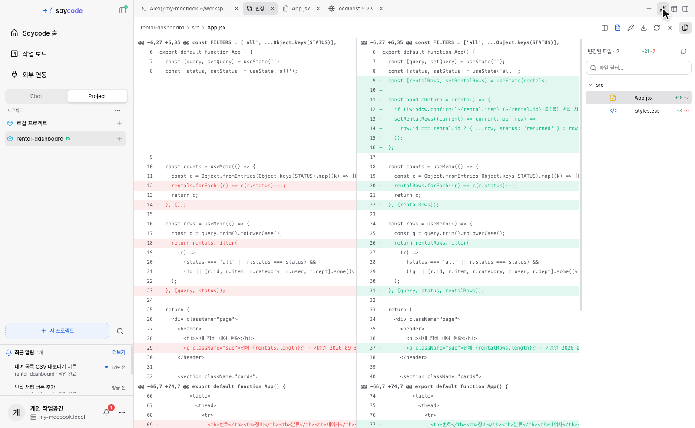
</td>
</tr>
<tr>
<td width="42%" valign="middle">

### 👀 边看边改 —— 选中界面元素，直接发到聊天

在工作区中打开**浏览器**，你机器上运行的应用就会原样呈现。
点击**选择元素并发送到聊天**，再点一下界面上的卡片，选择器 · 尺寸 · 文本和截图就会
自动附加到聊天中。只需一句 *"把逾期卡片用红色背景突出显示，并加上'立即回收'徽标"* ——
视频中的实际修改仅用 **14 秒**就完成了，并通过 HMR 立即反映在同一个面板中。
视口预设以及控制台 · 网络错误收集也都在同一条工具栏上。

</td>
<td>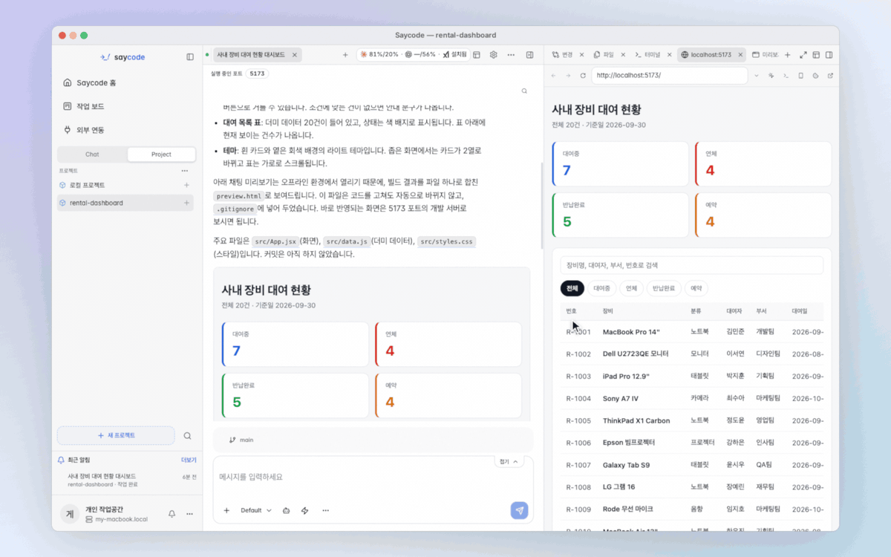</td>
</tr>
<tr>
<td width="42%" valign="middle">

### 🤖 沿用你喜欢的智能体，模型交给它来选

在输入框中从 **Claude Code · Codex · Opencode · Grok** 中任选其一。模型保持 **Default** 时，
Saycode 会在每一轮根据请求难度自动挑选合适的模型和推理强度，并在每条消息上用
*"⚡ 自动选择 · Opus 5.5 · low"* 徽章记录选了什么、为什么选。需要时也可以直接锁定
**Fable 5.1 · Opus 5.5 · Opus 5 · Sonnet 5 · Haiku 4.5**（Codex 为 GPT-6 Sol · Luna ·
Astra）；常用的 AI · 模型 · 工作环境组合，可以保存为 **AI 配置文件**。

</td>
<td>
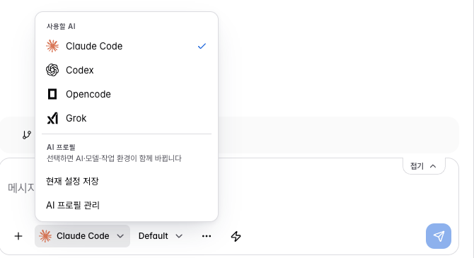 
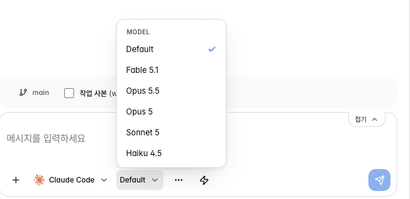 

</td>
</tr>
<tr>
<td width="42%" valign="middle">

### 🗂️ 智能体面板 —— 用看板指挥你的舰队

所有项目的所有对话都汇聚在一块面板上：**等待输入 → 响应中 → 等待 → 评审中 → 已完成 →
PR 已合并**。每张卡片都显示项目 · 智能体 · 模型 · 已用时间 · worktree，响应中的卡片会
实时滚动智能体正在写的内容。视频中两个 Claude 和两个 Codex 同时工作；把完成的卡片拖到
**评审中**，就弹出评审请求对话框；拖到**已完成**，就弹出完成确认。**Commit & PR**、
自动驾驶乃至变更验证，都能直接在卡片上执行。

</td>
<td>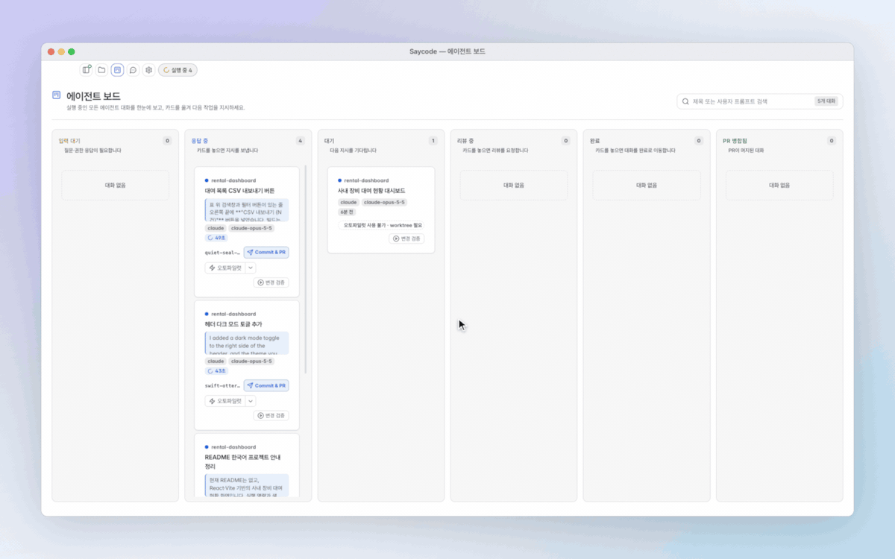</td>
</tr>
<tr>
<td width="42%" valign="middle">

### ✅ 工作完成 —— 评审、提交、完成一次搞定

输入框中的一个**工作完成**按钮，就能把一段对话妥善收尾：**让当前智能体检查**（若仍有
问题，最多自动重复 7 次）、**交给独立评审者**（由另一个智能体只审阅只读快照）、
**Commit & PR**（没有远程仓库时只执行到提交）、**移至已完成**。视频中的智能体在自查改动时
发现了潜在的端口冲突并加以修复，通过 `npm ci` · 构建 · `git diff --check` 之后，
报告了提交哈希。

</td>
<td>
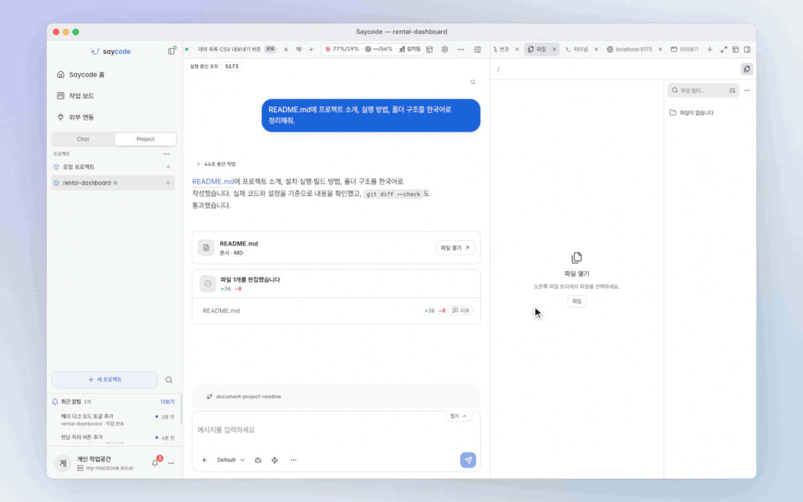 
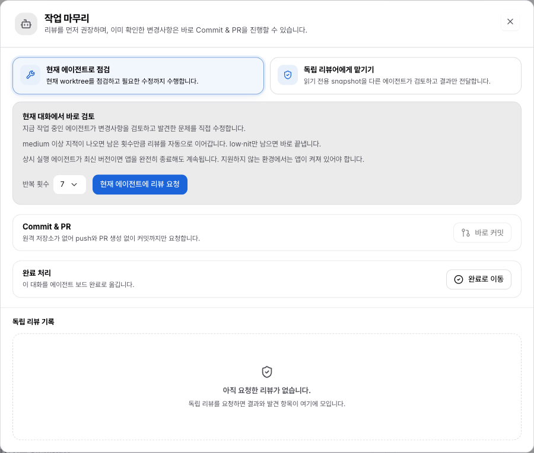
</td>
</tr>
<tr>
<td width="42%" valign="middle">

### 📊 在头部一眼看清 AI 余量与机器状态

对话头部的标签上会显示 **Claude · Codex · Grok 剩余用量**以及执行机器的 **CPU · 内存**。
点开即可查看各机器 5 小时 / 7 天窗口的余量；连接多个 Codex · Claude 账号后，可以
**一键切换**，额度用完时也会自动切换 —— 即使某个账号受限，工作也不会中断。

</td>
<td>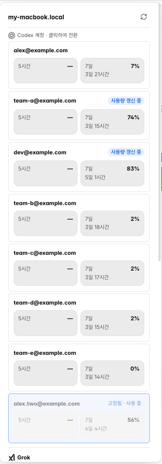</td>
</tr>
<tr>
<td width="42%" valign="middle">

### 🔌 外部集成 —— 扩展，以及在即时通讯中调度智能体

在侧边栏的**外部集成**中可以直接安装官方扩展：项目模板、插件管理器、公开链接，以及
**Telegram · Slack · Discord 频道适配器**。连接频道后，就能在即时通讯工具中发起 Saycode
对话、接收进度更新，并且只控制你允许的项目 · 机器 · 任务。权限按扩展逐一批准，
你随时都清楚自己允许了什么。

</td>
<td></td>
</tr>
<tr>
<td width="42%" valign="middle">

### 🧠 会记忆、会学习的智能体

智能体会把工作中验证过的方法作为**经验候选**提出，你只需在回答下方的卡片上点击**批准 /
拒绝**。批准的经验会从下一次对话起自动生效，并在记忆界面中集中管理。在**系统提示词**
设置中，可以逐项开关 Saycode 默认指令（子智能体调用、内部任务委派、先从规划开始、
提交署名、产出内联预览）。

</td>
<td>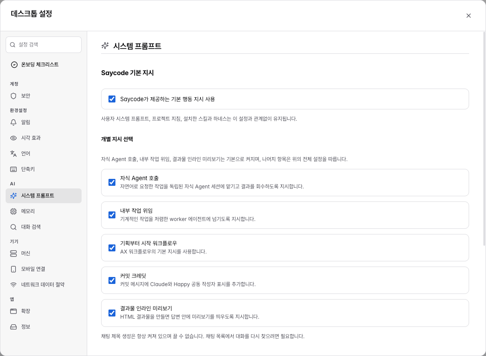</td>
</tr>
<tr>
<td width="42%" valign="middle">

### 🖥️ 我的机器，我的手机

这台 Mac 会在首次启动时自动注册；GPU 服务器 · 构建服务器 · 云端 VM 也可以通过**偏好设置 →
机器 → 注册机器**添加进来。在机器详情中可以查看状态，甚至直接执行 CLI 更新。
用 Saycode 移动应用扫描**移动连接**中的二维码，同一个工作区就会在手机上打开，
长任务完成的那一刻便会推送通知给你。

</td>
<td>
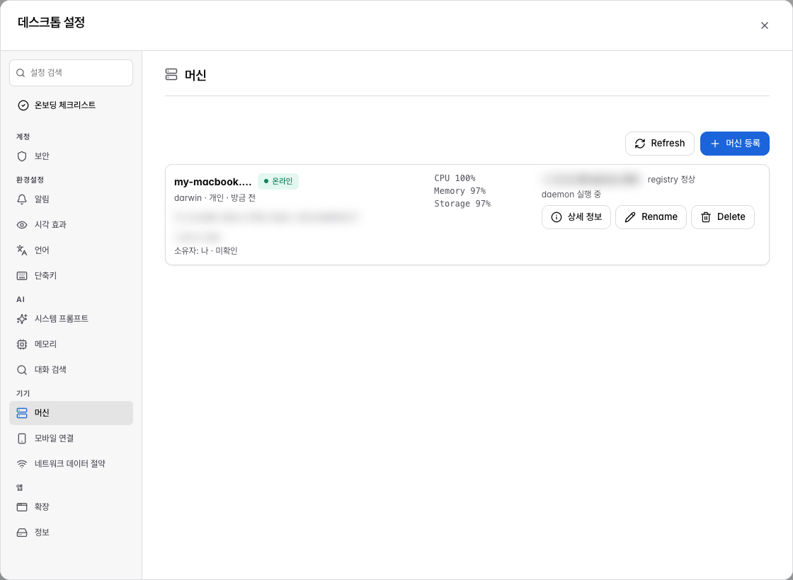 

</td>
</tr>
<tr>
<td width="42%" valign="middle">

### 🏢 团队工作区 —— 部署、共享、组织管控 *(需登录)*

使用 saycode.ai 账号登录后，可以**部署到团队可访问的内网 URL**（自动 SSL，每次部署都更新
同一个链接），以**协作**方式邀请同事加入项目或按团队共享，并用标签分类。在组织控制台中
可以管理成员 · 团队 · 权限 · 审计日志，以及组织共用的 MCP · GitHub PAT · AI 账号，还能把
Notion · Slack · Google Drive 等**连接器**接入对话。**只需打开已部署应用或报告的
最终使用者，不需要坐席。**

</td>
<td>
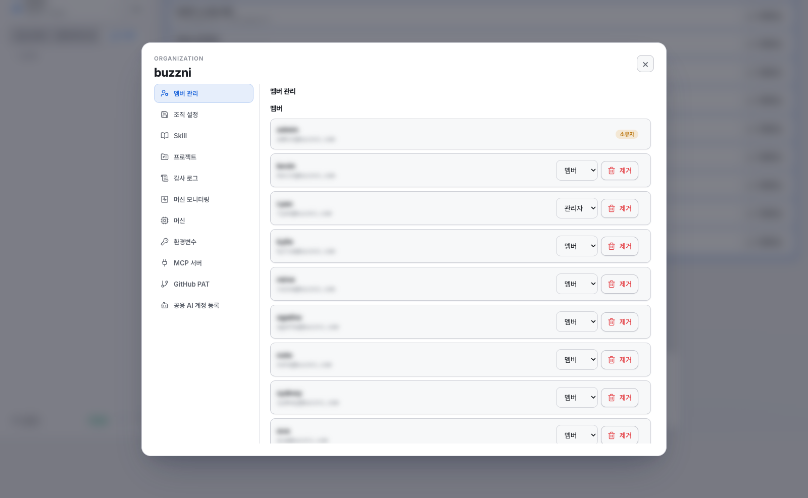 
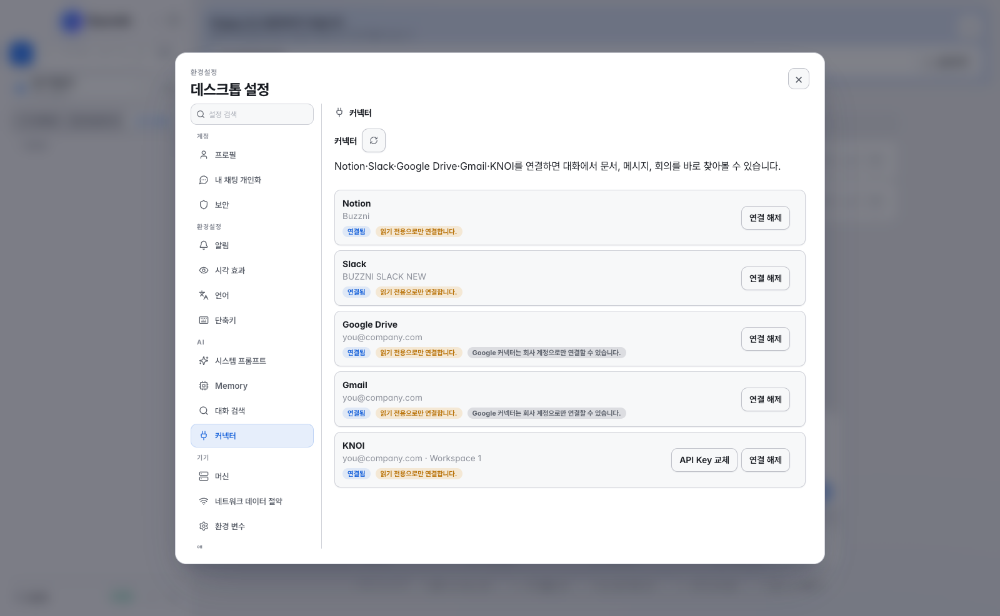
</td>
</tr>
<tr>
<td width="42%" valign="middle">

### 🌙 让你想一直留下来的工作区

在个人资料菜单中即可切换浅色 · 深色 · 自动主题。信息密度高，画面却很沉静。
可重新绑定的快捷键（⌘K 搜索、⌘⇧F 对话搜索、⌘P Quick Open、⌘⇧A 智能体面板）、
侧边栏中的最近通知、Dock 角标，以及输入请求 · 任务完成提示音 —— 细节的积累，
成就了体验。

</td>
<td>
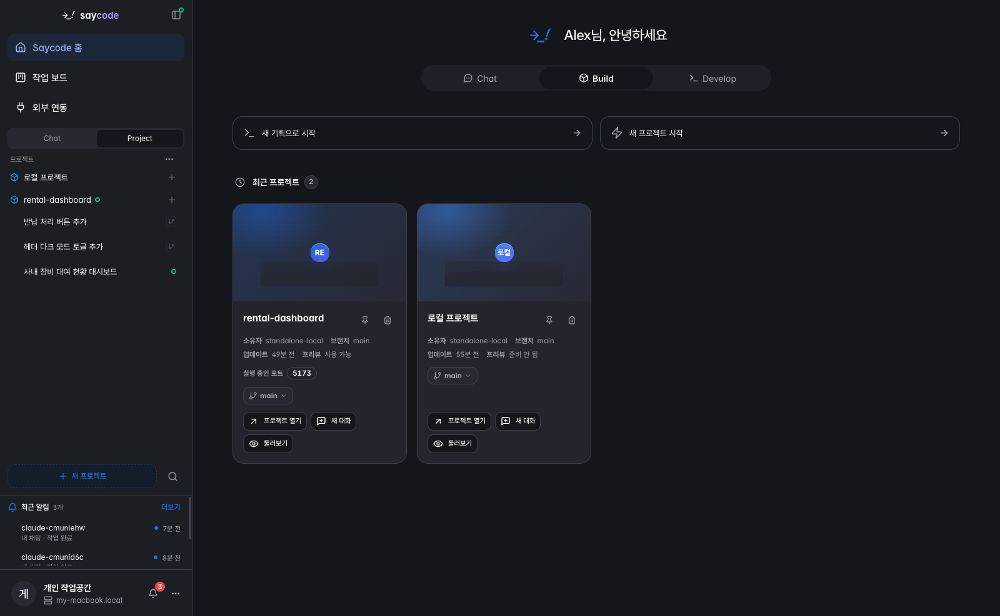 
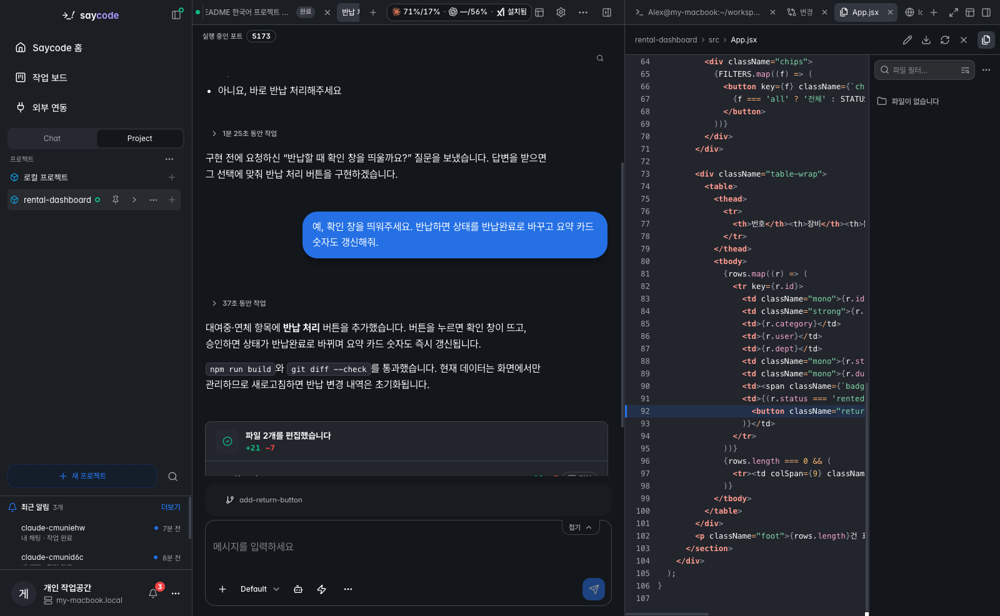
</td>
</tr>
</table>

### 还有这些

- ⌨️ **输入框效率** —— 在空输入框中按 **↑** 调出并搜索之前的提示词，用图钉按钮中的 **Quick Command** 保存常用提示词，用 `+` 附加文件 · 图片 · 文件夹
- 🛟 **文件检查点保护** —— 在新对话中开启后，智能体修改文件前会保存原始状态，经过逐文件预览与冲突判定后安全恢复
- 🌿 **每个对话独立 worktree 隔离** —— 开启`工作副本（worktree）`后，在对话专属分支上工作，即使在面板上并行运行也互不冲突
- 🧭 **项目中枢** —— 把一个对话指定为中枢后，其他对话的完成与提问会以消息形式送达，智能体还能查询并指挥同一项目中的其他对话
- 🔁 **换个智能体接着做** —— 在对话头部的 ⋯ 中选择模型与推理强度，在 Claude ↔ Codex 之间交接
- 🔎 **对话全文搜索与文件内容搜索** —— 用 ⌘⇧F 通过本地 FTS 索引搜索所有对话，在文件面板中搜索项目内容
- 🤖 **自动驾驶与自动质量验证** —— 自评审循环、任务完成前自动验证、PR 检查通过后预约自动合并、合并后验证循环
- 🔔 **通知与 Webhook** —— 完成通知在重启后依然保留，会话事件以 HMAC 签名的 Webhook 发送到你的端点
- 📄 **富文件查看器** —— Markdown · HTML · PDF · DOCX 直接在应用内渲染，新生成的产出会显示在文件面板中
- 🔐 **安全默认值** —— 聊天 · 终端端到端加密、通行密钥/TOTP MFA、全局暂停开关 *(团队)*，代码与数据都留在你的机器上

---

## 工作原理

| | | |
|---|---|---|
| **01 · 安装并选择** | **02 · 按目的出发** | **03 · 用语言提出请求** |
| 打开 DMG，选择语言和使用方式，内置服务器随即启动，引导流程自动进行。 | 在主页从 Chat（文档 · 提问）、Build（新规划 · 项目）、Develop（仓库 · ZIP · 文件夹）中选择。 | 一句自然语言就够了：*"给逾期卡片加上'立即回收'徽标"* |

| | |
|---|---|
| **04 · AI 在你的机器上构建** —— 智能体读写真实文件、执行命令。在右侧工作区通过 diff · 终端 · 预览直接确认，多个对话则用面板统一指挥。 | **05 · 收尾并共享** —— 用工作完成执行评审 → 提交 → 完成。如果是团队工作区，还可以部署到内网 URL，并通过协作完成交接。 |

---

## 安装与首次启动

### macOS

1. 从 **[Releases](https://github.com/buzzni/saycode-desktop-releases/releases/latest)** 下载最新 DMG（Apple Silicon —— 适用于 Intel Mac 的 x64 DMG 也在同一页面）
2. 打开 DMG，把 **Saycode** 拖入 Applications
3. 启动后选择**语言**（한국어 · English · 中文 · 日本語）
4. 在**你打算如何使用？**中进行选择
   - **个人使用** —— 无需登录，直接以 Guest 本地工作区开始
   - **组织使用** —— 接着进行 saycode.ai 登录并注册这台电脑（只有一个组织时会自动选择）

<table>
<tr>
<td width="33%">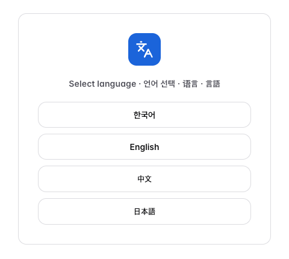</td>
<td width="33%">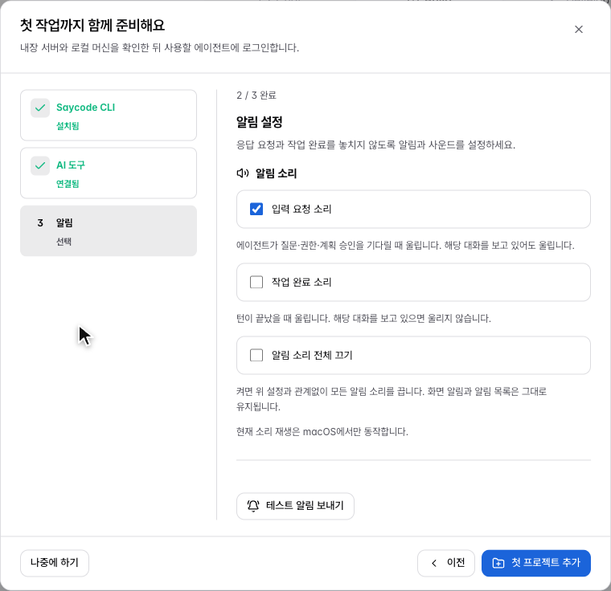</td>
<td width="33%">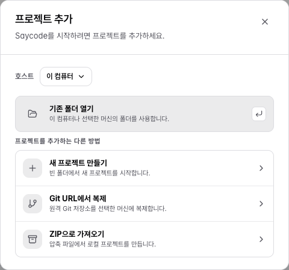</td>
</tr>
<tr>
<td valign="top"><b>① 语言</b> — 在第一个界面选择 UI 语言。之后可以在偏好设置 → 语言中更改。</td>
<td valign="top"><b>② 自动引导</b> — 按 Saycode CLI → AI 工具（检测 Claude Code · Codex 登录）→ 通知的顺序自行推进。如需登录，请在终端中完成 <code>claude</code> → <code>/login</code>、<code>codex login</code> 后再重新检查。</td>
<td valign="top"><b>③ 第一个项目</b> — 确认主机（这台电脑），然后在打开已有文件夹 · 新建项目 · 克隆 Git URL · 导入 ZIP 中选择。</td>
</tr>
</table>

引导可以用**稍后再说**跳过，也可以随时通过**偏好设置 → 引导清单 → 从此步骤开始自动进行**
继续。在第一次对话之前，会询问是否使用 **Saycode 默认指令** —— 开启后，智能体会遵循
子智能体委派、产出内联预览等 Saycode 工作流。

应用已通过 Developer ID 签名并公证，会自动更新。
若想查看每一步的详细截图，请参阅**[用户指南](docs/GUIDE.md)**（[한국어](docs/GUIDE.ko.md)）。

### 本地工作区与团队工作区

| | 个人使用 · Guest 本地工作区 | 组织使用 · 团队工作区（saycode.ai 登录） |
|---|---|---|
| 所需条件 | 无 —— 安装即可 | 组织账号（SSO · 通行密钥/TOTP MFA） |
| 数据位置 | 全部在这台 Mac 上 | 代码与数据在指定机器上，元数据与审计日志在组织控制台 |
| 智能体 · 模型自动选择 · Chat 与文档模板 · 任务看板 · worktree · 工作完成 · 浏览器 · 终端 · 搜索 · 经验/记忆 · 扩展 | ✅ | ✅ |
| 远程机器注册 · 移动连接 | ✅（移动端需同一网络或通过隧道） | ✅ |
| 内网 URL 部署 · 协作 · 团队共享 · 项目标签 | — | ✅ |
| 组织控制台（坐席 · 团队 · 权限 · 模型策略 · 成本 · 审计日志） · 连接器 | — | ✅ |

先从本地开始，需要时再登录即可。本地项目会原样保留。

> **Windows / Linux** —— 目前仍在准备中。请关注 [Releases](https://github.com/buzzni/saycode-desktop-releases/releases) 获取最新消息。

---

## 导入场景 —— 从哪里开始由客户决定

这三种场景不是先后顺序，而是可选项。可以从其中一种开始，也可以组合使用。

| 💬 聊天与文档 | ⚙️ 个人业务自动化 | 🚀 应用构建与部署 |
|---|---|---|
| 会议纪要总结、企划书/报告初稿、搜索与摘要。只使用经批准的用户和模型，按组限制可用模型，并汇总用量与成本。 | 与内部协作工具、文档存储连接，自动化生成周期性报表、协助请求/审批流程等重复性工作。 | 业务部门自行构建内部工具并部署到内网 URL，覆盖成果审阅、审批流程。 |

**即使不是开发者，从第一周起也能使用** —— 经营支持（会议纪要、月度报告初稿、
政策问答）、销售与市场（提案初稿、VOC 分类）、电商运营（商品/价格/库存检查报告）、
人力与总务（规章说明、请求/审批流程、入职资料）——从目前靠手工、Excel、
即时消息处理的重复性工作开始。成果以链接形式共享，无需在消息软件中来回传附件
就能完成审阅。

---

## 面向团队的 Saycode

### 用一个月免费 PoC 先看数据

针对客户选定的场景实测用量、成本、策略和审计，并一起制作出
导入决策所需的结果报告。**PoC 期间可以照常使用 Premium 坐席的全部功能。**

| 第 1 周 · 基线 | 第 2-3 周 · 实际使用 | 第 4 周 · 结果报告 |
|---|---|---|
| 测量当前 AI 使用与成本基线，选定目标部门与 PoC 场景 | 应用于实际业务，实测用量与成本，验证策略与权限设置 | 汇总激活率、成本、策略执行结果，产出正式导入报价 |

PoC 期间一个月免费。期间产生的模型使用费用按客户自身合约计算。

### 价格 —— 只为亲自构建的人设坐席

这不是转售 AI 模型的工具。直接连接你现有的 AI 合约，
只为管理与执行环境收取坐席费用。

| 方案 | 价格 | 适用对象 | 包含内容 |
|---|---|---|---|
| **Office** | $10 / 人·月 | 面向以聊天与文档为主的全体员工 | 聊天与文档工作 · 成果查看/审阅/审批 · 用量仪表盘 |
| **Premium** ⭐ | $40 / 人·月 | 面向亲自构建并部署的一线人员 | Office 的全部功能 + 应用构建/智能体执行 · 内网 URL 部署 · SSO 集成 |
| **批量导入** | 按规模协商 | 全公司导入 · 特殊需求 | 全公司规模的单价 · 私有化部署/隔离网络配置 · 专属支持与 SLA |

- **AI 模型加价 0%** —— 直接连接你现有的 Anthropic、OpenAI、Azure、Bedrock、Vertex 合约。月度总成本 = 坐席费 + 外部 AI 订阅费 + API 使用费。
- **只需打开已部署应用或报告 URL 的最终使用者，不需要坐席。** 坐席为实名制，不共享账号。
- 可以设置预算上限和阈值提醒，超出上限时自动停止。
- 当前导入活动期间无初始配置费用。

- 🌐 官网：**[saycode.ai](https://saycode.ai)** · 介绍资料：**[saycodepoc.apps.saycode.ai](https://saycodepoc.apps.saycode.ai/)**
- 💼 导入咨询：[soo@buzzni.com](mailto:soo@buzzni.com)
- 🛠 技术咨询：[ryan@buzzni.com](mailto:ryan@buzzni.com)
- 🤝 客户支持：[ernie@buzzni.com](mailto:ernie@buzzni.com)

---

## 开源声明

Saycode Desktop 构建于开源软件之上。以下项目被打包或使用在其中
（已标注许可证），完整的许可证全文包含在打包后的应用中：

| 项目 | 用途 | 许可证 |
|---|---|---|
| [Happy](https://github.com/slopus/happy) (经由 [buzzni 分支](https://github.com/buzzni/happy)) | 独立模式中打包的加密智能体会话中继引擎 (`happy-cli` / `happy-server`) | MIT |
| [Electron](https://www.electronjs.org/) | 桌面应用外壳 | MIT |
| [React](https://react.dev/) | UI 框架 | MIT |
| [xterm.js](https://xtermjs.org/) (+ fit / web-links / WebGL 插件) | 远程终端渲染 | MIT |
| [socket.io-client](https://socket.io/) | 实时传输 | MIT |
| [react-markdown](https://github.com/remarkjs/react-markdown) + [remark-gfm](https://github.com/remarkjs/remark-gfm) | 聊天 Markdown 渲染 | MIT |
| [electron-updater](https://www.electron.build/) | 应用内自动更新 | MIT |
| [buffer](https://github.com/feross/buffer) | 二进制工具库 | MIT |
| [lucide-react](https://lucide.dev/) | 图标库 | ISC |
| [TweetNaCl.js](https://tweetnacl.js.org/) | 端到端加密原语 | Unlicense（公有领域） |

特别感谢 Kirill Dubovitskiy 及其贡献者们的
**[slopus/happy](https://github.com/slopus/happy)**（MIT），它是 Saycode
加密会话同步架构的基石。

---

**© 2026 [Buzzni](https://buzzni.com) · [saycode.ai](https://saycode.ai)**

*让公司里的每个人，说出来就能做出来。*

