

# Saycode Desktop 사용자 가이드

**첫 실행부터 에이전트 함대 운영까지 — 순서대로 따라오면 됩니다.**

[English](GUIDE.md) | **한국어**

---

## 목차

1. [설치와 첫 실행](#1-설치와-첫-실행)
2. [머신 등록 — 에이전트가 일할 곳 정하기](#2-머신-등록--에이전트가-일할-곳-정하기)
3. [프로젝트 만들기](#3-프로젝트-만들기)
4. [첫 세션 — 에이전트에게 일 시키기](#4-첫-세션--에이전트에게-일-시키기)
5. [모델 자동 선택으로 토큰 비용 아끼기](#5-모델-자동-선택으로-토큰-비용-아끼기)
6. [라이브 미리보기](#6-라이브-미리보기)
7. [터미널과 화면 분할, 단축키](#7-터미널과-화면-분할-단축키)
8. [에이전트 보드 — 함대 지휘하기](#8-에이전트-보드--함대-지휘하기)
9. [작업 마무리 — 리뷰와 Commit & PR](#9-작업-마무리--리뷰와-commit--pr)
10. [배포와 공유](#10-배포와-공유)
11. [대화 전문 검색](#11-대화-전문-검색)
12. [알림 센터](#12-알림-센터)
13. [AI 사용량 대시보드](#13-ai-사용량-대시보드)
14. [기획 문서, 음성 입력, 파일 첨부·뷰어](#14-기획-문서-음성-입력-파일-첨부뷰어)
15. [팁과 문제 해결](#15-팁과-문제-해결)

---

## 1. 설치와 첫 실행

**[최신 DMG를 내려받아](https://github.com/buzzni/saycode-desktop-releases/releases/latest)**
열고 **Saycode**를 Applications 폴더로 드래그하세요. 앱은 서명·공증되어 있고 자동으로
업데이트됩니다.

처음 실행하면 먼저 **언어**를 고릅니다 (한국어 / English / 中文 / 日本語):

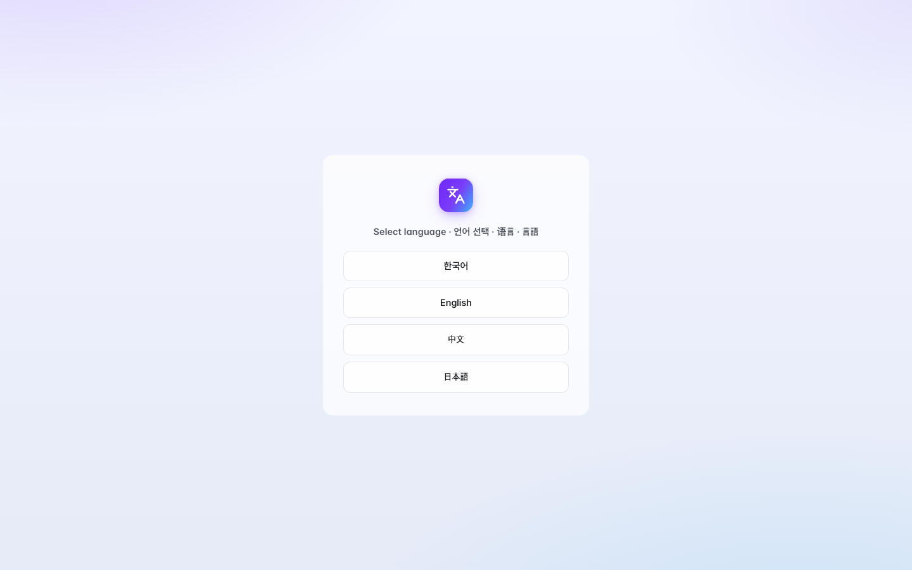

이어서 시작 방식을 선택합니다:

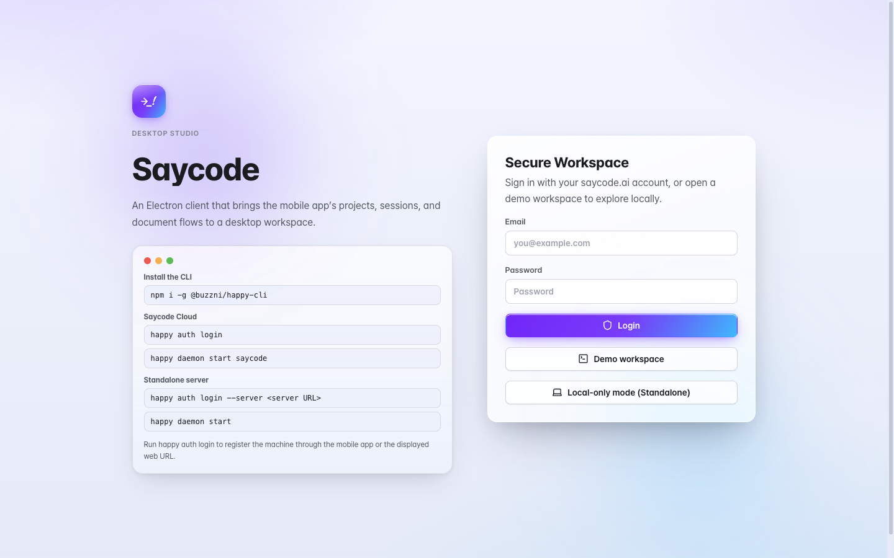

| 시작 방식 | 이런 분께 |
|---|---|
| **Login** | saycode.ai 계정이 있는 팀 사용자. 조직 워크스페이스·공유 머신·배포까지 전부 사용 |
| **Demo workspace** | 계정 없이 바로 둘러보기. 가짜 데이터로 채워진 안전한 체험 공간 |
| **로컬 전용 모드 (Standalone)** | 클릭 한 번으로 내장 서버가 뜨는 완전 로컬 환경. 데이터가 Mac 밖으로 나가지 않음 |

아래는 언어 선택 → 로그인 화면 → 로컬 전용 모드 부팅 → 첫 실행 체크리스트까지
실제 화면 그대로입니다:

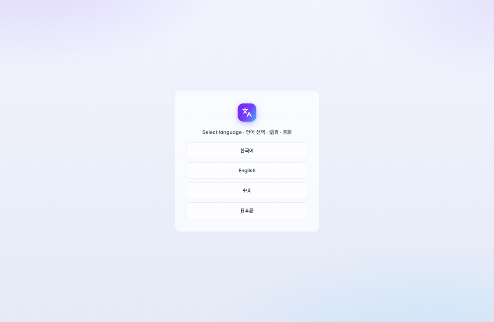

### 첫 실행 체크리스트

워크스페이스에 들어오면 **"첫 작업까지 함께 준비해요"** 체크리스트가 나타나
필요한 것들을 하나씩 확인해 줍니다:

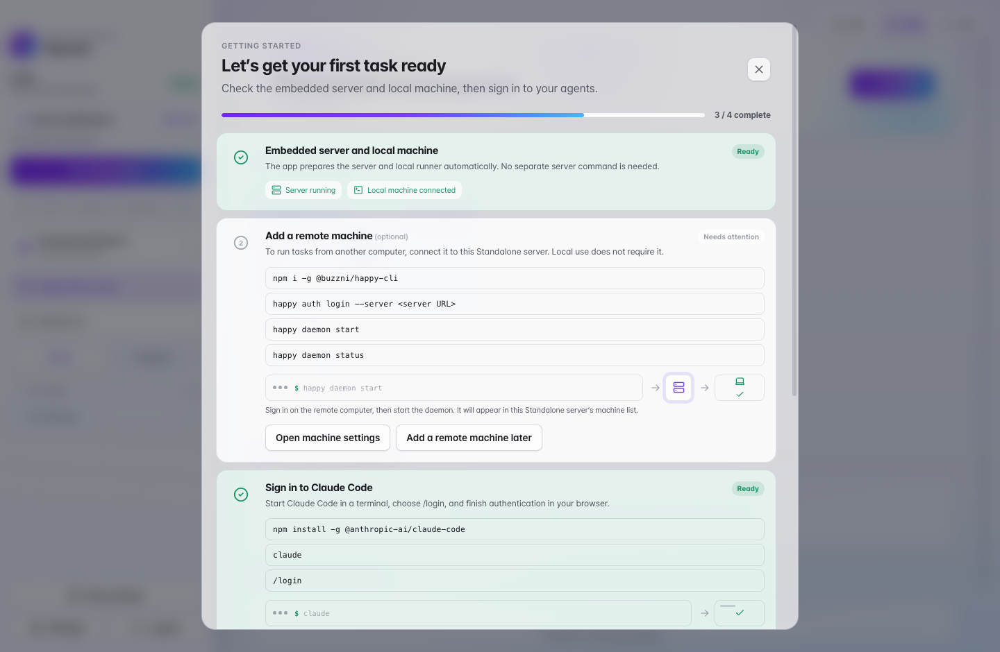

- **내장 서버와 로컬 머신** — 스탠드얼론이라면 자동으로 준비됩니다 (자동 확인)
- **원격 머신 추가** *(선택)* — 다른 컴퓨터에서도 작업을 돌리고 싶을 때
- **Claude Code 로그인 / Codex 로그인** — 터미널에서 로그인돼 있으면 자동으로 **준비됨** 표시
- **첫 세션 시작** — 버튼 한 번으로 첫 작업 화면으로 이동

나중에 다시 보고 싶으면 **Settings → Machines → 시작 설정 이어하기**로 언제든 다시 열 수
있습니다.

---

## 2. 머신 등록 — 에이전트가 일할 곳 정하기

Saycode의 에이전트는 **여러분이 등록한 머신 위에서** 코드를 읽고 씁니다. 노트북, GPU
서버, 빌드 서버, 클라우드 VM — 무엇이든 좋습니다.

1. **Settings → Machines → Register machine**을 엽니다
2. **Generate code**를 누르면 한 줄짜리 등록 명령어가 생성됩니다
3. 그 명령어를 대상 머신 터미널에서 실행하면, 몇 초 뒤 머신이 **online**으로 나타납니다

스탠드얼론 모드라면 이 과정도 필요 없습니다 — 앱이 현재 Mac을 자동으로 등록합니다.
원격 머신을 추가하고 싶을 때만 체크리스트의 안내대로 `happy auth login --server <URL>`을
실행하면 됩니다.

---

## 3. 프로젝트 만들기

사이드바의 **New project** 버튼을 누르세요. 네 가지 방식이 있습니다:

| 탭 | 설명 |
|---|---|
| **Blank** | 빈 프로젝트로 시작 |
| **Git** | 저장소를 클론해서 시작 — GitHub/GitLab 계정을 연결하면 목록에서 바로 선택 |
| **Zip/파일 가져오기** | 압축 파일이나 파일 묶음을 올려서 시작 |
| **Folder** | 머신에 이미 있는 폴더를 그대로 연결 |

**Git 탭**에서 **Connect GitHub / Connect GitLab**을 누르면 브라우저 인증 후 내 계정의
저장소(비공개 포함)를 목록에서 고를 수 있습니다:

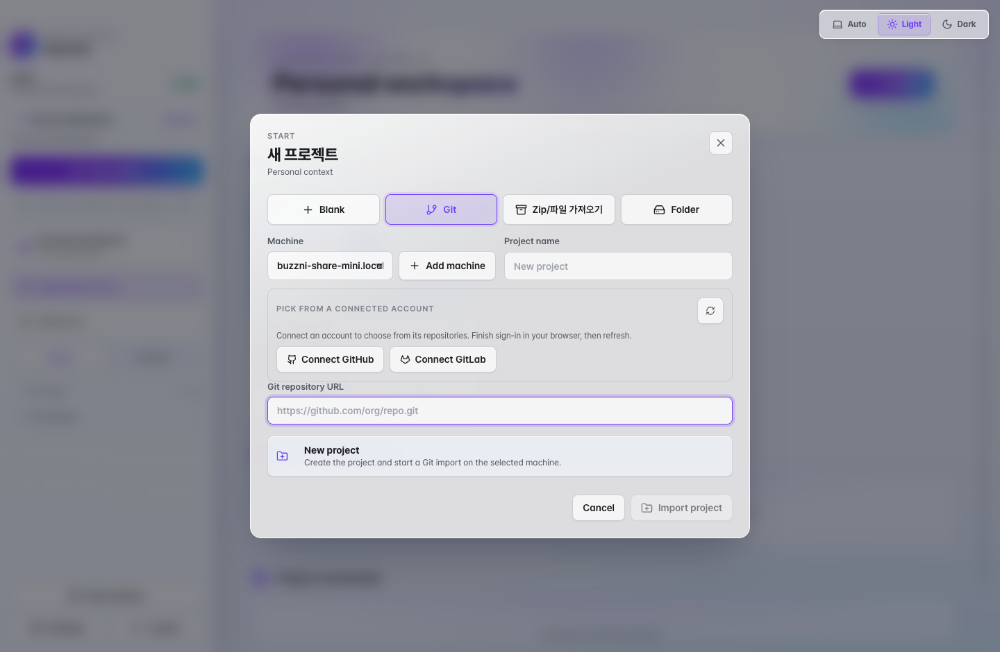

머신을 고르고 이름을 정한 뒤 **Create project** — 끝입니다.

---

## 4. 첫 세션 — 에이전트에게 일 시키기

프로젝트에 들어가 **새 세션**을 누르면 세션 시작 화면이 열립니다:

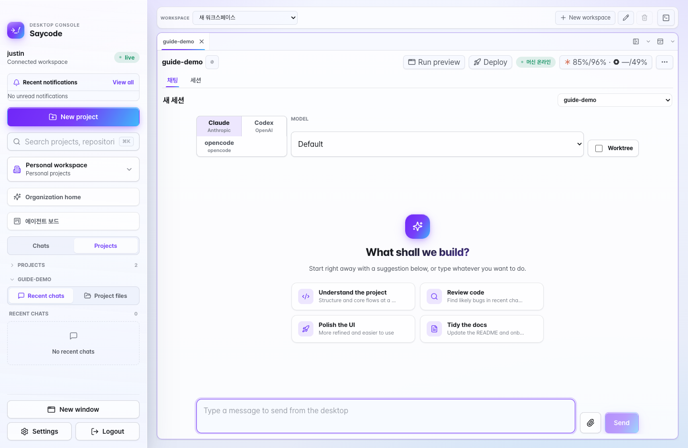

여기서 정하는 것들:

- **에이전트** — Claude(Anthropic) / Codex(OpenAI) / opencode 중 선택. 최근 선택이 기본값으로 기억됩니다
- **MODEL** — 그대로 **Default**를 권장합니다. 난이도에 맞는 모델이 자동 선택됩니다 ([5장](#5-모델-자동-선택으로-토큰-비용-아끼기))
- **Worktree** — 실험적인 작업이라면 켜세요. 세션 전용 git worktree가 만들어져 main을 건드리지 않습니다

무엇을 시킬지 모르겠다면 **추천 카드**(프로젝트 이해하기 / 코드 리뷰 / UI 다듬기 / 문서
정리)를 눌러 시작해도 됩니다. 아니면 그냥 원하는 것을 적으세요 — 한국어로, 말하듯이.

전송하면 에이전트가 파일 수정·터미널 명령·테스트 실행을 **스트리밍 카드**로 보여주며
일합니다. 세션 제목도 자동으로 지어집니다:

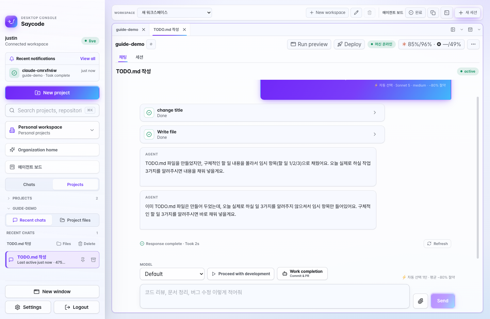

작업이 끝나면 **Response complete** 표시와 함께 [알림 센터](#12-알림-센터)와 Dock 배지,
(모바일 앱 사용 시) 푸시 알림이 옵니다.

> 💬 응답이 진행 중일 때도 입력창에 다음 지시를 미리 적어 보낼 수 있습니다. 대기 중인
> 세션이라도 바로 입력·전송이 가능합니다.

---

## 5. 모델 자동 선택으로 토큰 비용 아끼기

Saycode의 가장 조용하지만 가장 돈이 되는 기능입니다. 모델을 **Default**로 두면, 매 턴마다
요청의 난이도를 분석해 **그 일을 해낼 수 있는 가장 저렴한 모델**로 라우팅합니다:

| 난이도 | Claude 세션 | Codex 세션 | 절약(최고가 대비) |
|---|---|---|---|
| 간단 (오타·라벨 수정 등) | Haiku 4.5 · low | GPT-5.6 Luna · low | **~90%** |
| 일반 (기능 추가·수정) | Sonnet 5 · medium | GPT-5.6 Terra · medium | **~80%** |
| 어려움 (리팩터링·성능·디버깅) | Opus 4.8 · high | GPT-5.6 Sol · high | **~50%** |
| 막힘 (에스컬레이션) | Fable 5 · xhigh | GPT-5.6 Sol · xhigh | — |

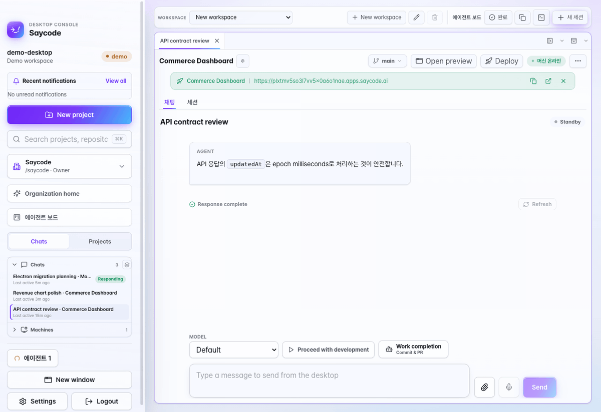

동작 방식을 알아두면 좋습니다:

- **모든 턴에 투명성 배지** — 보낸 메시지마다 *"⚡ 자동 선택 · Sonnet 5 · medium · ~80%
  절약"* 처럼 어떤 모델이 왜 선택됐는지 표시됩니다. 난이도 판단이 애매해 로컬 분류
  모델이 개입하면 *"AI가 정밀 분석"* 이 함께 붙습니다
- **막혔을 때만 최고 티어** — 같은 오류가 반복되거나 "아직도 안 돼" 같은 신호가 감지되면
  *"막혀서 최고 성능으로 승격"* 배지와 함께 최상위 모델이 투입됩니다. 비싼 턴에는 항상
  이유가 붙습니다
- **세션 안에서는 올라가기만** — 프롬프트 캐시를 지키기 위해 세션 도중에는 모델을
  낮추지 않습니다. 1시간 이상 쉬면 다시 초기화됩니다
- **누적 절약 집계** — 입력창 옆에 *"⚡ 자동 선택 12턴 · 평균 ~72% 절약"* 이 쌓이고,
  [에이전트 보드](#8-에이전트-보드--함대-지휘하기) 상단 위젯에서 **일간/주간/월간**
  절감액 추정치를 볼 수 있습니다
- **직접 고르고 싶다면** — 모델 드롭다운에서 아무 모델이나 선택하는 순간 그 세션은 수동
  고정 모드가 됩니다

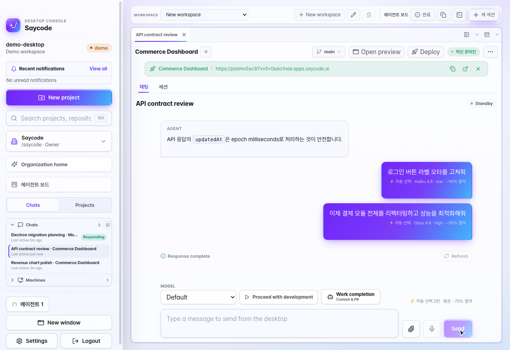

---

## 6. 라이브 미리보기

**미리보기 실행(Run preview)** 을 누르면 채팅 옆 사이드 패널에 앱이 열립니다 — 목업이
아니라 프로젝트 머신에서 실제로 돌아가는 개발 서버입니다. 왼쪽에서 대화하고 오른쪽에서
클릭해 보세요. 에이전트가 코드를 바꾸면 즉시 반영됩니다.

미리보기 런타임은 채팅의 worktree별로 격리되므로, 여러 세션이 같은 프로젝트를 만져도
서로의 미리보기를 덮어쓰지 않습니다.

---

## 7. 터미널과 화면 분할, 단축키

**터미널** — 채팅 헤더의 터미널 버튼(또는 ⌘⌥⇧T)으로 채팅 아래에 실제 셸을 도킹합니다.
등록된 머신에 붙는 종단간 암호화 세션이라 빌드·로그 확인을 에이전트가 일하는 동안
그대로 할 수 있습니다. 탭을 바꿔도 살아있고 끊기면 스스로 재연결됩니다.

**화면 분할** — 패널 분할 아이콘을 **클릭하면 그 방향으로 터미널**이, **⌥(Alt)+클릭하면
채팅**이 열립니다. 탭을 **우클릭**해도 분할 메뉴가 나옵니다. 그리드 프리셋(2×2 등)으로
한 번에 배치하고, **분할 크기 동일하게 맞추기** 버튼으로 흐트러진 패널을 균등하게
되돌리세요.

**단축키** — 전부 **Settings → Shortcuts**에서 원하는 키로 바꿀 수 있습니다:

| 동작 | 기본 키 |
|---|---|
| 프로젝트 검색 | ⌘K |
| 대화 전문 검색 | ⌘⇧F |
| 파일 저장 (파일 편집기) | ⌘S |
| 새 창 | ⌘N |
| 오른쪽에 터미널 분할 | ⌘⌥T |
| 아래에 터미널 분할 | ⌘⌥⇧T |
| 오른쪽에 채팅 분할 | ⌘⌥C |
| 아래에 채팅 분할 | ⌘⌥⇧C |

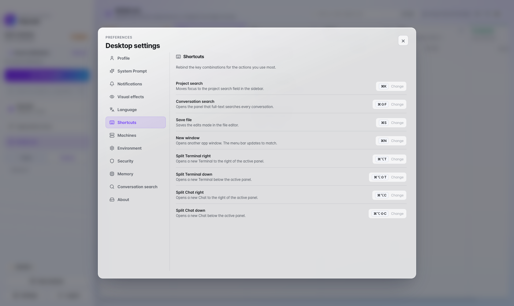

---

## 8. 에이전트 보드 — 함대 지휘하기

세션이 몇 개만 돼도 채팅 탭을 오가는 건 금방 버거워집니다. 사이드바의 **에이전트 보드**를
누르면 **모든 프로젝트의 모든 세션**이 칸반 보드로 펼쳐집니다:

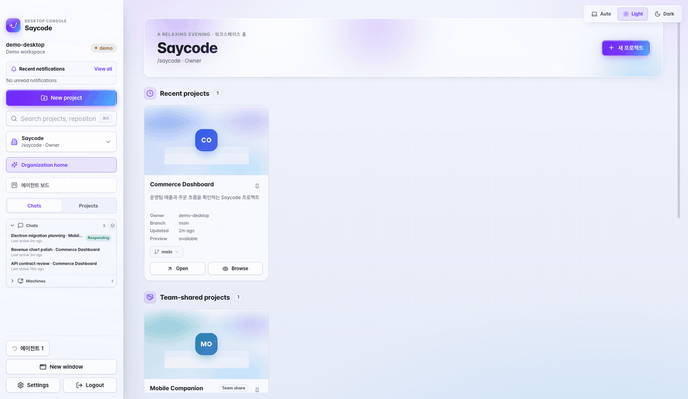

| 컬럼 | 의미 |
|---|---|
| **입력 대기** | 에이전트가 질문·권한 응답을 기다리는 중 — 가장 먼저 볼 곳 |
| **응답 중** | 지금 일하는 중. 카드에 에이전트의 최신 응답이 실시간으로 흐릅니다 |
| **대기** | 다음 지시를 기다리는 중 |
| **리뷰 중** | 코드 리뷰가 진행 중 |
| **완료** | 보관된 세션 (초록 "완료" 배지) |
| **PR Merged** | PR이 머지되어 완전히 끝난 세션 |

보드에서 할 수 있는 것들:

- **카드를 응답 중 컬럼으로 드래그** → 지시 입력창이 열리고, 쓰는 대로 그 세션에 전송됩니다
- **카드를 리뷰 중으로 드래그** → 리뷰 요청 프롬프트가 미리 채워진 다이얼로그가 열립니다
- **카드를 완료로 드래그** → 세션을 보관합니다
- **카드 클릭** → 마지막 요청과 최신 응답을 미리보고, **채팅으로 이동**으로 바로 진입
- **검색창** — 제목·프롬프트로 세션을 즉시 필터링
- **Commit & PR / PR 머지** — GitHub 연동 프로젝트라면 카드에서 바로 PR을 만들고 머지까지
- **완료 해제** — 보관한 세션도 다시 열어 이어서 작업 (지워진 worktree도 브랜치에서 복원)

상단의 **절감 위젯**은 자동 모델 선택이 아껴준 비용을 일간/주간/월간으로 집계합니다.

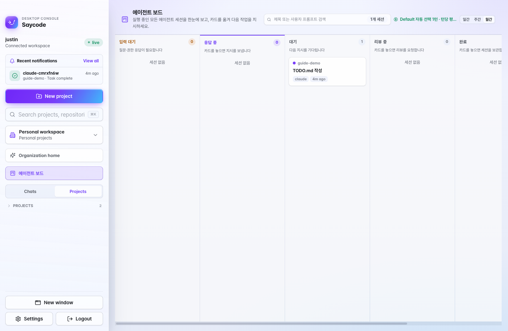

---

## 9. 작업 마무리 — 리뷰와 Commit & PR

작업이 끝났다면 입력창 옆의 **작업 마무리(Work completion)** 버튼을 누르세요:

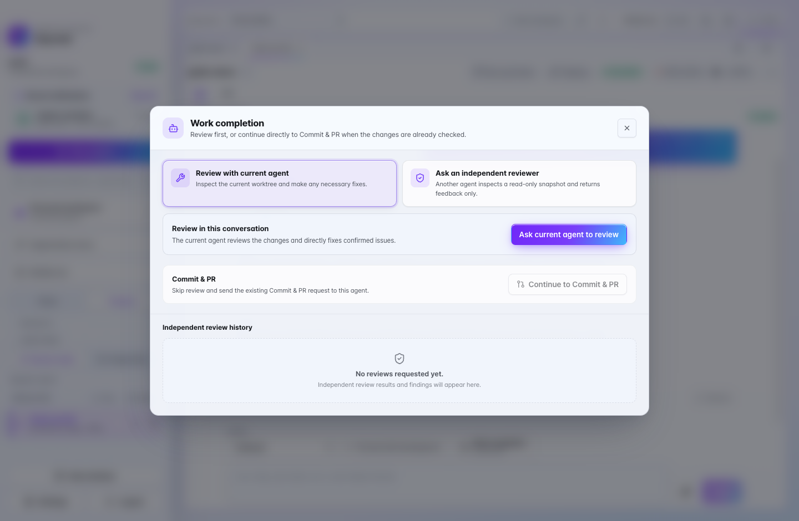

세 가지 길이 있습니다:

1. **현재 에이전트로 점검** — 지금 작업한 에이전트가 자기 변경 사항을 리뷰하고, 확인된
   문제는 바로 고칩니다
2. **독립 리뷰어에게 맡기기** — **다른 에이전트**(Claude/Codex 등, 모델·리뷰 프로파일
   선택 가능: 일반/버그·회귀/보안)가 **읽기 전용 스냅샷**을 검토합니다. 코드는 건드리지
   못하고 발견 사항만 보고하므로, 셀프 리뷰의 사각지대를 줄여줍니다. 결과에서 받아들일
   항목만 골라 수정을 요청할 수 있고, 리뷰 이력은 세션에 남습니다
3. **바로 Commit & PR** — 이미 확인한 변경이라면 리뷰를 건너뛰고 커밋·PR 생성으로 직행

서브모듈 안의 변경까지 리뷰 범위에 포함됩니다.

---

## 10. 배포와 공유

채팅 헤더의 **Deploy**를 누르면 팀 전체가 열 수 있는 **사내 URL**로 배포됩니다 — SSL
자동, 배포할 때마다 같은 링크가 갱신됩니다. 성공하면 채팅에 URL과 복사 버튼이 있는
배포 카드가 남고, 입력창 옆에도 최신 배포 바로가기가 붙습니다.

프로젝트는 팀이나 사내 커뮤니티에 공유할 수 있습니다 — 동료가 둘러보고, 복제해 다듬고,
변경을 안전하게 되돌려줄 수 있습니다.

---

## 11. 대화 전문 검색

**⌘⇧F** 하나면 지금까지의 모든 대화 — 세션 제목, 내가 보낸 프롬프트, 에이전트의 응답 —
를 전문 검색합니다. 인덱스는 내 머신의 로컬 SQLite(FTS5)에만 저장됩니다.

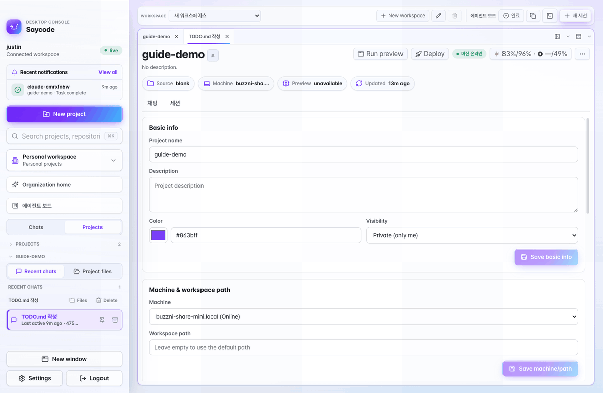

- 범위 전환: **내 대화** ↔ **조직 전체**
- 필터 문법:

| 필터 | 예시 |
|---|---|
| 프로젝트 한정 | `project:commerce 결제 오류` |
| 화자 한정 | `role:user 배포`, `role:agent 원인` |
| 에이전트 종류 | `agent:claude 리팩터링` |
| 기간 | `after:2026-07-01 before:2026-07-20 로그인` |
| 정확한 문구 | `"epoch milliseconds"` |

**Settings → Conversation search**에서 기능을 켜고 끄거나 인덱스를 삭제할 수 있습니다.

> ⌘K는 프로젝트·저장소를 찾는 **탐색 검색**, ⌘⇧F는 대화 내용을 뒤지는 **전문 검색**입니다.

---

## 12. 알림 센터

긴 작업을 걸어두고 다른 일을 하세요 — 끝나면 알려드립니다.

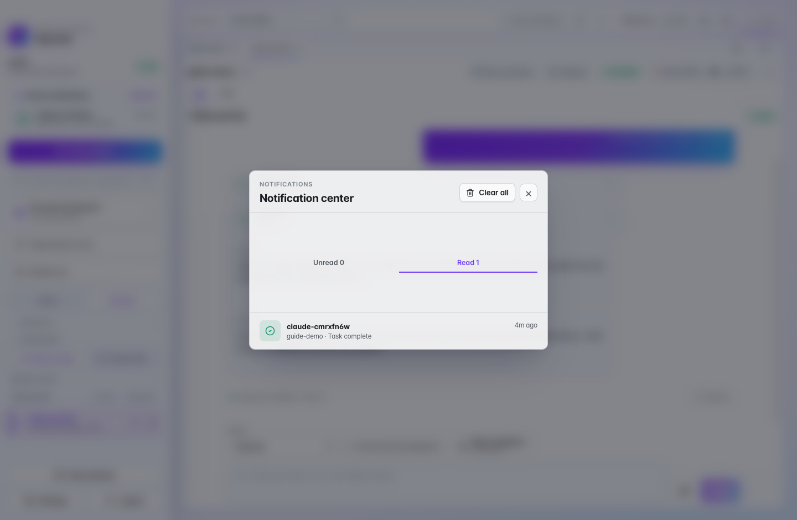

- 사이드바 상단 **최근 알림**에 최신 완료 알림이 미리 보이고, **View all**로 전체 목록을 엽니다
- **미확인 / 확인함** 탭 — 확인한 알림도 기록으로 남습니다
- 알림을 클릭하면 해당 채팅이 **새 탭으로** 열립니다
- 알림은 재시작해도 유지되고, Dock 배지·네이티브 알림·모바일 푸시(모바일 앱 사용 시)와 연동됩니다

---

## 13. AI 사용량 대시보드

채팅 헤더의 **사용량 칩**(예: `⁂ 84%/96% · ⬡ —/49%`)을 누르면 그 머신의 서비스별 남은
사용량이 열립니다:

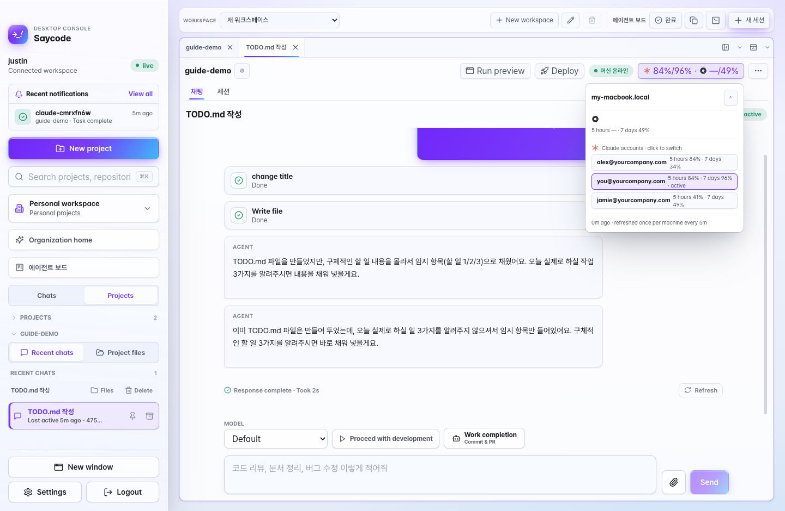

- **Claude / Codex 아이콘별로** 5시간 창·7일 창 남은 비율을 표시
- **Claude 계정 여러 개**를 쓰면 목록에서 클릭 한 번으로 전환
- 수치는 머신당 5분에 한 번씩 갱신됩니다

한도가 얼마 안 남았다면 [자동 모델 선택](#5-모델-자동-선택으로-토큰-비용-아끼기)이 더
귀해집니다 — 쉬운 일에 비싼 한도를 쓰지 않게 해주니까요.

---

## 14. 기획 문서, 음성 입력, 파일 첨부·뷰어

**기획 문서(Planning)** — 프로젝트마다 spec·plan·design 문서 탭이 있습니다. 에이전트가
작업하며 직접 읽고 갱신하므로 "왜 이렇게 만들었는지"가 세션이 끝나도 남습니다.

**음성 입력** — 입력창의 마이크 버튼을 누르고 말하면 **실시간으로 전사**되어 입력창에
채워집니다. (스탠드얼론 모드에서는 비활성화됩니다)

**파일 첨부** — 클립 버튼이나 드래그로 이미지·파일을 대화에 첨부할 수 있습니다.

**파일 뷰어** — 프로젝트 파일 탭에서 마크다운·HTML은 렌더링된 모습으로, PDF·DOCX는
문서 뷰어로 바로 열립니다. 다운로드도 지원합니다.

---

## 15. 팁과 문제 해결

**세션 상태 한눈에 보기** — 사이드바와 보드의 배지:
*Responding*(응답 중) · *대기*(다음 지시 대기 / 유휴 회수됨) · *입력 대기*(질문·권한 응답
필요 — 에이전트가 멈춘 게 아니라 여러분을 기다리는 중입니다) · *완료*(보관됨).

**완료한 세션 이어가기** — 보관(완료)한 세션도 에이전트 보드나 채팅 헤더의 **완료 해제**로
다시 살릴 수 있습니다. 세션에 연결됐던 worktree가 지워졌어도 브랜치에서 복원됩니다.

**Worktree 활용** — 새 세션에서 Worktree를 켜면 세션마다 격리된 브랜치 작업 공간이
생깁니다. 기존 worktree를 재사용하는 옵션도 있으며, 최근 선택을 기억합니다. 세션을
보관·삭제하면 연동 worktree도 자동 정리됩니다.

**질문 카드가 떴는데 놓쳤다면** — 에이전트의 질문(AskUserQuestion)이나 권한 요청은
세션이 재개될 때 안전하게 다시 전달됩니다. **입력 대기** 컬럼만 주기적으로 확인하세요.

**데모 모드의 한계** — Demo workspace에서는 실제 머신 실행·배포·Commit & PR이
비활성화됩니다. 진짜로 굴려보려면 로컬 전용 모드가 가장 빠릅니다.

**막힌 것 같을 때** — 자동 선택이 *"막혀서 최고 성능으로 승격"* 을 띄웠다면 이미 최상위
모델이 투입된 상태입니다. 그래도 안 풀리면 문제를 더 작게 쪼개 요청하거나, 작업 마무리
허브의 **독립 리뷰어**에게 신선한 시각을 요청해 보세요.

---

더 궁금한 것이 있나요? [saycode.ai](https://saycode.ai) · 기술 문의 [ryan@buzzni.com](mailto:ryan@buzzni.com)

**© 2026 [Buzzni](https://buzzni.com)**

