

# Saycode Desktop 사용자 가이드

**첫 실행부터 에이전트 함대 운영까지 — 순서대로 따라오면 됩니다.**

[English](GUIDE.md) | **한국어**

---

## 목차

1. [설치와 첫 실행](#1-설치와-첫-실행)
2. [첫 작업까지 함께 준비해요 — 3단계 마법사](#2-첫-작업까지-함께-준비해요--3단계-마법사)
3. [프로젝트 추가하기](#3-프로젝트-추가하기)
4. [첫 대화 — 에이전트에게 일 시키기](#4-첫-대화--에이전트에게-일-시키기)
5. [모델 자동 선택으로 토큰 비용 아끼기](#5-모델-자동-선택으로-토큰-비용-아끼기)
6. [브라우저 패널 — 보면서 고치기](#6-브라우저-패널--보면서-고치기)
7. [터미널과 화면 분할, 단축키](#7-터미널과-화면-분할-단축키)
8. [에이전트 보드 — 함대 지휘하기](#8-에이전트-보드--함대-지휘하기)
9. [작업 마무리 — 리뷰와 Commit & PR](#9-작업-마무리--리뷰와-commit--pr)
10. [대화 검색과 Quick Open](#10-대화-검색과-quick-open)
11. [알림 센터와 웹훅](#11-알림-센터와-웹훅)
12. [AI 사용량과 계정 전환](#12-ai-사용량과-계정-전환)
13. [환경설정 둘러보기](#13-환경설정-둘러보기)
14. [머신 추가와 모바일 연결](#14-머신-추가와-모바일-연결)
15. [팀 워크스페이스 — 로그인, 배포, 공유](#15-팀-워크스페이스--로그인-배포-공유)
16. [팁과 문제 해결](#16-팁과-문제-해결)

---

## 1. 설치와 첫 실행

**[최신 DMG를 내려받아](https://github.com/buzzni/saycode-desktop-releases/releases/latest)**
열고 **Saycode**를 Applications 폴더로 드래그하세요. 앱은 서명·공증되어 있고 자동으로
업데이트됩니다.

처음 실행하면 **언어**를 고릅니다 (한국어 / English / 中文 / 日本語):

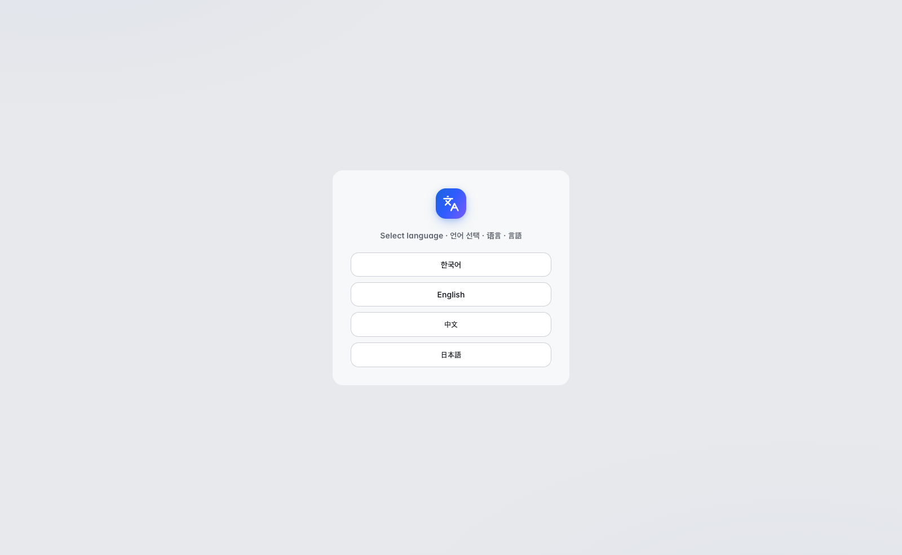

여기서 끝입니다. 로그인 화면도, 시작 방식을 고르는 화면도 없습니다. Saycode가 알아서:

1. **내장 서버**(릴레이·데이터베이스)를 이 Mac 안에서 띄우고
2. 이 Mac을 **로컬 머신**으로 등록한 뒤
3. **Guest 로컬 작업공간**을 엽니다 — 약 10초

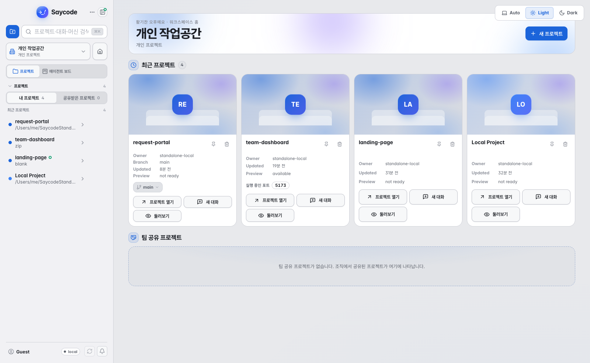

이 상태에서 데이터는 한 바이트도 Mac 밖으로 나가지 않습니다. 팀 기능(배포·공유·조직
콘솔)이 필요해지면 그때 사이드바 아래 **Guest → 로그인**으로 saycode.ai 계정에 들어가면
됩니다 ([15장](#15-팀-워크스페이스--로그인-배포-공유)).

---

## 2. 첫 작업까지 함께 준비해요 — 3단계 마법사

작업공간이 열리면 **"첫 작업까지 함께 준비해요"** 마법사가 나타납니다. 내장 서버와 로컬
머신을 확인한 뒤 사용할 에이전트 로그인을 점검하는 세 단계입니다.

### ① Saycode CLI

에이전트가 실제로 돌아가는 로컬 런타임을 확인합니다. Standalone 앱은 런타임을 내장하고
있어 **설치됨 · "Standalone 앱에 포함된 로컬 런타임을 사용합니다"** 로 바로 표시됩니다.
따로 설치할 것이 없으니 **계속**을 누르세요.

### ② AI 도구 — Claude Code와 Codex

Saycode는 여러분이 이미 쓰는 에이전트 CLI를 그대로 구동합니다. 이 단계에서 각 도구의
로그인 상태를 감지해 **연결됨**으로 표시합니다. 아직이라면 터미널에서:

| 도구 | 로그인 방법 |
|---|---|
| **Claude Code** | 터미널에서 `claude` 실행 후 `/login` |
| **Codex** | `codex login` — 브라우저가 열리며 OpenAI 계정으로 로그인 |

로그인을 마친 뒤 **상태 다시 확인**을 누르면 됩니다. 둘 중 하나만 연결돼 있어도 시작할
수 있습니다.

### ③ 알림 설정

에이전트가 **입력을 요청할 때**와 **작업을 마쳤을 때** 소리로 알릴지 고릅니다 (전체 끄기도
가능). **테스트 알림 보내기**로 실제로 울리는지 확인하세요. 소리 재생은 현재 macOS에서만
동작합니다.

마지막 버튼을 누르면 곧바로 **프로젝트 추가** 대화상자로 이어집니다 ([3장](#3-프로젝트-추가하기)).

> 각 단계는 **나중에 하기**로 건너뛸 수 있고, **환경설정 → 기기 → 머신 → 시작 설정
> 이어하기**로 언제든 다시 열 수 있습니다.

---

## 3. 프로젝트 추가하기

마법사가 끝나면 **"Saycode를 시작하려면 프로젝트를 추가하세요"** 대화상자가 열립니다.
이후에는 사이드바 상단의 **새 프로젝트** 버튼(폴더 아이콘)으로 언제든 열 수 있습니다.

먼저 **호스트**(에이전트가 일할 머신)를 고릅니다. 처음에는 이 Mac 하나뿐입니다. 그다음:

| 방식 | 이런 때 |
|---|---|
| **기존 폴더 열기** (기본, ↵) | 이미 있는 코드베이스를 그대로 연결. git 저장소면 브랜치·worktree·Commit & PR까지 전부 사용 가능 |
| **새 프로젝트 만들기** | 템플릿 갤러리 또는 빈 프로젝트에서 시작 |
| **Git URL에서 복제** | 저장소를 클론해서 시작 |
| **ZIP으로 가져오기** | 압축 파일이나 파일 묶음을 올려서 시작 |

### 템플릿 갤러리

**새 프로젝트 만들기**를 누르면 **템플릿 / 빈 프로젝트 / Git / Zip·파일 가져오기 / 폴더**
탭이 있는 폼이 열립니다:

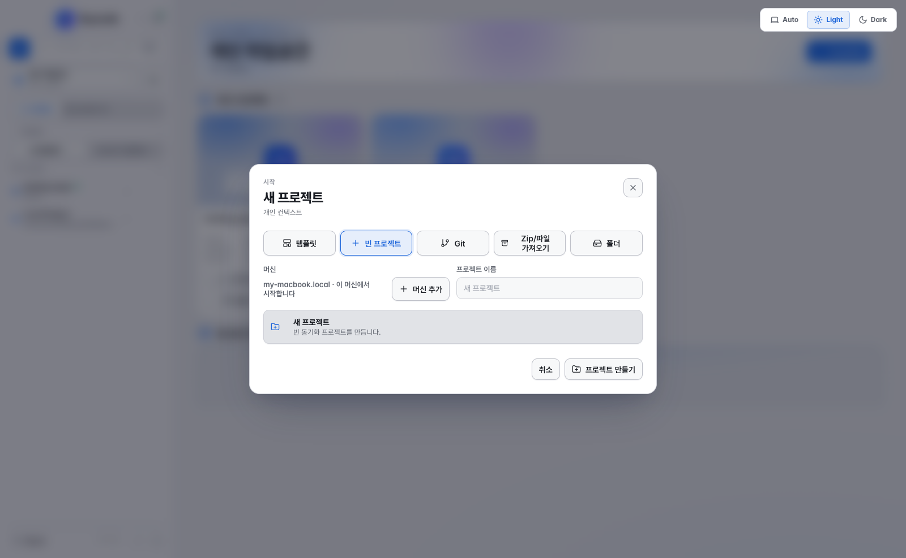

**템플릿** 탭에는 바로 실행되는 Vite + React + TypeScript 시작점이 준비돼 있습니다:

| 템플릿 | 내용 |
|---|---|
| **사내 대시보드** | 차트·테이블이 있는 관리 화면 |
| **설문 폼** | 응답 수집·검증이 있는 폼 앱 |
| **API 백오피스** | 목록·상세·편집 흐름을 갖춘 CRUD 백오피스 |

각 템플릿에는 **첫 프롬프트**가 딸려 있습니다. 머신과 프로젝트 이름을 정하고 만들면 첫
대화가 열리면서 그 프롬프트가 입력창에 **미리 채워져** 있습니다 — 보내기만 누르면
에이전트가 `npm install` → `npm run dev` → 브라우저 확인까지 이어서 진행합니다:

**Git 탭**에서는 URL을 붙여 넣거나 (팀 워크스페이스에서 GitHub/GitLab 계정을 연결했다면)
내 저장소 목록에서 고를 수 있습니다:

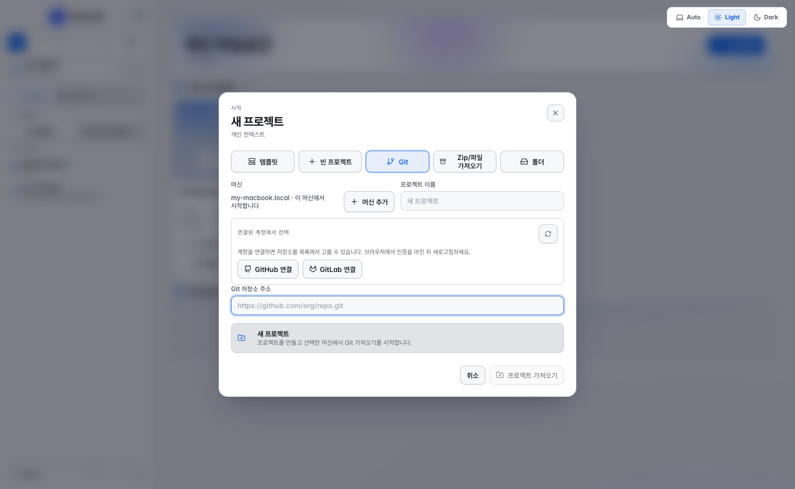

머신을 고르고 이름을 정한 뒤 **프로젝트 만들기** — 끝입니다.

### 프로젝트 설정

프로젝트 헤더의 **설정** 버튼(또는 프로젝트 행의 ⋯ 메뉴)에서 **프로젝트 정보 / 머신 및
경로 / 실행 / 환경변수**를 관리합니다. **실행** 탭에는 개발 서버 명령·포트, 1st-party
스킬 팩 사용 여부, PR·이슈 이벤트에 반응하는 **GitHub 트리거**가 있습니다.

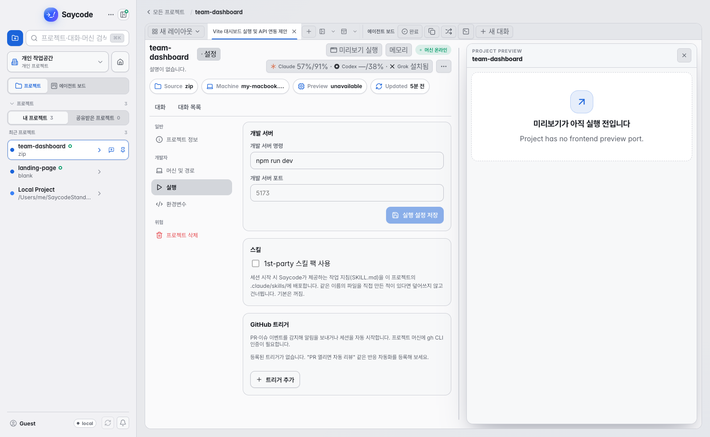

---

## 4. 첫 대화 — 에이전트에게 일 시키기

프로젝트에 들어가 **새 대화**를 누르면 대화 시작 옵션이 열립니다:

- **에이전트** — Claude Code(Anthropic) / Codex(OpenAI) / Grok(xAI) / opencode 중 선택. 최근 선택이 기본값으로 기억됩니다
- **모델** — 그대로 **Default**를 권장합니다. 난이도에 맞는 모델이 자동 선택됩니다 ([5장](#5-모델-자동-선택으로-토큰-비용-아끼기)). 특정 모델을 고르면 effort(low·medium·high·xhigh)도 지정할 수 있습니다
- **Worktree** — 실험적인 작업이라면 켜세요. 세션 전용 브랜치와 격리된 작업 폴더가 만들어져 main을 건드리지 않습니다

첫 대화를 열면 **"Saycode 기본 지시를 사용할까요?"** 라고 묻습니다:

켜두면 에이전트가 자식 에이전트 위임, 기획부터 시작 워크플로우, 커밋 크레딧, 결과물
인라인 미리보기 같은 Saycode 워크플로우를 따릅니다. 나중에 **환경설정 → AI → 시스템
프롬프트**에서 항목별로 바꿀 수 있습니다 ([13장](#13-환경설정-둘러보기)).

이제 원하는 것을 적으세요 — 한국어로, 말하듯이. *"요청 테이블에 담당자 열 추가하고
더미 데이터 채워줘"* 정도면 충분합니다. 전송하면 에이전트가 파일 수정·터미널 명령·테스트
실행을 **스트리밍 카드**로 보여주며 일하고, 대화 제목도 자동으로 지어집니다:

작업이 끝나면 **응답 완료 · 소요 시간** 표시와 함께 [알림 센터](#11-알림-센터와-웹훅)와
Dock 배지, (모바일 앱 사용 시) 푸시 알림이 옵니다. 턴이 끝나면 입력창이 **다음에 할 만한
요청을 먼저 제안**합니다 — *"GitHub 원격 추가하고 PR 만들어줘"* 처럼요.

입력창 위에는 **개발 진행**(다음 단계를 에이전트에게 맡김)과 **작업 마무리 · Commit &
PR** 버튼이 있습니다 ([9장](#9-작업-마무리--리뷰와-commit--pr)).

> 💬 응답이 진행 중일 때도 입력창에 다음 지시를 미리 적어 보낼 수 있습니다. `/`를 치면
> 슬래시 명령이, **+** 버튼으로 파일·이미지·폴더 첨부 메뉴가 열립니다.

---

## 5. 모델 자동 선택으로 토큰 비용 아끼기

Saycode의 가장 조용하지만 가장 돈이 되는 기능입니다. 모델을 **Default**로 두면, 매 턴마다
요청의 난이도를 분석해 **그 일을 해낼 수 있는 가장 저렴한 모델**로 라우팅합니다:

| 난이도 | Claude 세션 | Codex 세션 | 절약 (최고가 대비) |
|---|---|---|---|
| 간단 (오타·라벨 수정 등) | Haiku 4.5 · low | GPT-5.6 Luna · low | **~90%** |
| 일반 (기능 추가·수정) | Sonnet 5 · medium | GPT-5.6 Terra · medium | **~80%** |
| 어려움 (리팩터링·성능·디버깅) | Opus 5 · high | GPT-5.6 Sol · high | **~50%** |
| 막힘 (에스컬레이션) | Fable 5 · xhigh | GPT-5.6 Sol · high | — |

*(절약률은 Claude 라인업 기준. Codex는 Luna ~85%, Terra ~60%.)*

동작 방식을 알아두면 좋습니다:

- **모든 턴에 투명성 배지** — 보낸 메시지마다 *"⚡ 자동 선택 · Sonnet 5 · medium · ~80%
  절약"* 처럼 어떤 모델이 왜 선택됐는지 표시됩니다. 난이도 판단이 애매하면 가벼운
  분류 모델이 한 번 더 판단합니다
- **막혔을 때만 최고 티어** — 어려운 턴이 3번 이어지거나 "아직도 안 돼" 같은 신호가
  감지되면 *"막혀서 최고 성능으로 승격"* 배지와 함께 최상위 모델이 투입됩니다. 비싼
  턴에는 항상 이유가 붙습니다
- **세션 안에서는 올라가기만** — 프롬프트 캐시를 지키기 위해 세션 도중에는 모델을
  낮추지 않습니다. 1시간 이상 쉬면 다시 초기화됩니다
- **누적 절약 집계** — 입력창 옆에 *"⚡ 자동 선택 2턴 · 평균 ~65% 절약"* 이 쌓이고,
  [에이전트 보드](#8-에이전트-보드--함대-지휘하기) 상단 위젯에서 **일간/주간/월간**
  절감액 추정치를 볼 수 있습니다
- **직접 고르고 싶다면** — 모델 드롭다운에서 아무 모델이나 선택하는 순간 그 세션은 수동
  고정 모드가 됩니다

---

## 6. 브라우저 패널 — 보면서 고치기

대화 헤더의 **Preview 열기**(또는 분할 메뉴의 **새 브라우저**)를 누르면 채팅 옆에
**브라우저 패널**이 열립니다. 목업이 아니라 프로젝트 머신에서 실제로 돌아가는 개발
서버입니다. 왼쪽에서 대화하고 오른쪽에서 클릭해 보세요.

주소창에 `localhost:5173` 같은 주소를 넣거나 **주소 후보**에서 고르면 됩니다.
데스크톱·태블릿·모바일 **뷰포트 프리셋**으로 반응형을 바로 확인하세요:

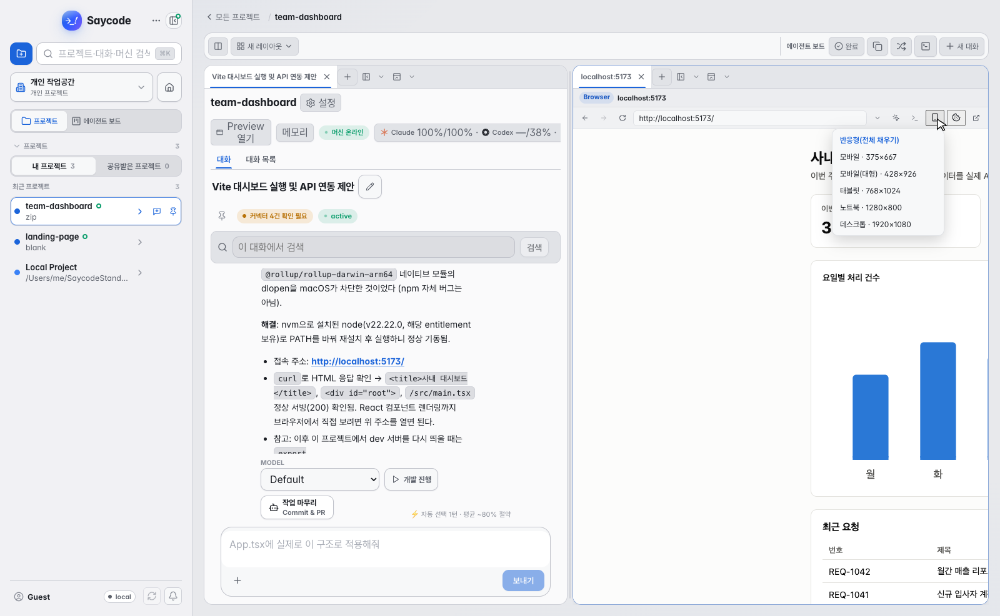

### 요소를 집어서 채팅으로

패널 툴바의 **요소 선택** 모드를 켜고 화면의 버튼·카드를 클릭하면 그 요소의 셀렉터가
채팅 입력창에 첨부됩니다. *"이 버튼 파란색으로 바꿔줘"* 한 줄이면 에이전트가 고치고,
HMR로 즉시 반영된 결과를 같은 패널에서 확인합니다:

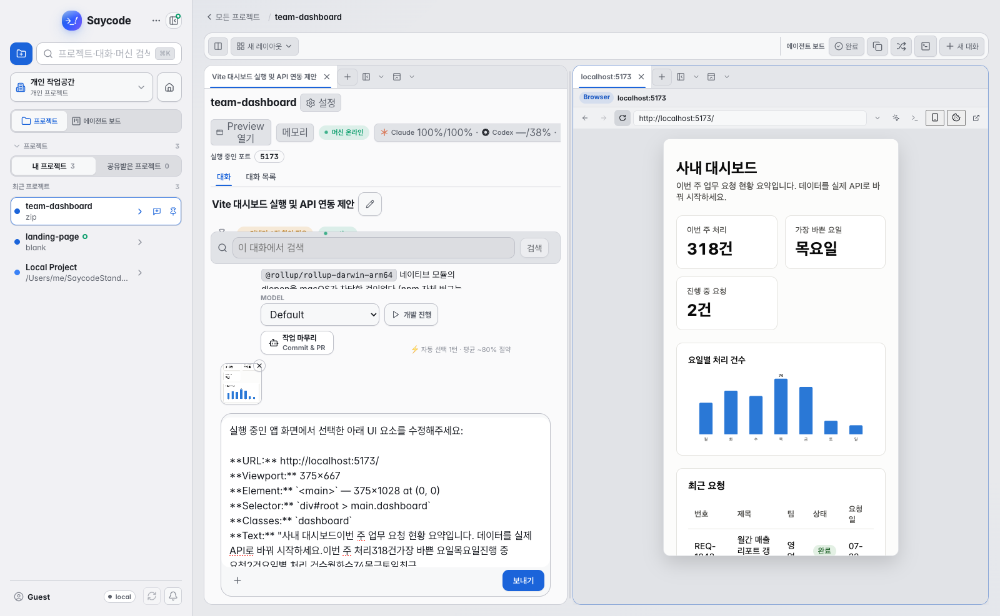

> 프로젝트 설정 → 실행에서 개발 서버 명령과 포트를 지정해 두면 프로젝트 헤더의
> **미리보기 실행**으로도 열 수 있습니다.

---

## 7. 터미널과 화면 분할, 단축키

**터미널** — 대화 헤더의 **터미널 열기**(또는 ⌘⌥T / ⌘⌥⇧T)로 채팅 옆이나 아래에 실제
셸을 도킹합니다. 세션이 worktree에서 돌고 있다면 터미널도 그 worktree에서 열립니다.
등록된 머신에 붙는 종단간 암호화 세션이라 빌드·로그 확인을 에이전트가 일하는 동안
그대로 할 수 있습니다. 탭을 바꿔도 살아있고 끊기면 스스로 재연결됩니다.

**화면 분할** — 대화 헤더 오른쪽 **⋯** 메뉴에 분할 도구가 모여 있습니다. 분할 아이콘을
누르면 **새 대화 / 새 터미널 / 새 브라우저** 중 무엇을 그 방향에 열지 고를 수 있고,
**새 레이아웃**에서 2×2 같은 그리드 프리셋을 한 번에 적용합니다. 같은 메뉴에 에이전트
보드 바로가기(완료, 복제, 핸드오프)와 **메모리**, 머신 상태도 있습니다.

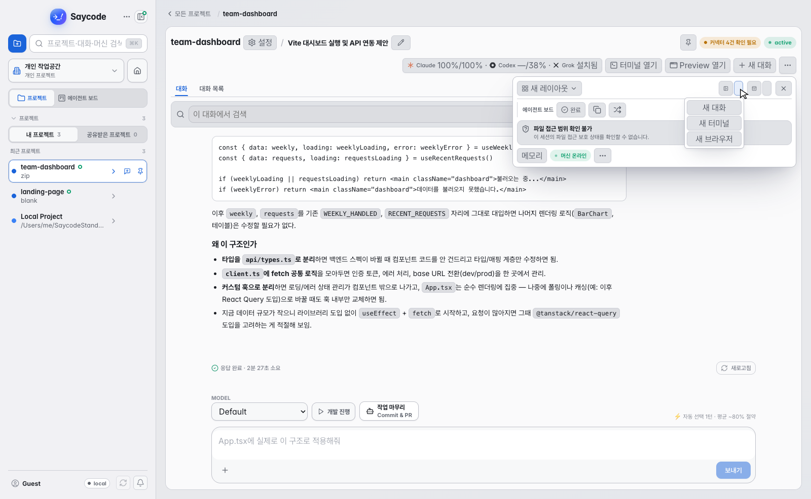

**단축키** — 전부 **환경설정 → 단축키**에서 원하는 키로 바꿀 수 있습니다:

| 동작 | 기본 키 |
|---|---|
| 프로젝트·대화·머신 검색 | ⌘K |
| 대화 검색 (전문) | ⌘⇧F |
| Quick Open (프로젝트·대화·파일) | ⌘P |
| 에이전트 보드 | ⌘⇧A |
| 파일 저장 (파일 편집기) | ⌘S |
| 사용량 팝오버 | ⌘U |
| 새 창 / 새 탭 | ⌘N / ⌘T |
| 사이드바 접기 | ⌘B |
| 환경설정 | ⌘, |
| 오른쪽 / 아래에 터미널 분할 | ⌘⌥T / ⌘⌥⇧T |
| 오른쪽 / 아래에 채팅 분할 | ⌘⌥C / ⌘⌥⇧C |

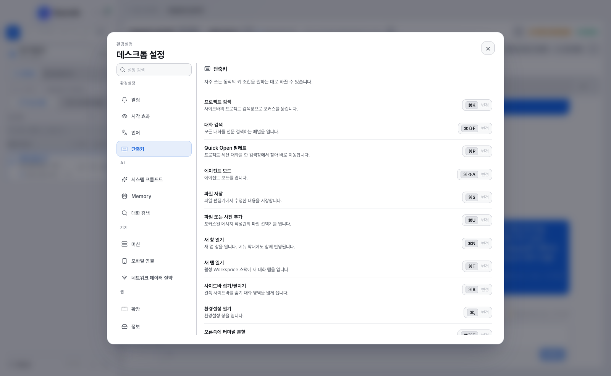

---

## 8. 에이전트 보드 — 함대 지휘하기

세션이 몇 개만 돼도 채팅 탭을 오가는 건 금방 버거워집니다. 사이드바의 **에이전트
보드**(⌘⇧A)를 누르면 **모든 프로젝트의 모든 세션**이 칸반 보드로 펼쳐집니다:

| 컬럼 | 의미 |
|---|---|
| **입력 대기** | 에이전트가 질문·권한 응답을 기다리는 중 — 가장 먼저 볼 곳 |
| **응답 중** | 지금 일하는 중. 카드에 에이전트의 최신 응답이 실시간으로 흐릅니다 |
| **대기** | 다음 지시를 기다리는 중 |
| **리뷰 중** | 코드 리뷰가 진행 중 |
| **완료** | 보관된 세션 (초록 "완료" 배지) |
| **PR Merged** | PR이 머지되어 완전히 끝난 세션 |

보드에서 할 수 있는 것들:

- **카드를 응답 중 컬럼으로 드래그** → 지시 입력창이 열리고, 쓰는 대로 그 세션에 전송됩니다
- **카드를 리뷰 중으로 드래그** → 리뷰 요청 프롬프트가 미리 채워진 확인 대화상자가 열립니다
- **카드를 완료로 드래그** → 세션을 보관합니다
- **카드 클릭** → 마지막 요청과 최신 응답을 미리보고, **채팅으로 이동**으로 바로 진입
- **검색창** — 제목·프롬프트로 세션을 즉시 필터링
- **Commit & PR / PR 머지 / CI 실패 시 자동 수정** — GitHub 연동 프로젝트라면 카드에서 바로
- **완료 해제** — 보관한 세션도 다시 열어 이어서 작업 (지워진 worktree도 브랜치에서 복원)

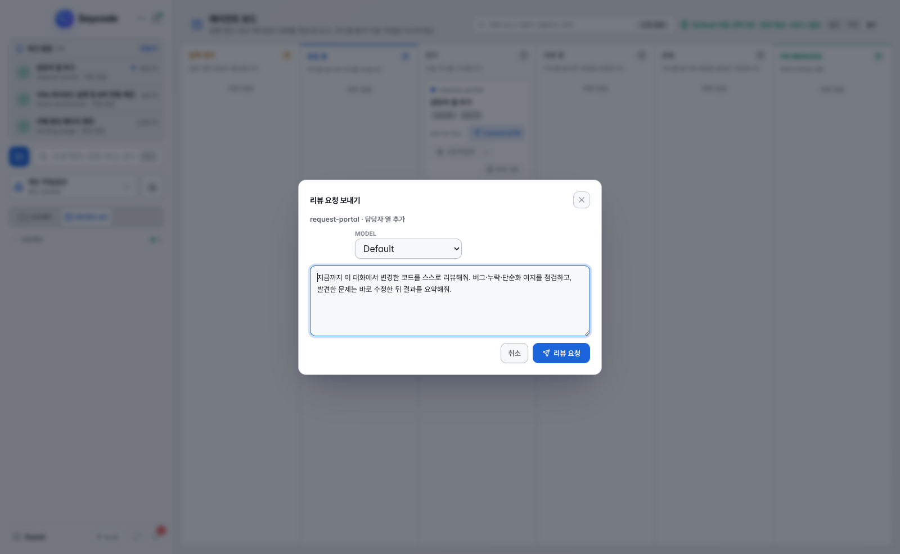

상단의 **절감 위젯**은 자동 모델 선택이 아껴준 비용을 일간/주간/월간으로 집계합니다.

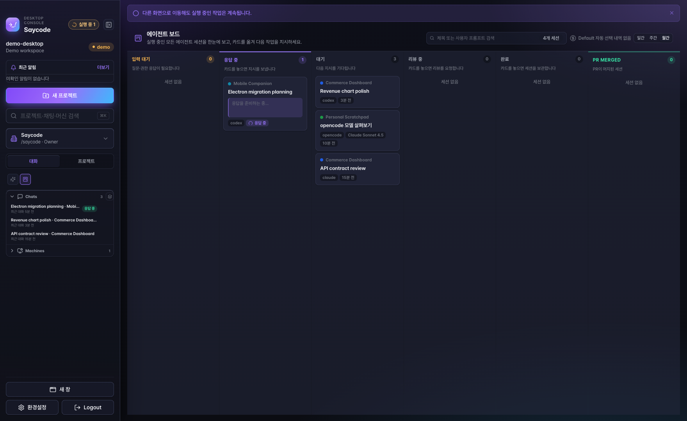

---

## 9. 작업 마무리 — 리뷰와 Commit & PR

작업이 끝났다면 입력창 위의 **작업 마무리 · Commit & PR** 버튼을 누르세요:

세 가지 길이 있습니다:

1. **현재 에이전트로 점검** — 지금 작업한 에이전트가 자기 변경 사항을 리뷰하고, 확인된
   문제는 바로 고칩니다
2. **독립 리뷰어에게 맡기기** — **다른 에이전트**(Claude/Codex 등, 모델·리뷰 프로파일
   선택 가능: 일반/버그·회귀/보안)가 **읽기 전용 스냅샷**을 검토합니다. 코드는 건드리지
   못하고 발견 사항만 보고하므로, 셀프 리뷰의 사각지대를 줄여줍니다. 결과에서 받아들일
   항목만 골라 수정을 요청할 수 있고, 리뷰 이력은 세션에 남습니다
3. **바로 Commit & PR** — 이미 확인한 변경이라면 리뷰를 건너뛰고 커밋·PR 생성으로 직행

**Commit & PR**은 한 턴 안에서 리뷰 → 테스트 → 커밋 → push → PR 생성까지 진행합니다:

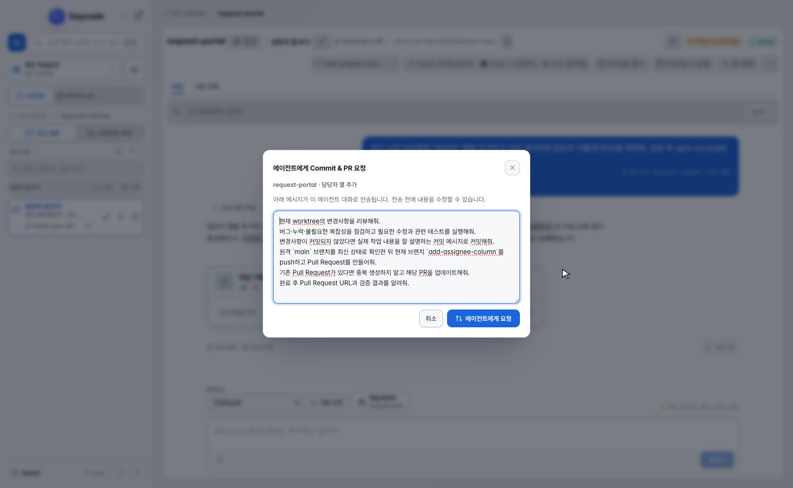

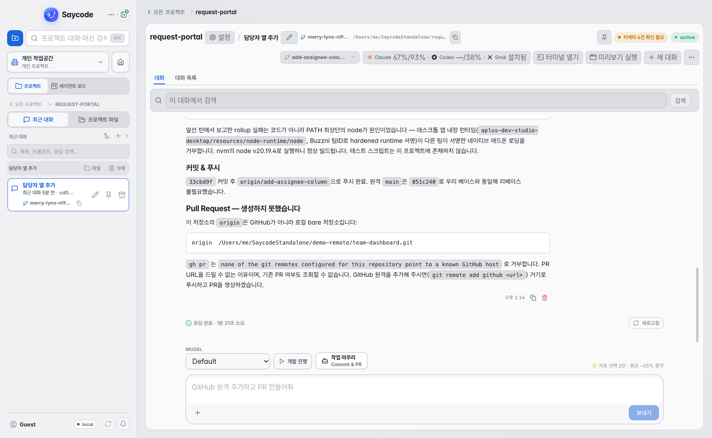

원격이 GitHub가 아니거나 원격이 없으면 에이전트가 그 사실을 알려주고 커밋(·push)까지만
진행합니다. 서브모듈 안의 변경까지 리뷰 범위에 포함됩니다.

---

## 10. 대화 검색과 Quick Open

**⌘⇧F** 하나면 지금까지의 모든 대화 — 세션 제목, 내가 보낸 프롬프트, 에이전트의 응답 —
를 전문 검색합니다. 인덱스는 내 머신의 로컬 SQLite(FTS5)에만 저장됩니다.

| 필터 | 예시 |
|---|---|
| 프로젝트 한정 | `project:commerce 결제 오류` |
| 화자 한정 | `role:user 배포`, `role:agent 원인` |
| 에이전트 종류 | `agent:claude 리팩터링` |
| 기간 | `after:2026-07-01 before:2026-07-20 로그인` |
| 정확한 문구 | `"epoch milliseconds"` |

**환경설정 → AI → 대화 검색**에서 기능을 켜고 끄거나 인덱스를 삭제할 수 있습니다.

**⌘P Quick Open**은 프로젝트·대화·파일을 한 입력창에서 바로 엽니다:

> ⌘K는 프로젝트·대화·머신을 찾는 **탐색 검색**, ⌘⇧F는 대화 내용을 뒤지는 **전문 검색**,
> ⌘P는 아무 데나 바로 뛰어드는 **Quick Open**입니다.

---

## 11. 알림 센터와 웹훅

긴 작업을 걸어두고 다른 일을 하세요 — 끝나면 알려드립니다.

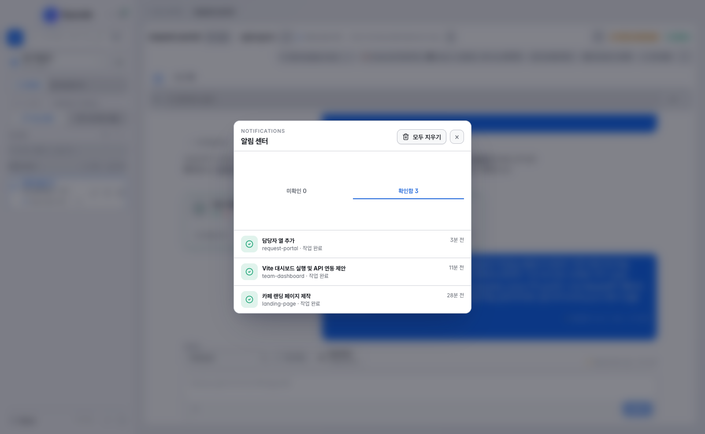

- 사이드바 하단 **종 아이콘**으로 알림 센터를 엽니다. **미확인 / 확인함** 탭 — 확인한 알림도 기록으로 남습니다
- 알림을 클릭하면 해당 채팅이 **새 탭으로** 열립니다
- 알림은 재시작해도 유지되고, Dock 배지·네이티브 알림·모바일 푸시(모바일 앱 사용 시)와 연동됩니다

**환경설정 → 알림**에서 소리(입력 요청·작업 완료)와 함께 **아웃바운드 웹훅**을 설정할
수 있습니다 — `session.turn-completed`, `session.waiting-input`, `session.stalled`
이벤트를 HMAC-SHA256 서명(`X-Saycode-Signature-256`)과 함께 내 엔드포인트로 보내
Slack·사내 봇과 연결하세요.

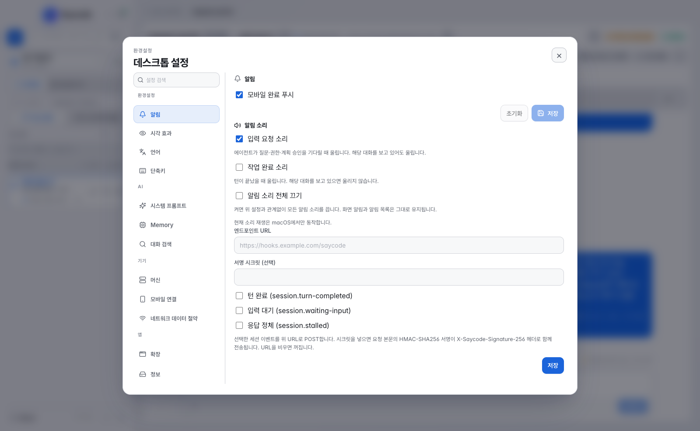

---

## 12. AI 사용량과 계정 전환

대화 헤더의 **사용량 칩**(예: `✱ Claude 57%/91% · Codex —/38% · Grok 설치됨`, ⌘U)을
누르면 그 머신의 서비스별 남은 사용량이 열립니다:

- **Claude / Codex / Grok** 별로 5시간 창·7일 창 남은 비율을 표시
- **Claude 계정 여러 개**를 연결해 두면 목록에서 **클릭하여 전환** — 한 계정의 한도가 차도 작업이 멈추지 않습니다
- 수치는 머신당 5분에 한 번씩 갱신됩니다

한도가 얼마 안 남았다면 [자동 모델 선택](#5-모델-자동-선택으로-토큰-비용-아끼기)이 더
귀해집니다 — 쉬운 일에 비싼 한도를 쓰지 않게 해주니까요.

---

## 13. 환경설정 둘러보기

사이드바 하단 **Guest(또는 내 이름) → 환경설정**(⌘,)을 엽니다. 상단 검색창에 설정 이름을
치면 바로 찾아갑니다.

| 그룹 | 탭 | 내용 |
|---|---|---|
| 환경설정 | 알림 · 시각 효과 · 언어 · 단축키 | 소리·웹훅, 애니메이션, UI 언어, 모든 단축키 재바인딩 |
| AI | 시스템 프롬프트 · Memory · 대화 검색 | 기본 지시·프리셋, 메모리 레이어, 검색 인덱스 |
| 기기 | 머신 · 모바일 연결 · 네트워크 데이터 절약 | 머신 등록·상태, QR 연결, 종량제 네트워크 대응 |
| 앱 | 확장 · 정보 | 확장·스킬 관리, 버전·업데이트 |

### 시스템 프롬프트

**Saycode 기본 지시**를 통째로 켜고 끄거나, 개별 지시(자식 Agent 호출 · 내부 작업 위임 ·
기획부터 시작 워크플로우 · 커밋 크레딧 · 결과물 인라인 미리보기)를 항목별로 조정합니다.
그 아래에 TypeScript · Tailwind · Korean · Minimal · Full-stack 프리셋이나 내 지시를
얹을 수 있습니다.

### Memory

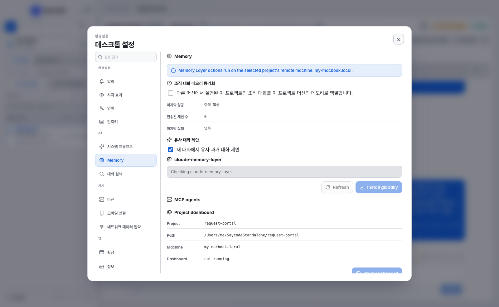

에이전트가 세션을 넘어 프로젝트 맥락(결정, 관례, 교훈)을 기억하는 메모리 레이어입니다.
대화 헤더 ⋯ 메뉴의 **메모리** 버튼으로 현재 세션에서 무엇을 기억하고 있는지 볼 수
있습니다.

### 확장

템플릿 팩(`buzzni.project-templates`) 같은 확장과 스킬을 설치·업데이트합니다. 프로젝트
설정 → 실행에서 **1st-party 스킬 팩 사용**을 켜면 세션 시작 시 작업 지침(SKILL.md)이
프로젝트의 `.claude/skills/`에 배포됩니다.

---

## 14. 머신 추가와 모바일 연결

### 머신

이 Mac은 첫 실행에 자동으로 등록됩니다. **환경설정 → 기기 → 머신**에서 상태를 보고,
**머신 추가**로 다른 컴퓨터(GPU 서버, 빌드 서버, 클라우드 VM)를 더할 수 있습니다:

1. **머신 추가**를 누르면 한 줄짜리 등록 명령어가 생성됩니다
2. 그 명령어를 대상 머신 터미널에서 실행하면, 몇 초 뒤 머신이 **온라인**으로 나타납니다
3. 이후 프로젝트를 만들 때 **호스트**에서 그 머신을 고르면 에이전트가 거기서 일합니다

같은 화면의 **시작 설정 이어하기**로 3단계 마법사를 다시 열 수 있습니다.

### 모바일 연결

**환경설정 → 기기 → 모바일 연결**의 QR 코드를 Saycode 모바일 앱으로 찍으면 같은
워크스페이스가 폰에 열립니다. 로컬 작업공간은 같은 네트워크에서 바로 연결되고, 다른
네트워크에서는 터널을 켜서 연결합니다. 에이전트 세션을 실시간으로 지켜보고, 원격
터미널을 열고, 긴 작업이 끝나는 순간 푸시 알림을 받으세요.

---

## 15. 팀 워크스페이스 — 로그인, 배포, 공유

로컬 작업공간만으로도 에이전트·보드·worktree·작업 마무리·터미널·브라우저 패널을 모두
쓸 수 있습니다. 다음이 필요해지면 로그인하세요:

- 팀이 여는 **사내 URL로 배포** (SSL 자동, 배포마다 같은 링크 갱신)
- 프로젝트 **공유·복제·인수인계**, 사내 커뮤니티
- **조직 콘솔** — 좌석·권한·모델 정책·비용·감사 로그, SSO
- Google Drive·Slack·Notion 같은 **커넥터**, 개인 메모리 동기화, 프로젝트 내보내기

사이드바 하단 **Guest → 로그인**을 누르면 saycode.ai 로그인 창이 열립니다 (패스키 또는
TOTP MFA 지원):

로그인하면 워크스페이스 홈에 **팀 공유 프로젝트**가 나타나고, 대화 헤더에 **Deploy**
버튼이 추가됩니다. 배포에 성공하면 채팅에 URL과 복사 버튼이 있는 배포 카드가 남습니다.
배포된 앱·리포트 URL을 여는 최종 이용자에게는 좌석이 필요 없습니다.

로컬 프로젝트는 로그인 후에도 그대로 남습니다.

---

## 16. 팁과 문제 해결

**세션 상태 한눈에 보기** — 사이드바와 보드의 배지:
*응답 중* · *대기*(다음 지시 대기 / 유휴 회수됨) · *입력 대기*(질문·권한 응답 필요 —
에이전트가 멈춘 게 아니라 여러분을 기다리는 중입니다) · *완료*(보관됨).

**완료한 세션 이어가기** — 보관(완료)한 세션도 에이전트 보드나 대화 헤더 ⋯ 메뉴의
**완료 해제**로 다시 살릴 수 있습니다. 세션에 연결됐던 worktree가 지워졌어도 브랜치에서
복원됩니다.

**Worktree 활용** — 새 대화에서 Worktree를 켜면 세션마다 격리된 브랜치 작업 공간이
생깁니다. 기존 worktree를 재사용하는 옵션도 있으며, 최근 선택을 기억합니다. 세션을
보관·삭제하면 연동 worktree도 자동 정리됩니다. Worktree·Commit & PR은 프로젝트가 git
저장소일 때 쓸 수 있으니, 템플릿·빈 프로젝트라면 첫 대화에서 *"git init 하고 첫 커밋
만들어줘"* 로 시작하세요.

**AI 도구가 "확인 실패"로 뜬다면** — 마법사 2단계에서 터미널로 `claude` → `/login`,
`codex login`을 마친 뒤 **상태 다시 확인**을 누르세요. 둘 중 하나만 연결돼도 시작할 수
있습니다.

**질문 카드가 떴는데 놓쳤다면** — 에이전트의 질문이나 권한 요청은 세션이 재개될 때
안전하게 다시 전달됩니다. 보드의 **입력 대기** 컬럼만 주기적으로 확인하세요.

**터미널에서 pager가 열렸다면** — `git log`처럼 pager를 여는 명령은 `q`로 빠져나오거나
`git --no-pager log`로 실행하세요.

**막힌 것 같을 때** — 자동 선택이 *"막혀서 최고 성능으로 승격"* 을 띄웠다면 이미 최상위
모델이 투입된 상태입니다. 그래도 안 풀리면 문제를 더 작게 쪼개 요청하거나, 작업 마무리
허브의 **독립 리뷰어**에게 신선한 시각을 요청해 보세요.

**자동화를 한 번에 멈추려면** *(팀 워크스페이스)* — 환경설정 → 보안의 **전역 일시정지**를
켜면 예약 자동화, GitHub 트리거, 보드 오토파일럿의 다음 단계가 시작되지 않습니다. 이미
진행 중인 대화는 중단되지 않습니다.

---

더 궁금한 것이 있나요? [saycode.ai](https://saycode.ai) · 기술 문의 [ryan@buzzni.com](mailto:ryan@buzzni.com)

**© 2026 [Buzzni](https://buzzni.com)**

