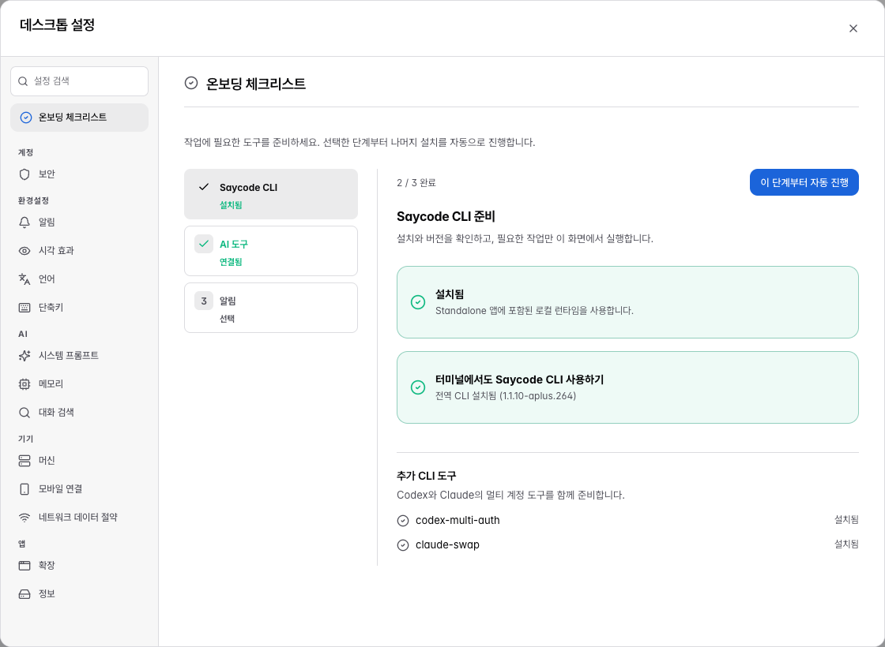
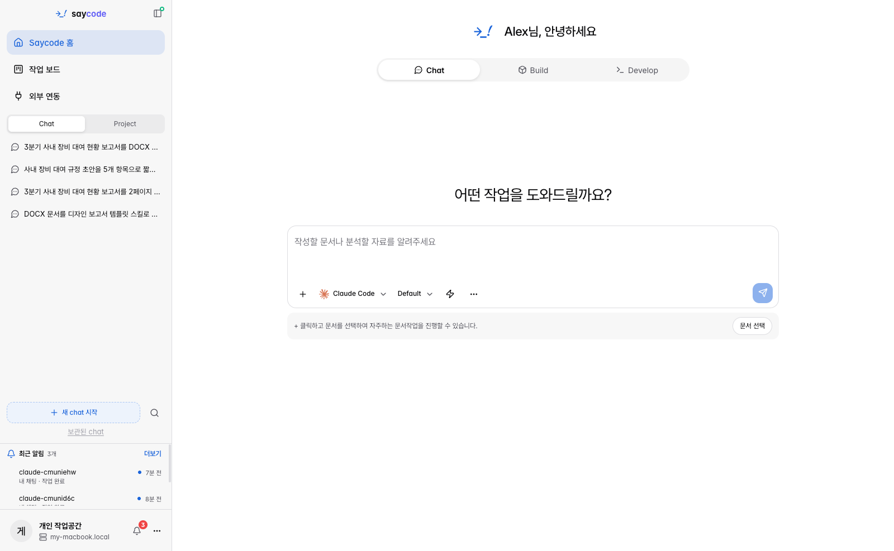
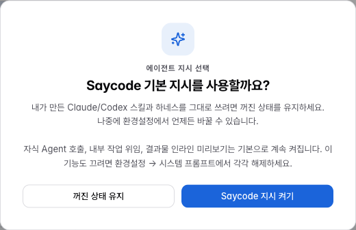
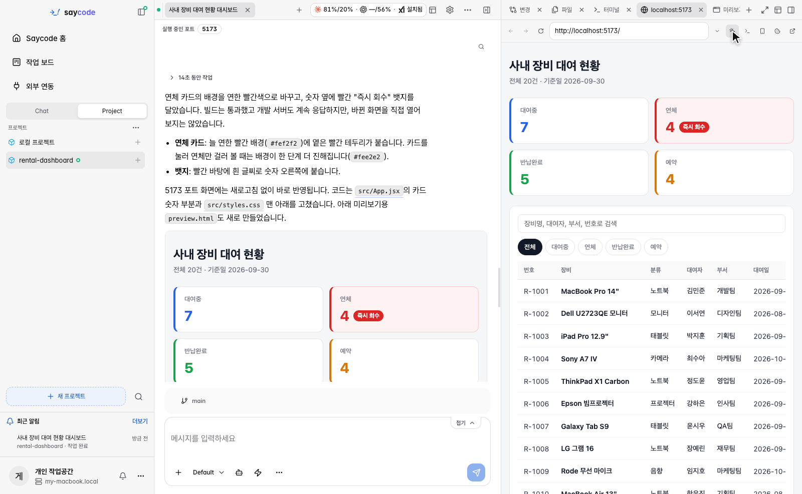
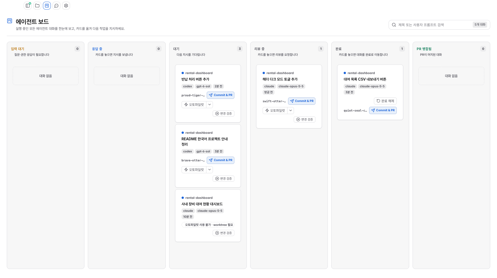
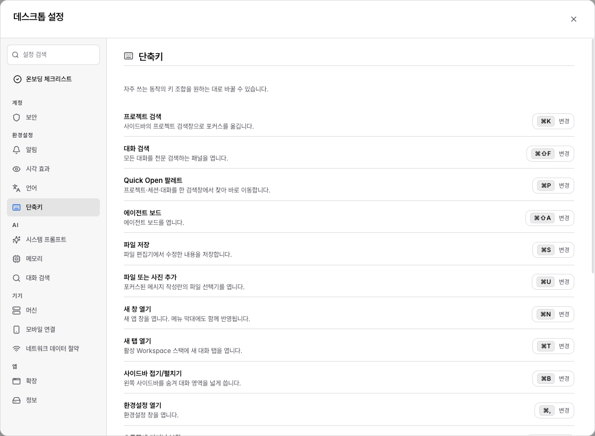
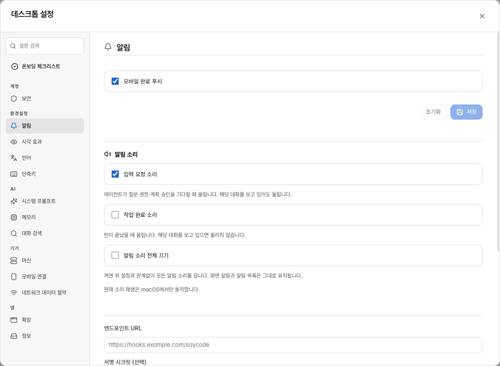
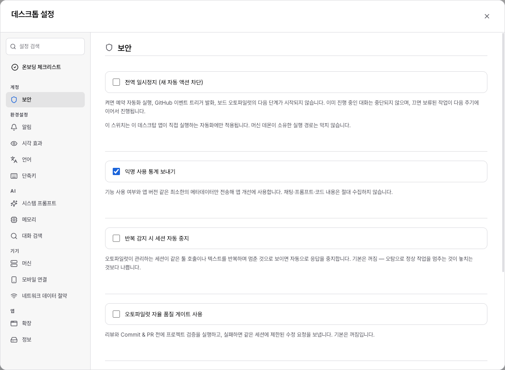

# Saycode Desktop 사용자 가이드

**첫 실행부터 에이전트 함대 운영까지 — 순서대로 따라오면 됩니다.**
*v0.1.50 화면 기준*

[English](GUIDE.md) | **한국어**

---

## 목차

1. [설치와 첫 실행](#1-설치와-첫-실행)
2. [온보딩 체크리스트](#2-온보딩-체크리스트)
3. [화면 둘러보기 — 사이드바와 홈](#3-화면-둘러보기--사이드바와-홈)
4. [프로젝트 추가하기](#4-프로젝트-추가하기)
5. [첫 대화 — 에이전트에게 일 시키기](#5-첫-대화--에이전트에게-일-시키기)
6. [프로젝트 없이 일하기 — Chat과 문서 템플릿](#6-프로젝트-없이-일하기--chat과-문서-템플릿)
7. [작업 영역 — 파일·변경·터미널·브라우저](#7-작업-영역--파일변경터미널브라우저)
8. [보면서 고치기 — 요소를 집어 채팅으로](#8-보면서-고치기--요소를-집어-채팅으로)
9. [에이전트와 모델 선택, AI 잔량](#9-에이전트와-모델-선택-ai-잔량)
10. [에이전트 보드 — 함대 지휘하기](#10-에이전트-보드--함대-지휘하기)
11. [작업 마무리 — 리뷰, 커밋, 완료](#11-작업-마무리--리뷰-커밋-완료)
12. [교훈과 메모리, 시스템 프롬프트](#12-교훈과-메모리-시스템-프롬프트)
13. [외부 연동 — 확장과 메신저 채널](#13-외부-연동--확장과-메신저-채널)
14. [환경설정 둘러보기](#14-환경설정-둘러보기)
15. [머신과 모바일 연결](#15-머신과-모바일-연결)
16. [팀 워크스페이스 — 로그인, 배포, 공유](#16-팀-워크스페이스--로그인-배포-공유)
17. [팁과 문제 해결](#17-팁과-문제-해결)

---

## 1. 설치와 첫 실행

**[최신 DMG를 내려받아](https://github.com/buzzni/saycode-desktop-releases/releases/latest)**
열고 **Saycode**를 Applications 폴더로 드래그하세요 (Apple Silicon용과 Intel Mac용 x64
DMG가 모두 있습니다). 앱은 서명·공증되어 있고 자동으로 업데이트됩니다.

처음 실행하면 두 가지만 고릅니다.

1. **언어** — 한국어 / English / 中文 / 日本語
2. **어떻게 사용하시겠어요?**
   - **개인 사용** — 나만의 프로젝트를 AI와 함께 만들고 관리합니다. 로그인 없이 **Guest
     로컬 작업공간**으로 바로 들어갑니다.
   - **조직 사용** — 팀원과 프로젝트를 공유합니다. saycode.ai 로그인과 이 컴퓨터 등록으로
     이어지고, 속한 조직이 하나면 자동으로 선택됩니다.

개인 사용을 고르면 Saycode가 알아서 **내장 서버**(릴레이·데이터베이스)를 이 Mac 안에서
띄우고, 이 Mac을 **로컬 머신**으로 등록한 뒤, 작업공간을 엽니다. 이 상태에서는 데이터가
한 바이트도 Mac 밖으로 나가지 않습니다.

---

## 2. 온보딩 체크리스트

작업공간이 열리면 **"첫 작업까지 함께 준비해요"** 체크리스트가 **자동으로 진행**됩니다.

| 단계 | 하는 일 |
|---|---|
| **① Saycode CLI** | 에이전트가 실제로 돌아가는 로컬 런타임을 확인합니다. 앱에 내장돼 있어 바로 *설치됨*으로 표시되고, 여러 계정 도구(codex-multi-auth, claude-swap)도 함께 준비합니다. 터미널에서 `saycode` CLI를 쓰고 싶다면 전역 설치를 선택할 수 있습니다. |
| **② AI 도구** | Claude Code와 Codex의 설치·로그인 상태를 감지합니다. 아직이라면 터미널에서 `claude` → `/login`, `codex login`을 마친 뒤 **상태 다시 확인**을 누르세요. 둘 중 하나만 있어도 시작할 수 있습니다. |
| **③ 알림** | 에이전트가 **입력을 요청할 때**와 **작업을 마쳤을 때** 소리로 알릴지 고르고, **테스트 알림 보내기**로 확인합니다. |

마지막 **첫 프로젝트 추가** 버튼이 [4장](#4-프로젝트-추가하기)으로 이어집니다. 중간에 오류가
나면 같은 단계에서 다시 시도하면 되고, 이미 끝난 단계는 유지됩니다. **나중에 하기**로 닫았다면
**환경설정 → 온보딩 체크리스트**에서 단계를 고르고 **이 단계부터 자동 진행**을 누르세요.

---

## 3. 화면 둘러보기 — 사이드바와 홈

### 사이드바

| 영역 | 내용 |
|---|---|
| **Saycode 홈** | Chat · Build · Develop 탭이 있는 시작 화면 |
| **작업 보드** | 모든 대화를 칸반으로 보는 에이전트 보드 ([10장](#10-에이전트-보드--함대-지휘하기)) |
| **외부 연동** | 확장과 메신저 채널 어댑터 설치 ([13장](#13-외부-연동--확장과-메신저-채널)) |
| **Chat / Project 탭** | 프로젝트 없이 나눈 대화 목록 / 프로젝트와 그 안의 대화 목록. 탭을 바꿔도 열린 화면은 유지되고, 각 목록 아래 검색 아이콘으로 필요할 때만 검색합니다 |
| **최근 알림** | 완료·입력 요청 알림. 누르면 해당 대화로 이동 |
| **계정 영역** | 작업공간·머신 표시, 알림, ⋯ 메뉴. 이름을 누르면 조직·머신 선택, 로그인, **환경설정**, 테마(자동·라이트·다크) |

⋯ 메뉴에서는 **AI 잔여량 보이기**, **CPU·메모리 보이기**, 새 창 열기 등을 켜고 끕니다.

### 홈 — 목적에 따라 세 갈래

| 탭 | 이런 때 |
|---|---|
| **Chat** | 프로젝트 없이 바로 질문하고 문서·표·발표자료를 만들 때 ([6장](#6-프로젝트-없이-일하기--chat과-문서-템플릿)) |
| **Build** | **새 기획으로 시작** 또는 **새 프로젝트 시작**, 최근 프로젝트를 미리보기 카드로 훑을 때 |
| **Develop** | **새 프로젝트 · 코드 저장소 가져오기 · ZIP/파일 가져오기 · 머신 폴더 사용하기**로 개발을 시작하고, 프로젝트를 상세 목록으로 볼 때 |

탭을 옮겨도 Chat에 쓰던 초안은 남아 있고, 홈이나 로고를 눌러 돌아오면 마지막 탭이 복원됩니다.

---

## 4. 프로젝트 추가하기

온보딩 마지막 버튼, 사이드바의 **새 프로젝트**, 또는 홈의 시작 카드로 엽니다.

먼저 **호스트**(에이전트가 일할 머신)를 확인합니다. 내 컴퓨터는 **이 컴퓨터**로 표시되고,
온라인인 머신만 고를 수 있습니다. 그다음:

| 방식 | 이런 때 |
|---|---|
| **기존 폴더 열기** (기본, ↵) | 이미 있는 코드베이스를 그대로 연결. git 저장소면 브랜치·worktree·Commit & PR까지 사용 |
| **새 프로젝트 만들기** | 이름만 정하면 빈 폴더(Git 저장소로 초기화)에서 시작. 템플릿 확장을 설치하면 사내 대시보드 같은 템플릿도 고를 수 있습니다 |
| **Git URL에서 복제** | 원격 저장소를 선택한 머신에 클론 |
| **ZIP으로 가져오기** | 압축 파일에서 로컬 프로젝트 생성 |

프로젝트 제목 옆 ⋯ 또는 대화 헤더의 ⚙에서 **프로젝트 설정**(기본 정보·태그·실행·자동화)을
엽니다.

---

## 5. 첫 대화 — 에이전트에게 일 시키기

프로젝트를 열면 *"rental-dashboard에서 무엇을 만들까요?"* 와 함께 **코드 이해하기 · 기능
만들기 · 코드 리뷰 · 버그 고치기** 시작 카드가 보입니다. 처음 대화를 열 때 **Saycode 기본
지시**를 쓸지 한 번 묻습니다.

### 입력창 해부

| 요소 | 설명 |
|---|---|
| **+** | 파일·사진(⌘U)·폴더 첨부, 기존 경로에서 시작 |
| **AI 선택** | Claude Code · Codex · Opencode · Grok, 그리고 AI 프로필 ([9장](#9-에이전트와-모델-선택-ai-잔량)) |
| **모델** | Default(자동 선택) 또는 특정 모델 고정 |
| **⚡ / ⋯** | 추가 실행 옵션 |
| **핀(Quick Commands)** | 자주 쓰는 프롬프트를 저장해 한 번에 채우기 |
| **↑ 키** | 입력창이 비어 있을 때 이전에 보낸 프롬프트를 차례로 불러오기·검색 |
| **작업 사본 (worktree)** | 대화 전용 브랜치·작업 폴더에서 격리해 작업 |
| **파일 체크포인트 보호** | (worktree를 끈 macOS 대화) 에이전트가 파일을 바꾸기 전 상태를 남기고 안전하게 복원 |

### 한 문장으로 앱 만들기

> *"사내 장비 대여 현황 대시보드를 만들어줘. Vite + React로 상태별 요약 카드, 검색·상태 필터,
> 대여 목록 표(더미 데이터 20건)를 넣고 깔끔한 라이트 테마로. 개발 서버를 5173 포트로 켜두고
> 미리보기로 볼 수 있게 해줘."*

에이전트는 실제 머신에서 파일을 만들고, `npm install`과 빌드를 돌리고, 개발 서버를 띄웁니다.
모든 도구 호출이 카드로 보이고, 답변은 쓰이는 대로 화면에 나타납니다. 개발 서버가 뜨면 오른쪽
작업 영역에 **미리보기가 자동으로 감지**되어 열립니다. HTML 결과물은 채팅 안에서도 인라인으로
미리 볼 수 있습니다.

> 개발 서버를 원한다면 요청에 *"개발 서버를 켜두고 미리보기로 볼 수 있게"* 를 꼭 넣으세요.
> 그렇지 않으면 에이전트가 HTML 파일 하나로 끝낼 수 있습니다.

---

## 6. 프로젝트 없이 일하기 — Chat과 문서 템플릿

홈의 **Chat** 탭(또는 사이드바 Chat → **새 chat 시작**)은 프로젝트 없이 바로 일하는
곳입니다. 로그인하지 않은 로컬 작업공간에서도 대화가 저장되고 이어집니다.

- *"3분기 사내 장비 대여 현황 보고서를 DOCX 파일로 만들어줘"* 처럼 요청하면 결과 파일이
  **작업 폴더**에 생기고, 앱 안의 뷰어로 바로 열립니다 (DOCX·PDF·HTML·마크다운 렌더링).
- **문서 선택**(또는 `+`)에서 **문서(DOCX) · 스프레드시트(XLSX) · 프레젠테이션(PPTX) · PDF**
  형식을 고르면 템플릿 목록이 열립니다. *디자인 보고서*, *기본 레터헤드* 같은 기본 템플릿이나
  **내 템플릿 만들기**로 저장한 Office 파일과 작성 지침을 실제 작업에 전달합니다.
- `+` → **기존 경로에서 시작**을 고르면 이 컴퓨터의 기존 폴더를 작업 경로로 씁니다.

---

## 7. 작업 영역 — 파일·변경·터미널·브라우저

프로젝트 화면은 **가운데 대화**와 **오른쪽 작업 영역**으로 나뉩니다. 가운데 위쪽 탭으로 여러
대화를 오가고, 오른쪽 탭으로 도구를 씁니다. 경계를 드래그해 너비를 조절하세요.

| 탭 | 할 수 있는 것 |
|---|---|
| **변경** | 이 대화(worktree)에서 바뀐 파일 목록과 **좌우 비교 diff**. 변경된 줄에 리뷰 코멘트를 달아 에이전트에게 보냅니다 |
| **파일** | 파일 트리 탐색, 파일명 필터, 프로젝트·worktree 전체 **내용 검색**(Enter). 결과를 누르면 해당 줄이 열리고, 새 산출물에는 표시가 붙습니다 |
| **터미널** | 그 머신에 붙은 실제 셸. 탭을 바꿔도 살아 있고 스스로 재연결합니다 |
| **브라우저 / 미리보기** | 실행 중인 앱 열기, 요소 선택, 뷰포트 프리셋 ([8장](#8-보면서-고치기--요소를-집어-채팅으로)) |

오른쪽 위 **+ (작업 패널 추가)** 로 Files · Terminal · 브라우저 · Review · 미리보기 실행을
추가하고, **작업 패널 전체화**로 크게 보거나 **분할 화면으로 복원**합니다.

---

## 8. 보면서 고치기 — 요소를 집어 채팅으로

작업 영역의 **브라우저**에서 `http://localhost:5173` 같은 주소를 열면 내 머신에서 돌아가는
앱이 그대로 뜹니다. 도구줄의 **요소를 선택해 채팅으로 보내기**를 누르고 화면의 요소를
클릭하면, 셀렉터·크기·텍스트·조상 경로와 스크린샷이 채팅 입력창에 첨부됩니다.

그 위에 한 줄만 덧붙이세요 — *"연체 카드를 연한 빨간 배경으로 강조하고 '즉시 회수' 뱃지를
달아줘."* 에이전트가 코드를 고치면 HMR로 같은 패널에 바로 반영됩니다.

도구줄에는 **콘솔·네트워크 오류 수집**, **뷰포트**(데스크톱·태블릿·모바일), 쿠키 가져오기,
새 창에서 열기도 있습니다.

---

## 9. 에이전트와 모델 선택, AI 잔량

### 에이전트

입력창의 AI 버튼으로 **Claude Code · Codex · Opencode · Grok**을 고릅니다. 선택은 다음 새
대화에도 유지됩니다. **AI 프로필**은 AI·모델·작업 환경을 한 번에 바꾸는 저장된 조합입니다.
진행 중인 대화는 헤더 ⋯의 **다른 에이전트로 이어가기**로 모델·추론 강도를 골라 넘길 수
있습니다.

### 모델 자동 선택

모델을 **Default**로 두면 Saycode가 매 턴 요청의 난이도를 보고 모델과 추론 강도를 고릅니다 —
오타 수정에는 가볍게, 기능 구현에는 적정하게, 진짜 어려운 문제에만 상위 모델을. 메시지에
마우스를 올리면 어떤 선택이 있었는지 배지로 보입니다.

특정 모델이 필요하면 **Fable 5.1 · Opus 5.5 · Opus 5 · Sonnet 5 · Haiku 4.5**(Codex는
GPT-6 Sol · Luna · Astra 등)를 직접 고정하세요.

### AI 잔량과 계정 전환

대화 헤더의 칩(예: `✱ 71%/17% · ◎ —/56% · Grok 설치됨`)을 누르면 그 머신의 서비스별 남은
사용량이 열립니다.

- **Claude / Codex / Grok** 별 5시간·7일 창 남은 비율
- `codex-multi-auth` · `claude-swap`으로 여러 계정을 연결했다면 **클릭 한 번으로 전환**,
  한도가 차면 자동 전환 — 한 계정이 막혀도 작업이 멈추지 않습니다
- ⋯ 메뉴에서 **AI 잔여량 보이기 / CPU·메모리 보이기**를 켜면 헤더에 항상 표시됩니다

---

## 10. 에이전트 보드 — 함대 지휘하기

사이드바의 **작업 보드**(⌘⇧A)를 누르면 **모든 프로젝트의 모든 대화**가 칸반으로 펼쳐집니다.
사이드바를 접으면 여섯 컬럼이 한 화면에 들어옵니다.

| 컬럼 | 의미 |
|---|---|
| **입력 대기** | 질문·권한 응답이 필요한 대화 — 가장 먼저 볼 곳 |
| **응답 중** | 지금 일하는 중. 카드에 최신 응답이 실시간으로 흐름. *카드를 놓으면 지시를 보냅니다* |
| **대기** | 다음 지시를 기다리는 중 |
| **리뷰 중** | *카드를 놓으면 리뷰를 요청합니다* — 모델과 프롬프트가 미리 채워진 확인 대화상자가 열림 |
| **완료** | *카드를 놓으면 대화를 완료로 이동합니다* — 기본 목록에서 숨겨지고, **완료 해제**로 되돌릴 수 있음 |
| **PR 병합됨** | PR이 머지되어 끝난 대화 |

카드에는 프로젝트·에이전트·모델·경과 시간·worktree 이름이 보이고, **Commit & PR**,
**오토파일럿**, **변경 검증**을 카드에서 바로 실행합니다. 카드를 누르면 마지막 요청과 최신
응답을 미리 보고 **대화로 이동**할 수 있습니다. 오른쪽 위 검색창으로 제목·프롬프트를 필터링하세요.

---

## 11. 작업 마무리 — 리뷰, 커밋, 완료

입력창의 **작업 마무리**(코드 리뷰 · Commit & PR) 버튼을 누르세요.

1. **현재 에이전트로 점검** — 지금 작업한 에이전트가 변경을 검토하고 문제를 직접 고칩니다.
   medium 이상 지적이 나오면 **반복 횟수**(기본 7)만큼 리뷰를 자동으로 이어가고, low·nit만
   남으면 끝납니다.
2. **독립 리뷰어에게 맡기기** — 다른 에이전트가 **읽기 전용 스냅샷**을 검토하고 결과만
   전달합니다. 코드를 쓴 모델과 다른 리뷰어를 먼저 제안합니다.
3. **Commit & PR** — 리뷰 → 테스트 → 커밋 → push → PR 생성을 한 턴에. 원격 저장소가 없으면
   *커밋까지만* 요청한다고 알려줍니다. (worktree 대화에서 사용)
4. **완료 처리** — 대화를 보드의 **완료**로 옮깁니다. worktree는 유지됩니다.

---

## 12. 교훈과 메모리, 시스템 프롬프트

- **교훈 후보** — 에이전트가 작업 중 확인한 방법을 프로젝트 교훈으로 제안하면 그 답변 아래에
  카드가 나타납니다. **승인**한 교훈만 다음 대화에서 쓰이고, **거절**하면 버려집니다.
- **메모리** — 환경설정 → 메모리에서 교훈과 검토 후보를 모아 보고, 다음 대화에서 회수하지 않도록
  제외할 수 있습니다.
- **시스템 프롬프트** — Saycode 기본 지시를 통째로 켜고 끄거나, 자식 Agent 호출 · 내부 작업
  위임 · 기획부터 시작 워크플로우 · 커밋 크레딧 · 결과물 인라인 미리보기를 항목별로 조정합니다.

---

## 13. 외부 연동 — 확장과 메신저 채널

사이드바의 **외부 연동**에서 필요한 기능만 공식 확장으로 설치합니다.

| 확장 | 하는 일 |
|---|---|
| **프로젝트 템플릿** | 사내 대시보드·설문 폼 같은 검증된 템플릿으로 새 프로젝트 시작 |
| **플러그인 관리자** | 스킬·플러그인 관리 |
| **공개 링크** | 렌더링된 HTML 문서·리포트를 링크로 게시 |
| **Telegram · Slack · Discord 채널 어댑터** | 메신저에서 Saycode 대화를 시작하고 진행 상황을 받아보며 허용한 프로젝트·머신·작업만 제어 |

확장을 설치하면 요청 권한(예: `channels.receive`, `sessions.control`)을 하나씩 확인하고
**권한 승인 및 활성화**를 누릅니다. 메신저 채널은 설정의 **메신저 채널**에서 봇을 두 단계로
연결하고, 원하면 Desktop 대신 **다른 머신에서 실행**하도록 옮겨 앱을 꺼도 수신을 유지할 수
있습니다. **개발자 모드**를 켜면 압축을 풀어둔 로컬 확장 폴더도 불러옵니다.

---

## 14. 환경설정 둘러보기

계정 영역의 이름(또는 Guest) → **환경설정**(⌘,)을 엽니다. 왼쪽 위 검색창에 설정 이름을
치면 바로 찾아갑니다.

| 그룹 | 탭 | 내용 |
|---|---|---|
| — | 온보딩 체크리스트 | 시작 설정을 이어서 자동 진행 |
| 계정 | 보안 | 익명 사용 통계, 반복 감지 시 세션 자동 중지, 오토파일럿 품질 게이트, 전역 일시정지 *(팀)* |
| 환경설정 | 알림 · 시각 효과 · 언어 · 단축키 | 모바일 푸시·알림 소리·웹훅, 테마·애니메이션, UI 언어, 모든 단축키 재바인딩 |
| AI | 시스템 프롬프트 · 메모리 · 대화 검색 | 기본 지시, 교훈·메모리, 대화 검색 인덱스 |
| 기기 | 머신 · 모바일 연결 · 네트워크 데이터 절약 | 머신 등록·상세·업데이트, QR 연결, 종량제 네트워크 대응 |
| 앱 | 확장 · 정보 | 확장 설치·관리, 버전 |

주요 단축키: **⌘K** 프로젝트 검색 · **⌘⇧F** 대화 전문 검색 · **⌘P** Quick Open ·
**⌘⇧A** 에이전트 보드 · **⌘S** 파일 저장 · **⌘U** 파일·사진 추가 · **⌘N** 새 창 ·
**⌘T** 새 탭 · **⌘B** 사이드바 접기/펼치기 · **⌘,** 환경설정.

---

## 15. 머신과 모바일 연결

### 머신

이 Mac은 첫 실행에 자동으로 등록됩니다. **환경설정 → 머신**에서 상태(CPU·메모리·저장공간,
데몬 상태)를 보고, **상세 정보**에서 Saycode CLI 업데이트를 실행하거나 **Rename / Delete**
합니다.

**머신 등록**을 누르면 대상 머신(GPU 서버, 빌드 서버, 클라우드 VM)에서 실행할 등록 명령과
1회용 코드가 발급됩니다. 몇 초 뒤 **온라인**으로 뜨면, 프로젝트를 만들 때 **호스트**에서
그 머신을 고르세요 — 에이전트가 코드와 데이터 옆에서 일합니다.

### 모바일 연결

QR 코드를 Saycode 모바일 앱으로 찍으면 같은 작업공간이 폰에 열립니다. 로컬 작업공간은 같은
네트워크에서 바로, 다른 네트워크에서는 터널을 켜서 연결합니다. 대화를 실시간으로 지켜보고
긴 작업이 끝나는 순간 푸시 알림을 받으세요.

---

## 16. 팀 워크스페이스 — 로그인, 배포, 공유

로컬 작업공간만으로도 에이전트·보드·worktree·작업 마무리·작업 영역·Chat과 문서 템플릿을
모두 쓸 수 있습니다. 다음이 필요해지면 계정 영역 → **로그인**(또는 첫 실행에서 **조직 사용**):

- 팀이 여는 **사내 URL로 배포** (SSL 자동, 배포마다 같은 링크 갱신)
- **함께 작업** 초대와 수락, 팀 단위 프로젝트 공유, 프로젝트 **태그**로 분류·필터
- **조직 관리** — 멤버·팀·권한·모델 정책·비용·감사 로그, SSO
- 조직 공용 MCP 서버·GitHub PAT·AI 계정, Notion·Slack·Google Drive 같은 **커넥터**

사이드바의 프로젝트 목록은 **내 프로젝트 / 함께 작업 / 공유받음**으로 나뉘고, 공유받은
프로젝트는 **프로젝트 보기 옵션**에서 찾을 수 있습니다. 배포된 앱·리포트 URL을 여는 최종
이용자에게는 좌석이 필요 없습니다. 로컬 프로젝트는 로그인 후에도 그대로 남습니다.

**전역 일시정지** — 환경설정 → 보안의 스위치를 켜면 예약 자동화, GitHub 이벤트 트리거, 보드
오토파일럿의 다음 단계가 시작되지 않습니다. 이미 진행 중인 대화는 중단되지 않습니다.

---

## 17. 팁과 문제 해결

**대화 상태 한눈에 보기** — *응답 중* · *대기*(다음 지시 대기) · *입력 대기*(질문·권한 응답
필요 — 에이전트가 멈춘 게 아니라 여러분을 기다리는 중) · *완료*(보관됨).

**완료한 대화 이어가기** — 보드나 대화 헤더의 **완료 해제**로 다시 살릴 수 있습니다.

**worktree 활용** — 여러 대화를 동시에 돌릴 땐 `작업 사본(worktree)`을 켜세요. 대화마다
격리된 브랜치에서 일해 서로 부딪히지 않습니다. worktree·Commit & PR은 프로젝트가 git
저장소일 때 쓸 수 있고, 새 프로젝트는 Git 저장소로 초기화된 상태로 시작합니다.

**AI 도구가 "설치 필요"나 "확인 실패"로 뜬다면** — 터미널에서 `claude` → `/login`,
`codex login`을 마친 뒤 온보딩 체크리스트에서 **상태 다시 확인**을 누르세요.

**터미널에서 pager가 열렸다면** — `q`로 빠져나오거나 `git --no-pager log`처럼 실행하세요.

**응답을 중단했다면** — 중단한 AI 응답은 다시 시도할 수 있습니다. 모델 사용 한도에 걸린
뒤에도 대화는 그대로 이어집니다.

**막힌 것 같을 때** — 문제를 더 작게 쪼개 요청하거나, 작업 마무리의 **독립 리뷰어**에게
신선한 시각을 요청해 보세요.

---

더 궁금한 것이 있나요? [saycode.ai](https://saycode.ai) · 기술 문의 [ryan@buzzni.com](mailto:ryan@buzzni.com)

**© 2026 [Buzzni](https://buzzni.com)**

