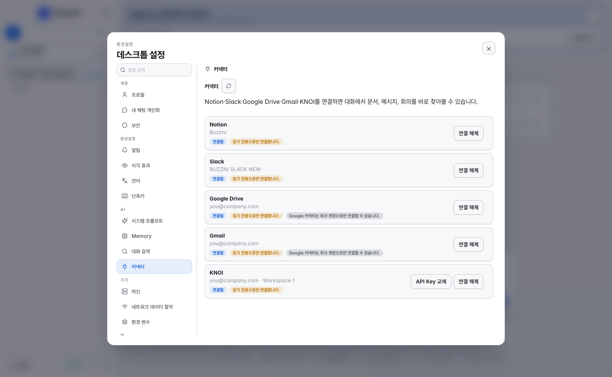

# Saycode Desktop User Guide

**From first launch to running a whole agent fleet — just follow along, in order.**

**English** | [한국어](GUIDE.ko.md)

---

## Contents

1. [Install & first run](#1-install--first-run)
2. [Getting ready for your first task — the 3-step wizard](#2-getting-ready-for-your-first-task--the-3-step-wizard)
3. [Add a project](#3-add-a-project)
4. [Your first conversation — putting the agent to work](#4-your-first-conversation--putting-the-agent-to-work)
5. [Save on token costs with Auto model selection](#5-save-on-token-costs-with-auto-model-selection)
6. [Browser panel — see it, fix it](#6-browser-panel--see-it-fix-it)
7. [Terminal, splits, and shortcuts](#7-terminal-splits-and-shortcuts)
8. [Agent Board — command your fleet](#8-agent-board--command-your-fleet)
9. [Finish work — review and Commit & PR](#9-finish-work--review-and-commit--pr)
10. [Conversation search and Quick Open](#10-conversation-search-and-quick-open)
11. [Notification centre and webhooks](#11-notification-centre-and-webhooks)
12. [AI usage and account switching](#12-ai-usage-and-account-switching)
13. [A tour of Settings](#13-a-tour-of-settings)
14. [Adding machines and mobile connection](#14-adding-machines-and-mobile-connection)
15. [Team workspace — login, deploy, share](#15-team-workspace--login-deploy-share)
16. [Tips and troubleshooting](#16-tips-and-troubleshooting)

---

## 1. Install & first run

**[Download the latest DMG](https://github.com/buzzni/saycode-desktop-releases/releases/latest)**,
open it, and drag **Saycode** into the Applications folder. The app is signed and
notarized, and updates itself automatically.

On first launch you pick a **language** (한국어 / English / 中文 / 日本語):

That's it. There's no login screen, and no screen asking how you want to start. Saycode
handles the rest automatically:

1. Boots the **embedded server** (relay · database) inside this Mac
2. Registers this Mac as a **local machine**
3. Opens the **Guest local workspace** — about 10 seconds

In this state, not a single byte of data leaves the Mac. When you need team features
(deploy, share, org console), log into your saycode.ai account via **Guest → Log in** at
the bottom of the sidebar ([Chapter 15](#15-team-workspace--login-deploy-share)).

---

## 2. Getting ready for your first task — the 3-step wizard

Once the workspace opens, the **"Let's get your first task ready"** wizard appears. It's
three steps: check the embedded server and local machine, then check the login state of
the agents you'll use.

### ① Saycode CLI

This checks the local runtime the agents actually run on. The standalone app bundles the
runtime, so it shows straight away as **Installed · "Using the local runtime bundled with
the standalone app"**. There's nothing extra to install — just click **Continue**.

### ② AI tools — Claude Code and Codex

Saycode runs the agent CLIs you already use, as-is. This step detects each tool's login
state and shows **Connected**. If you haven't logged in yet, in a terminal:

| Tool | How to log in |
|---|---|
| **Claude Code** | Run `claude` in a terminal, then `/login` |
| **Codex** | `codex login` — opens a browser to log in with your OpenAI account |

Once you've logged in, click **Check again**. You can get started with just one of the two
connected.

### ③ Notification settings

Choose whether to play a sound when the agent **asks for input** and when it **finishes a
task** (you can also turn everything off). Use **Send test notification** to confirm it
actually plays. Sound playback currently only works on macOS.

The last button leads straight into the **Add project** dialog ([Chapter 3](#3-add-a-project)).

> Each step can be skipped with **Later**, and you can reopen the wizard any time via
> **Settings → Devices → Machines → Resume setup**.

---

## 3. Add a project

When the wizard finishes, the **"Add a project to get started with Saycode"** dialog
opens. After that, you can open it any time with the **New project** button (folder icon)
at the top of the sidebar.

First pick a **host** (the machine the agent will work on). At first it's just this Mac.
Then:

| Option | When to use it |
|---|---|
| **Open existing folder** (default, ↵) | Connect an existing codebase as-is. If it's a git repository, branches, worktrees, and Commit & PR are all available |
| **New project** | Start from the template gallery or a blank project |
| **Clone from Git URL** | Start by cloning a repository |
| **Import ZIP** | Start by uploading an archive or a set of files |

### Template gallery

Click **New project** and a form opens with **Template / Blank project / Git / Zip · file
import / Folder** tabs:

The **Template** tab has ready-to-run Vite + React + TypeScript starting points:

| Template | What it is |
|---|---|
| **Internal dashboard** | An admin screen with charts and tables |
| **Survey form** | A form app with response collection and validation |
| **API back-office** | A CRUD back-office with list, detail, and edit flows |

Each template comes with a **first prompt**. Pick a machine and project name, create it,
and the first conversation opens with that prompt **pre-filled** in the composer — just
hit send, and the agent carries on through `npm install` → `npm run dev` → checking it in
the browser:

On the **Git tab** you can paste a URL, or — if you've connected a GitHub/GitLab account
in the team workspace — pick from your list of repositories:

Pick a machine, name it, click **Create project** — done.

### Project settings

The **Settings** button in the project header (or the ⋯ menu on the project row) manages
**Project info / Machine & path / Run / Environment variables**. The **Run** tab has the
dev server command and port, whether to use 1st-party skill packs, and **GitHub
triggers** that react to PR and issue events.

---

## 4. Your first conversation — putting the agent to work

Enter the project and click **New conversation** to open the session-start options:

- **Agent** — choose Claude Code (Anthropic) / Codex (OpenAI) / Grok (xAI) / opencode. Your most recent choice is remembered as the default
- **Model** — leaving it on **Default** is recommended. The right model is auto-selected for the difficulty ([Chapter 5](#5-save-on-token-costs-with-auto-model-selection)). Pick a specific model and you can also set the effort (low · medium · high · xhigh)
- **Worktree** — turn this on for experimental work. It creates a session-only branch and an isolated working folder so main is never touched

Opening your first conversation asks **"Use Saycode default instructions?"**:

Keep it on and the agent follows Saycode workflows such as child-agent delegation,
plan-first workflow, commit credits, and inline artifact previews. You can change each
item later in **Settings → AI → System prompt** ([Chapter 13](#13-a-tour-of-settings)).

Now write what you want — in plain language, like you're talking. *"Add an assignee
column to the requests table and fill in dummy data"* is enough. Send it, and the agent
works while showing file edits, terminal commands, and test runs as **streaming cards**;
the conversation title is also generated automatically:

When the work finishes, you get a **Response complete · elapsed time** marker along with
the [Notification centre](#11-notification-centre-and-webhooks), a Dock badge, and (if you
use the mobile app) a push notification. When the turn ends, the composer **suggests what
to ask next** — something like *"Add a GitHub remote and open a PR"*.

Above the composer there are **Continue development** (hand the next step to the agent)
and **Finish work · Commit & PR** buttons ([Chapter 9](#9-finish-work--review-and-commit--pr)).

> 💬 You can write and queue your next instruction in the composer even while a response
> is still in progress. Type `/` to open slash commands, and the **+** button opens the
> file/image/folder attachment menu.

---

## 5. Save on token costs with Auto model selection

This is Saycode's quietest feature, and its biggest money-saver. Leave the model on
**Default**, and every turn is analyzed for difficulty and routed to the **cheapest model
that can do the job**:

| Difficulty | Claude session | Codex session | Saved (vs top tier) |
|---|---|---|---|
| Trivial (typo/label fixes, etc.) | Haiku 4.5 · low | GPT-5.6 Luna · low | **~90%** |
| Routine (feature add/fix) | Sonnet 5 · medium | GPT-5.6 Terra · medium | **~80%** |
| Hard (refactoring, performance, debugging) | Opus 5 · high | GPT-5.6 Sol · high | **~50%** |
| Stuck (escalation) | Fable 5 · xhigh | GPT-5.6 Sol · high | — |

*(Savings percentages are for the Claude lineup. For Codex: Luna ~85%, Terra ~60%.)*

Good to know how it behaves:

- **Every turn gets a transparency badge** — every message sent shows something like *"⚡
  Auto model selection · Sonnet 5 · medium · ~80% saved"*, so you always see which model
  was picked and why. When the difficulty is hard to judge, a lightweight classifier model
  makes the call
- **Top tier only when stuck** — if three hard turns happen in a row, or a signal like
  "still not working" is detected, the top-tier model kicks in with an explicit *"promoted
  to top performance because the session is stuck"* badge. Expensive turns always come
  with a reason
- **Only goes up within a session** — to protect the prompt cache, the model is never
  downgraded mid-session. It resets after more than an hour idle
- **Cumulative savings** — next to the composer, *"⚡ Auto model selection · 2 turns · avg
  ~65% saved"* accumulates, and the [Agent Board](#8-agent-board--command-your-fleet)'s top
  widget shows estimated **daily / weekly / monthly** savings
- **Prefer to choose yourself?** — the moment you pick any model from the model dropdown,
  that session switches to manual pinned mode

---

## 6. Browser panel — see it, fix it

Click **Open preview** in the conversation header (or **New browser** in the split menu)
and a **Browser panel** opens next to the chat. It's not a mock-up — it's the real dev
server running on the project's machine. Chat on the left, click around on the right.

Type an address like `localhost:5173` into the address bar, or pick one from the
**address suggestions**. Check responsiveness right away with desktop / tablet / mobile
**viewport presets**:

### Pick an element, send it to chat

Turn on **element-select mode** in the panel toolbar and click a button or card on
screen — that element's selector is attached to the chat composer. One line like *"Make
this button blue"* is enough: the agent fixes it, and you see the result reflected
instantly via HMR in the same panel:

> If you've set the dev server command and port in Project settings → Run, you can also
> open it with **Run preview** in the project header.

---

## 7. Terminal, splits, and shortcuts

**Terminal** — use **Open terminal** in the conversation header (or ⌘⌥T / ⌘⌥⇧T) to dock a
real shell next to or below the chat. If the session is running in a worktree, the
terminal opens in that same worktree. It's an end-to-end encrypted session attached to the
registered machine, so you can run builds and check logs while the agent keeps working. It
stays alive across tab switches and reconnects on its own if it drops.

**Splits** — the split tools live in the **⋯** menu on the right of the conversation
header. Click a split icon to choose whether to open **New conversation / New terminal /
New browser** in that direction, and use **New layout** to apply grid presets like 2×2 all
at once. The same menu also has Agent Board shortcuts (finish, duplicate, hand off),
**Memory**, and machine status.

**Shortcuts** — every one of these can be rebound in **Settings → Shortcuts**:

| Action | Default key |
|---|---|
| Search projects · conversations · machines | ⌘K |
| Conversation search (full-text) | ⌘⇧F |
| Quick Open (projects · conversations · files) | ⌘P |
| Agent Board | ⌘⇧A |
| Save file (file editor) | ⌘S |
| Usage popover | ⌘U |
| New window / new tab | ⌘N / ⌘T |
| Collapse sidebar | ⌘B |
| Settings | ⌘, |
| Split terminal right / down | ⌘⌥T / ⌘⌥⇧T |
| Split chat right / down | ⌘⌥C / ⌘⌥⇧C |

---

## 8. Agent Board — command your fleet

Even a handful of sessions makes hopping between chat tabs tiring fast. Click **Agent
Board** (⌘⇧A) in the sidebar and **every session across every project** unfolds as a
Kanban board:

| Column | Meaning |
|---|---|
| **Awaiting input** | The agent is waiting for a question or permission response — check here first |
| **Responding** | Working right now. The card streams the agent's latest reply live |
| **Waiting** | Waiting for the next instruction |
| **In review** | A code review is running |
| **Done** | Archived sessions (green "Done" badge) |
| **PR Merged** | The PR merged and the session is fully finished |

What you can do from the board:

- **Drag a card into Responding** → an instruction box opens, and whatever you type is sent to that session
- **Drag a card into In review** → a confirmation dialog opens with a pre-filled review-request prompt
- **Drag a card into Done** → archives the session
- **Click a card** → preview the last request and latest reply, then jump straight in with **Go to chat**
- **Search box** — instantly filter sessions by title or prompt
- **Commit & PR / merge PR / auto-fix on CI failure** — right from the card, for GitHub-connected projects
- **Un-complete** — reopen an archived session and keep going (a deleted worktree is restored from its branch too)

The **savings widget** at the top totals what auto model selection has saved you, by day,
week, and month.

---

## 9. Finish work — review and Commit & PR

Done with the work? Click the **Finish work · Commit & PR** button above the composer:

There are three paths:

1. **Review with the current agent** — the agent that did the work reviews its own
   changes and fixes confirmed issues right away
2. **Hand it to an independent reviewer** — a **different agent** (Claude/Codex and more,
   with model and review-profile choices: general / bugs & regressions / security)
   inspects a **read-only snapshot**. It can't touch the code, only reports findings —
   which cuts down on self-review blind spots. From the results, pick just the items you
   want and request fixes; the review history stays with the session
3. **Straight to Commit & PR** — if the changes are already confirmed, skip the review and
   go straight to committing and opening a PR

**Commit & PR** runs review → test → commit → push → PR creation, all in a single turn:

If the remote isn't GitHub, or there's no remote, the agent tells you so and stops after
committing (and pushing). Review scope includes changes inside submodules too.

---

## 10. Conversation search and Quick Open

**⌘⇧F** alone full-text searches every conversation you've ever had — session titles, the
prompts you sent, the agent's replies. The index is stored only in a local SQLite (FTS5)
database on your machine.

| Filter | Example |
|---|---|
| Limit to a project | `project:commerce payment error` |
| Limit by speaker | `role:user deploy`, `role:agent root cause` |
| Agent type | `agent:claude refactor` |
| Date range | `after:2026-07-01 before:2026-07-20 login` |
| Exact phrase | `"epoch milliseconds"` |

Turn the feature on/off or delete the index in **Settings → AI → Conversation search**.

**⌘P Quick Open** opens projects, conversations, and files straight from one input box:

> ⌘K is **navigation search** for finding projects, conversations, and machines; ⌘⇧F is
> **full-text search** that digs through conversation content; ⌘P is **Quick Open** for
> jumping straight anywhere.

---

## 11. Notification centre and webhooks

Kick off a long task and go do something else — Saycode will tell you when it's done.

- Open the notification centre with the **bell icon** at the bottom of the sidebar. **Unread / Read** tabs — acknowledged notifications stay on record too
- Clicking a notification opens that chat **in a new tab**
- Notifications survive restarts, and sync with Dock badges, native notifications, and mobile push (if you use the mobile app)

In **Settings → Notifications** you can set sounds (input requests · task complete)
alongside **outbound webhooks** — send `session.turn-completed`, `session.waiting-input`,
and `session.stalled` events, HMAC-SHA256 signed (`X-Saycode-Signature-256`), to your own
endpoint to connect Slack or an internal bot.

---

## 12. AI usage and account switching

Click the **usage chip** in the conversation header (e.g. `✱ Claude 57%/91% · Codex
—/38% · Grok installed`, ⌘U) and the remaining usage per service on that machine opens up:

- Shows the remaining share of the 5-hour and 7-day windows, per **Claude / Codex / Grok**
- If you've connected **multiple Claude accounts**, **click to switch** between them in the list — work doesn't stop even if one account hits its limit
- Numbers refresh once every 5 minutes, per machine

Running low on quota? That's when [Auto model selection](#5-save-on-token-costs-with-auto-model-selection)
earns its keep even more — it keeps easy work from burning expensive quota.

---

## 13. A tour of Settings

Open **Guest (or your name) → Settings** (⌘,) at the bottom of the sidebar. Type a
setting's name into the search box at the top to jump straight to it.

| Group | Tabs | What's there |
|---|---|---|
| Preferences | Notifications · Visual effects · Language · Shortcuts | Sounds/webhooks, animations, UI language, rebinding every shortcut |
| AI | System prompt · Memory · Conversation search | Default instructions/presets, the memory layer, the search index |
| Devices | Machines · Mobile connection · Network data saver | Machine registration/status, QR connection, handling metered networks |
| App | Extensions · About | Managing extensions/skills, version and updates |

### System prompt

Toggle **Saycode default instructions** wholesale, or adjust individual instructions
(calling child agents · internal task delegation · plan-first workflow · commit credits ·
inline artifact previews) item by item. Below that you can layer TypeScript · Tailwind ·
Korean · Minimal · Full-stack presets, or your own instructions.

### Memory

This is the memory layer that lets the agent remember project context — decisions,
conventions, lessons — across sessions. Use the **Memory** button in the conversation
header's ⋯ menu to see what the current session remembers.

### Extensions

Install and update extensions and skills, such as the template pack
(`buzzni.project-templates`). Turn on **Use 1st-party skill packs** in Project settings →
Run and work instructions (SKILL.md) are deployed to the project's `.claude/skills/` at
session start.

---

## 14. Adding machines and mobile connection

### Machines

This Mac is registered automatically on first run. Check its status in **Settings →
Devices → Machines**, and add other computers (GPU servers, build servers, cloud VMs) with
**Add machine**:

1. Click **Add machine** to generate a one-line registration command
2. Run that command in a terminal on the target machine, and within seconds it shows up as **Online**
3. From then on, pick that machine as the **host** when creating a project, and the agent works there

Use **Resume setup** on the same screen to reopen the 3-step wizard.

### Mobile connection

Scan the QR code in **Settings → Devices → Mobile connection** with the Saycode mobile
app, and the same workspace opens on your phone. A local workspace connects directly on
the same network, and over a tunnel on a different network. Watch agent sessions live,
open a remote terminal, and get a push notification the moment a long task finishes.

---

## 15. Team workspace — login, deploy, share

The local workspace alone already gives you agents, the board, worktrees, finish work, the
terminal, and the browser panel. Log in once you need:

- **Deploying to an internal URL** the team can open (automatic SSL, the same link refreshed on every deploy)
- **Sharing, cloning, and handing over** projects, and the internal community
- The **org console** — seats, permissions, model policy, cost, audit log, SSO
- **Connectors** like Google Drive, Slack, and Notion, personal memory sync, project export

Click **Guest → Log in** at the bottom of the sidebar and the saycode.ai login window
opens (passkey or TOTP MFA supported):

Once logged in, **team shared projects** appear on the workspace home, and a **Deploy**
button is added to the conversation header. A successful deploy leaves a deploy card in
the chat with the URL and a copy button. End users who only open the deployed app or
report URL don't need a seat.

**Connectors** — in Settings → Connectors, link Notion, Slack, Google Drive, Gmail and
KNOI so conversations can pull in documents, messages and meetings directly. All
connections are read-only.

**Machine registration** — in Settings → Devices → Machines, click **Register machine**
to get a CLI install command plus a Personal or Organization registration code. On the
target machine, run `npm i -g @buzzni/happy-cli`, then `happy auth login` and enter the
code — it comes online within seconds.

Click **Generate code** and a one-time code with its expiry time appears, along with a
ready-to-paste curl command — the code expires within minutes so it can't leak.

**Organization console** — switch to an organization workspace and an **Organization
management** entry appears at the bottom of the sidebar workspace switcher. Invite
members, change roles (admin/member) or remove them, review the audit log (who opened
which project, when), and register org-wide MCP servers, a GitHub PAT and shared AI
accounts — all from one console.

**Global pause** — the global-pause switch in Settings → Security stops the next run of
scheduled automations, GitHub event triggers and board autopilot from starting. Chats
already in progress aren't interrupted, and the switch only applies to automation this
desktop app runs directly (it doesn't block execution paths owned by a machine daemon).

Local projects stay exactly as they were, even after logging in.

---

## 16. Tips and troubleshooting

**See session status at a glance** — sidebar and board badges:
*Responding* · *Waiting* (waiting for the next instruction / reclaimed after idling) ·
*Awaiting input* (needs a question or permission answered — the agent isn't stuck, it's
waiting for you) · *Done* (archived).

**Resume a finished session** — even archived (Done) sessions can be brought back with
**Un-complete** on the Agent Board or in the conversation header's ⋯ menu. Even if the
session's worktree was deleted, it's restored from the branch.

**Using Worktree** — turning on Worktree in a new conversation creates an isolated branch
workspace per session. There's also an option to reuse an existing worktree, and your last
choice is remembered. Archiving or deleting a session automatically cleans up its linked
worktree too. Worktree and Commit & PR only work when the project is a git repository, so
for templates or blank projects, start your first conversation with *"git init and make
the first commit"*.

**If an AI tool shows "Check failed"** — in step 2 of the wizard, run `claude` → `/login`
and `codex login` in a terminal, then click **Check again**. You can get started with just
one of the two connected.

**Missed a question card?** — agent questions and permission requests are safely
re-delivered when the session resumes. Just check the board's **Awaiting input** column
periodically.

**If a pager opens in the terminal** — for commands like `git log` that open a pager,
press `q` to exit, or run it as `git --no-pager log`.

**When it feels stuck** — if auto selection has shown *"promoted to top performance
because the session is stuck"*, the top-tier model is already on the case. Still not
resolved? Break the problem into smaller requests, or ask the Work-completion hub's
**independent reviewer** for a fresh perspective.

**To halt all automation at once** *(team workspace)* — turn on **Global pause** in
Settings → Security, and scheduled automations, GitHub triggers, and the board
autopilot's next steps won't start. Conversations already in progress aren't interrupted.

---

Have more questions? [saycode.ai](https://saycode.ai) · Technical contact [ryan@buzzni.com](mailto:ryan@buzzni.com)

**© 2026 [Buzzni](https://buzzni.com)**

